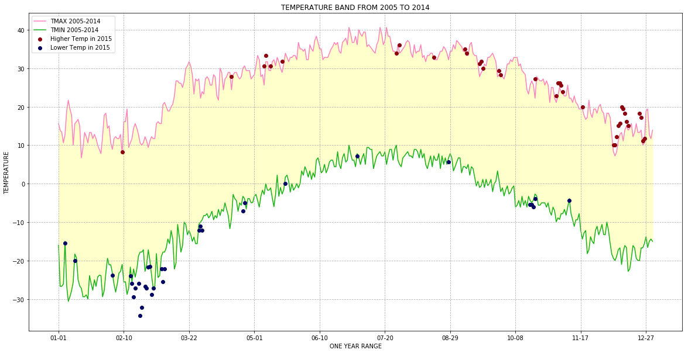

# 本文档功能
## 所有在DS课程、练习和实践过程中遇到的python语法都汇总在这里，便于日后查找


```python
# 寻找两个list中的共同项并且写入一个新的list

list1 = [1,2,3,4,5,6]
list2 = [3, 5, 7, 9]
list(set(list1).intersection(list2))
# 输出结果：[3, 5]
```


```python
# 把整列df series的内容类型改成指定类型（astrpe括号里的）
window_ti_impact['time'].astype(int)

# 把某个df中的datetime类型数值改成millisecond的形式（python3版本的代码）
window_ti_impact['time'][1].timestamp()
```


```python
# 在python中与postgresql链接的库
import psycopg2

# 使用 psycopg2 连接postgresql
conn = psycopg2.connect("host=localhost dbname=xiucat user=xiucat")
cursor = conn.cursor()

# 展示 PostgreSQL 连接属性
print ( conn.get_dsn_parameters(),"\n")

# 展示 postgresql 的版本
cursor.execute("SELECT version();")
record = cursor.fetchone()
print("You are connected to - ", record,"\n")

```

    {'user': 'xiucat', 'passfile': '/Users/xiucat/.pgpass', 'dbname': 'xiucat', 'host': 'localhost', 'port': '5432', 'tty': '', 'options': '', 'sslmode': 'prefer', 'sslcompression': '0', 'krbsrvname': 'postgres', 'target_session_attrs': 'any'} 
    
    You are connected to -  ('PostgreSQL 12.1 on x86_64-apple-darwin16.7.0, compiled by Apple LLVM version 8.1.0 (clang-802.0.42), 64-bit',) 
    


# Assignment 2 - Pandas Introduction
All questions are weighted the same in this assignment.
## Part 1
The following code loads the olympics dataset (olympics.csv), which was derrived from the Wikipedia entry on [All Time Olympic Games Medals](https://en.wikipedia.org/wiki/All-time_Olympic_Games_medal_table), and does some basic data cleaning. 

The columns are organized as # of Summer games, Summer medals, # of Winter games, Winter medals, total # number of games, total # of medals. Use this dataset to answer the questions below.


```python
import pandas as pd

df = pd.read_csv('olympics.csv', index_col=0, skiprows=1)
df.head()
```


<div>
<style scoped>
    .dataframe tbody tr th:only-of-type {
        vertical-align: middle;
    }

    .dataframe tbody tr th {
        vertical-align: top;
    }

    .dataframe thead th {
        text-align: right;
    }
</style>
<table border="1" class="dataframe">
  <thead>
    <tr style="text-align: right;">
      <th></th>
      <th>№ Summer</th>
      <th>01 !</th>
      <th>02 !</th>
      <th>03 !</th>
      <th>Total</th>
      <th>№ Winter</th>
      <th>01 !.1</th>
      <th>02 !.1</th>
      <th>03 !.1</th>
      <th>Total.1</th>
      <th>№ Games</th>
      <th>01 !.2</th>
      <th>02 !.2</th>
      <th>03 !.2</th>
      <th>Combined total</th>
    </tr>
  </thead>
  <tbody>
    <tr>
      <th>Afghanistan (AFG)</th>
      <td>13</td>
      <td>0</td>
      <td>0</td>
      <td>2</td>
      <td>2</td>
      <td>0</td>
      <td>0</td>
      <td>0</td>
      <td>0</td>
      <td>0</td>
      <td>13</td>
      <td>0</td>
      <td>0</td>
      <td>2</td>
      <td>2</td>
    </tr>
    <tr>
      <th>Algeria (ALG)</th>
      <td>12</td>
      <td>5</td>
      <td>2</td>
      <td>8</td>
      <td>15</td>
      <td>3</td>
      <td>0</td>
      <td>0</td>
      <td>0</td>
      <td>0</td>
      <td>15</td>
      <td>5</td>
      <td>2</td>
      <td>8</td>
      <td>15</td>
    </tr>
    <tr>
      <th>Argentina (ARG)</th>
      <td>23</td>
      <td>18</td>
      <td>24</td>
      <td>28</td>
      <td>70</td>
      <td>18</td>
      <td>0</td>
      <td>0</td>
      <td>0</td>
      <td>0</td>
      <td>41</td>
      <td>18</td>
      <td>24</td>
      <td>28</td>
      <td>70</td>
    </tr>
    <tr>
      <th>Armenia (ARM)</th>
      <td>5</td>
      <td>1</td>
      <td>2</td>
      <td>9</td>
      <td>12</td>
      <td>6</td>
      <td>0</td>
      <td>0</td>
      <td>0</td>
      <td>0</td>
      <td>11</td>
      <td>1</td>
      <td>2</td>
      <td>9</td>
      <td>12</td>
    </tr>
    <tr>
      <th>Australasia (ANZ) [ANZ]</th>
      <td>2</td>
      <td>3</td>
      <td>4</td>
      <td>5</td>
      <td>12</td>
      <td>0</td>
      <td>0</td>
      <td>0</td>
      <td>0</td>
      <td>0</td>
      <td>2</td>
      <td>3</td>
      <td>4</td>
      <td>5</td>
      <td>12</td>
    </tr>
  </tbody>
</table>
</div>


```python
import pandas as pd
# index_col=0 就是在导入问当时不包含自动添加的index
df = pd.read_csv('olympics.csv', index_col=0, skiprows=1)

for col in df.columns:
    #print(col)
    if col[:2]=='01': #也就是0，1两个digit的位置，2不包含在内，所以对应的就是column名称的前两个字符，下同
        df.rename(columns={col:'Gold'+col[4:]}, inplace=True)
    if col[:2]=='02':
        df.rename(columns={col:'Silver'+col[4:]}, inplace=True)
    if col[:2]=='03':
        df.rename(columns={col:'Bronze'+col[4:]}, inplace=True)
    if col[:1]=='№':
        df.rename(columns={col:'#'+col[1:]}, inplace=True)

names_ids = df.index.str.split('\s\(') # split the index by '('

df.index = names_ids.str[0] # the [0] element is the country name (new index) 
df['ID'] = names_ids.str[1].str[:3] # the [1] element is the abbreviation or ID (take first 3 characters from that)

df = df.drop('Totals')
df.head()
```


<div>
<style scoped>
    .dataframe tbody tr th:only-of-type {
        vertical-align: middle;
    }

    .dataframe tbody tr th {
        vertical-align: top;
    }

    .dataframe thead th {
        text-align: right;
    }
</style>
<table border="1" class="dataframe">
  <thead>
    <tr style="text-align: right;">
      <th></th>
      <th># Summer</th>
      <th>Gold</th>
      <th>Silver</th>
      <th>Bronze</th>
      <th>Total</th>
      <th># Winter</th>
      <th>Gold.1</th>
      <th>Silver.1</th>
      <th>Bronze.1</th>
      <th>Total.1</th>
      <th># Games</th>
      <th>Gold.2</th>
      <th>Silver.2</th>
      <th>Bronze.2</th>
      <th>Combined total</th>
      <th>ID</th>
    </tr>
  </thead>
  <tbody>
    <tr>
      <th>Afghanistan</th>
      <td>13</td>
      <td>0</td>
      <td>0</td>
      <td>2</td>
      <td>2</td>
      <td>0</td>
      <td>0</td>
      <td>0</td>
      <td>0</td>
      <td>0</td>
      <td>13</td>
      <td>0</td>
      <td>0</td>
      <td>2</td>
      <td>2</td>
      <td>AFG</td>
    </tr>
    <tr>
      <th>Algeria</th>
      <td>12</td>
      <td>5</td>
      <td>2</td>
      <td>8</td>
      <td>15</td>
      <td>3</td>
      <td>0</td>
      <td>0</td>
      <td>0</td>
      <td>0</td>
      <td>15</td>
      <td>5</td>
      <td>2</td>
      <td>8</td>
      <td>15</td>
      <td>ALG</td>
    </tr>
    <tr>
      <th>Argentina</th>
      <td>23</td>
      <td>18</td>
      <td>24</td>
      <td>28</td>
      <td>70</td>
      <td>18</td>
      <td>0</td>
      <td>0</td>
      <td>0</td>
      <td>0</td>
      <td>41</td>
      <td>18</td>
      <td>24</td>
      <td>28</td>
      <td>70</td>
      <td>ARG</td>
    </tr>
    <tr>
      <th>Armenia</th>
      <td>5</td>
      <td>1</td>
      <td>2</td>
      <td>9</td>
      <td>12</td>
      <td>6</td>
      <td>0</td>
      <td>0</td>
      <td>0</td>
      <td>0</td>
      <td>11</td>
      <td>1</td>
      <td>2</td>
      <td>9</td>
      <td>12</td>
      <td>ARM</td>
    </tr>
    <tr>
      <th>Australasia</th>
      <td>2</td>
      <td>3</td>
      <td>4</td>
      <td>5</td>
      <td>12</td>
      <td>0</td>
      <td>0</td>
      <td>0</td>
      <td>0</td>
      <td>0</td>
      <td>2</td>
      <td>3</td>
      <td>4</td>
      <td>5</td>
      <td>12</td>
      <td>ANZ</td>
    </tr>
  </tbody>
</table>
</div>


### Question 0 (Example)

What is the first country in df?

*This function should return a Series.*


```python
# You should write your whole answer within the function provided. The autograder will call
# this function and compare the return value against the correct solution value
def answer_zero():
    # This function returns the row for Afghanistan, which is a Series object. The assignment
    # question description will tell you the general format the autograder is expecting
    return df.iloc[0]

# You can examine what your function returns by calling it in the cell. If you have questions
# about the assignment formats, check out the discussion forums for any FAQs
answer_zero() 
```


    # Summer           13
    Gold                0
    Silver              0
    Bronze              2
    Total               2
    # Winter            0
    Gold.1              0
    Silver.1            0
    Bronze.1            0
    Total.1             0
    # Games            13
    Gold.2              0
    Silver.2            0
    Bronze.2            2
    Combined total      2
    ID                AFG
    Name: Afghanistan, dtype: object


### Question 1
Which country has won the most gold medals in summer games?

*This function should return a single string value.*


```python
def answer_one():
    return df.loc[df['Gold'] == df['Gold'].max()].index[0] #"YOUR ANSWER HERE"
answer_one()
```


    'United States'


### Question 2
Which country had the biggest difference between their summer and winter gold medal counts?

*This function should return a single string value.*


```python

def answer_two():
    try:
        df.insert(0, 'Summer and Winter Gold Gap', (df['Gold'] - df['Gold.1']).abs())
    except:pass
    return df[df['Summer and Winter Gold Gap'] == df['Summer and Winter Gold Gap'].max()].index[0] #"YOUR ANSWER HERE"
answer_two()


```


    'United States'


### Question 3
Which country has the biggest difference between their summer gold medal counts and winter gold medal counts relative to their total gold medal count? 

$$\frac{Summer~Gold - Winter~Gold}{Total~Gold}$$

Only include countries that have won at least 1 gold in both summer and winter.

*This function should return a single string value.*


```python

def answer_three():
    noGold = df['Gold'].isin([0]) | df['Gold.1'].isin([0])
    df_withGold = df[~noGold]
    df_withGold.insert(0,'Gap_Total_Ratio',((df['Gold'] - df['Gold.1'])/df['Gold.2']).abs())
    return df_withGold[df_withGold['Gap_Total_Ratio'] == df_withGold['Gap_Total_Ratio'].max()].index[0] #"YOUR ANSWER HERE"
answer_three()


```


    'Bulgaria'


### Question 4
Write a function that creates a Series called "Points" which is a weighted value where each gold medal (`Gold.2`) counts for 3 points, silver medals (`Silver.2`) for 2 points, and bronze medals (`Bronze.2`) for 1 point. The function should return only the column (a Series object) which you created, with the country names as indices.

*This function should return a Series named `Points` of length 146*


```python
def answer_four():
    try:
        df.insert(0,'Points',df['Gold.2']*3 + df['Silver.2']*2 + df['Bronze.2']*1)
    except:pass
    return df['Points'] #"YOUR ANSWER HERE"
answer_four()
```


    Afghanistan                            2
    Algeria                               27
    Argentina                            130
    Armenia                               16
    Australasia                           22
    Australia                            923
    Austria                              569
    Azerbaijan                            43
    Bahamas                               24
    Bahrain                                1
    Barbados                               1
    Belarus                              154
    Belgium                              276
    Bermuda                                1
    Bohemia                                5
    Botswana                               2
    Brazil                               184
    British West Indies                    2
    Bulgaria                             411
    Burundi                                3
    Cameroon                              12
    Canada                               846
    Chile                                 24
    China                               1120
    Colombia                              29
    Costa Rica                             7
    Ivory Coast                            2
    Croatia                               67
    Cuba                                 420
    Cyprus                                 2
                                        ... 
    Spain                                268
    Sri Lanka                              4
    Sudan                                  2
    Suriname                               4
    Sweden                              1217
    Switzerland                          630
    Syria                                  6
    Chinese Taipei                        32
    Tajikistan                             4
    Tanzania                               4
    Thailand                              44
    Togo                                   1
    Tonga                                  2
    Trinidad and Tobago                   27
    Tunisia                               19
    Turkey                               191
    Uganda                                14
    Ukraine                              220
    United Arab Emirates                   3
    United States                       5684
    Uruguay                               16
    Uzbekistan                            38
    Venezuela                             18
    Vietnam                                4
    Virgin Islands                         2
    Yugoslavia                           171
    Independent Olympic Participants       4
    Zambia                                 3
    Zimbabwe                              18
    Mixed team                            38
    Name: Points, Length: 146, dtype: int64


## Part 2
For the next set of questions, we will be using census data from the [United States Census Bureau](http://www.census.gov). Counties are political and geographic subdivisions of states in the United States. This dataset contains population data for counties and states in the US from 2010 to 2015. [See this document](https://www2.census.gov/programs-surveys/popest/technical-documentation/file-layouts/2010-2015/co-est2015-alldata.pdf) for a description of the variable names.

The census dataset (census.csv) should be loaded as census_df. Answer questions using this as appropriate.

### Question 5
Which state has the most counties in it? (hint: consider the sumlevel key carefully! You'll need this for future questions too...)

*This function should return a single string value.*


```python
census_df = pd.read_csv('census.csv')
census_df.head()
```


<div>
<style scoped>
    .dataframe tbody tr th:only-of-type {
        vertical-align: middle;
    }

    .dataframe tbody tr th {
        vertical-align: top;
    }

    .dataframe thead th {
        text-align: right;
    }
</style>
<table border="1" class="dataframe">
  <thead>
    <tr style="text-align: right;">
      <th></th>
      <th>SUMLEV</th>
      <th>REGION</th>
      <th>DIVISION</th>
      <th>STATE</th>
      <th>COUNTY</th>
      <th>STNAME</th>
      <th>CTYNAME</th>
      <th>CENSUS2010POP</th>
      <th>ESTIMATESBASE2010</th>
      <th>POPESTIMATE2010</th>
      <th>...</th>
      <th>RDOMESTICMIG2011</th>
      <th>RDOMESTICMIG2012</th>
      <th>RDOMESTICMIG2013</th>
      <th>RDOMESTICMIG2014</th>
      <th>RDOMESTICMIG2015</th>
      <th>RNETMIG2011</th>
      <th>RNETMIG2012</th>
      <th>RNETMIG2013</th>
      <th>RNETMIG2014</th>
      <th>RNETMIG2015</th>
    </tr>
  </thead>
  <tbody>
    <tr>
      <th>0</th>
      <td>40</td>
      <td>3</td>
      <td>6</td>
      <td>1</td>
      <td>0</td>
      <td>Alabama</td>
      <td>Alabama</td>
      <td>4779736</td>
      <td>4780127</td>
      <td>4785161</td>
      <td>...</td>
      <td>0.002295</td>
      <td>-0.193196</td>
      <td>0.381066</td>
      <td>0.582002</td>
      <td>-0.467369</td>
      <td>1.030015</td>
      <td>0.826644</td>
      <td>1.383282</td>
      <td>1.724718</td>
      <td>0.712594</td>
    </tr>
    <tr>
      <th>1</th>
      <td>50</td>
      <td>3</td>
      <td>6</td>
      <td>1</td>
      <td>1</td>
      <td>Alabama</td>
      <td>Autauga County</td>
      <td>54571</td>
      <td>54571</td>
      <td>54660</td>
      <td>...</td>
      <td>7.242091</td>
      <td>-2.915927</td>
      <td>-3.012349</td>
      <td>2.265971</td>
      <td>-2.530799</td>
      <td>7.606016</td>
      <td>-2.626146</td>
      <td>-2.722002</td>
      <td>2.592270</td>
      <td>-2.187333</td>
    </tr>
    <tr>
      <th>2</th>
      <td>50</td>
      <td>3</td>
      <td>6</td>
      <td>1</td>
      <td>3</td>
      <td>Alabama</td>
      <td>Baldwin County</td>
      <td>182265</td>
      <td>182265</td>
      <td>183193</td>
      <td>...</td>
      <td>14.832960</td>
      <td>17.647293</td>
      <td>21.845705</td>
      <td>19.243287</td>
      <td>17.197872</td>
      <td>15.844176</td>
      <td>18.559627</td>
      <td>22.727626</td>
      <td>20.317142</td>
      <td>18.293499</td>
    </tr>
    <tr>
      <th>3</th>
      <td>50</td>
      <td>3</td>
      <td>6</td>
      <td>1</td>
      <td>5</td>
      <td>Alabama</td>
      <td>Barbour County</td>
      <td>27457</td>
      <td>27457</td>
      <td>27341</td>
      <td>...</td>
      <td>-4.728132</td>
      <td>-2.500690</td>
      <td>-7.056824</td>
      <td>-3.904217</td>
      <td>-10.543299</td>
      <td>-4.874741</td>
      <td>-2.758113</td>
      <td>-7.167664</td>
      <td>-3.978583</td>
      <td>-10.543299</td>
    </tr>
    <tr>
      <th>4</th>
      <td>50</td>
      <td>3</td>
      <td>6</td>
      <td>1</td>
      <td>7</td>
      <td>Alabama</td>
      <td>Bibb County</td>
      <td>22915</td>
      <td>22919</td>
      <td>22861</td>
      <td>...</td>
      <td>-5.527043</td>
      <td>-5.068871</td>
      <td>-6.201001</td>
      <td>-0.177537</td>
      <td>0.177258</td>
      <td>-5.088389</td>
      <td>-4.363636</td>
      <td>-5.403729</td>
      <td>0.754533</td>
      <td>1.107861</td>
    </tr>
  </tbody>
</table>
<p>5 rows × 100 columns</p>
</div>


```python
def answer_five():
    state = set(census_df['STNAME']) #put all state names into one set
    c_len = []
    for s in state:
        c_len.append((s,len(census_df.loc[census_df['STNAME'] == s]))) #loop over the set and append a tuple with state name and county's count as pair
    return max(c_len, key = lambda item:item[1])[0] #return the state name which contains the maximum county count
answer_five()


```


    'Texas'


### Question 6
**Only looking at the three most populous counties for each state**, what are the three most populous states (in order of highest population to lowest population)? Use `CENSUS2010POP`.

*This function should return a list of string values.*


```python
def answer_six():
    from operator import itemgetter
    state = set(census_df['STNAME'])
    s_pop = []
    for s in state:
        x = census_df.loc[census_df['STNAME'] == s] #locate each state
        y = x['CENSUS2010POP'].sort_values(ascending=False)[1:4].sum() #only parse the top 3 county's population of each state and do a sum
        s_pop.append((s,y)) #write the state and its population of top 3 counties into a list of tuples
    sorted_s_pop = sorted(s_pop,key=itemgetter(1),reverse = True) #sort the list of tuples by the population of each state
    answer = []
    for i in sorted_s_pop[0:3]:
        answer.append(i[0])
    return answer #"YOUR ANSWER HERE"
answer_six()


```


    ['California', 'Texas', 'Illinois']


### Question 7
Which county has had the largest absolute change in population within the period 2010-2015? (Hint: population values are stored in columns POPESTIMATE2010 through POPESTIMATE2015, you need to consider all six columns.)

e.g. If County Population in the 5 year period is 100, 120, 80, 105, 100, 130, then its largest change in the period would be |130-80| = 50.

*This function should return a single string value.*


```python
'''version 1'''

def answer_seven():
    from operator import itemgetter
    copy_df = census_df.loc[census_df['SUMLEV'] == 50] #exclude all state rows
    c_abs_change = []
    for index,row in copy_df.iterrows():
        x = [abs(row['POPESTIMATE2015'] - row['POPESTIMATE2014']),
             abs(row['POPESTIMATE2014'] - row['POPESTIMATE2013']),
             abs(row['POPESTIMATE2013'] - row['POPESTIMATE2012']),
             abs(row['POPESTIMATE2012'] - row['POPESTIMATE2011']),
             abs(row['POPESTIMATE2011'] - row['POPESTIMATE2010']),
                ] #calculate five absolute change value for each row(county) and write them into a list
        c_abs_change.append((row['CTYNAME'],max(x))) #pair the county's name and the maximum absolute change value and append them into a list
    sorted_c_abs_change = sorted(c_abs_change,key=itemgetter(1),reverse = True) # sort the list of tuple based on the maximum absolute change value
    for i in sorted_c_abs_change[0:1]:x = str(i[0])
    return x #"YOUR ANSWER HERE"

answer_seven()


```


    'Harris County'


```python

```

### Question 8
In this datafile, the United States is broken up into four regions using the "REGION" column. 

Create a query that finds the counties that belong to regions 1 or 2, whose name starts with 'Washington', and whose POPESTIMATE2015 was greater than their POPESTIMATE 2014.

*This function should return a 5x2 DataFrame with the columns = ['STNAME', 'CTYNAME'] and the same index ID as the census_df (sorted ascending by index).*


```python
def answer_eight():
    copy_df = census_df.loc[census_df['SUMLEV'] == 50] #exclude all state rows
    copy_df = copy_df.loc[copy_df['REGION'] <= 2] #select all rows with 'REGION' less than or equal to 2, i.e. 1 or 2
    copy_df.insert(0,'2015-2014',copy_df['POPESTIMATE2015'] - copy_df['POPESTIMATE2014']) 
    copy_df = copy_df.loc[copy_df['2015-2014'] > 0] #select all rows with 'POPESTIMATE2015' value greater than that of 2014
    copy_df = copy_df.loc[copy_df['CTYNAME'].str.contains('Washington', case=True, na=False)]
    copy_df = copy_df[['STNAME', 'CTYNAME']]
    return copy_df #"YOUR ANSWER HERE"
answer_eight()

```


<div>
<style scoped>
    .dataframe tbody tr th:only-of-type {
        vertical-align: middle;
    }

    .dataframe tbody tr th {
        vertical-align: top;
    }

    .dataframe thead th {
        text-align: right;
    }
</style>
<table border="1" class="dataframe">
  <thead>
    <tr style="text-align: right;">
      <th></th>
      <th>STNAME</th>
      <th>CTYNAME</th>
    </tr>
  </thead>
  <tbody>
    <tr>
      <th>896</th>
      <td>Iowa</td>
      <td>Washington County</td>
    </tr>
    <tr>
      <th>1419</th>
      <td>Minnesota</td>
      <td>Washington County</td>
    </tr>
    <tr>
      <th>2345</th>
      <td>Pennsylvania</td>
      <td>Washington County</td>
    </tr>
    <tr>
      <th>2355</th>
      <td>Rhode Island</td>
      <td>Washington County</td>
    </tr>
    <tr>
      <th>3163</th>
      <td>Wisconsin</td>
      <td>Washington County</td>
    </tr>
  </tbody>
</table>
</div>


# Assignment 3 - More Pandas
This assignment requires more individual learning then the last one did - you are encouraged to check out the [pandas documentation](http://pandas.pydata.org/pandas-docs/stable/) to find functions or methods you might not have used yet, or ask questions on [Stack Overflow](http://stackoverflow.com/) and tag them as pandas and python related. And of course, the discussion forums are open for interaction with your peers and the course staff.

### Question 1 (20%)


Load the energy data from the file `Energy Indicators.xls`, which is a list of indicators of [energy supply and renewable electricity production](Energy%20Indicators.xls) from the [United Nations](http://unstats.un.org/unsd/environment/excel_file_tables/2013/Energy%20Indicators.xls) for the year 2013, and should be put into a DataFrame with the variable name of **energy**.

Keep in mind that this is an Excel file, and not a comma separated values file. Also, ***make sure to exclude the footer and header information from the datafile. The first two columns are unneccessary***, so you should get rid of them, and you should change the column labels so that the columns are:

***`['Country', 'Energy Supply', 'Energy Supply per Capita', '% Renewable']`***

Convert `Energy Supply` to gigajoules (there are 1,000,000 gigajoules in a petajoule). For all countries which have missing data (e.g. data with "...") make sure this is reflected as `np.NaN` values.

Rename the following list of countries (for use in later questions):

```"Republic of Korea": "South Korea",
"United States of America": "United States",
"United Kingdom of Great Britain and Northern Ireland": "United Kingdom",
"China, Hong Kong Special Administrative Region": "Hong Kong"```

There are also several countries with numbers and/or parenthesis in their name. Be sure to remove these, 

e.g. 

`'Bolivia (Plurinational State of)'` should be `'Bolivia'`, 

`'Switzerland17'` should be `'Switzerland'`.

<br>

Next, load the GDP data from the file `world_bank.csv`, which is a csv containing countries' GDP from 1960 to 2015 from [World Bank](http://data.worldbank.org/indicator/NY.GDP.MKTP.CD). Call this DataFrame **GDP**. 

Make sure to skip the header, and rename the following list of countries:

```"Korea, Rep.": "South Korea", 
"Iran, Islamic Rep.": "Iran",
"Hong Kong SAR, China": "Hong Kong"```

<br>

Finally, load the [Sciamgo Journal and Country Rank data for Energy Engineering and Power Technology](http://www.scimagojr.com/countryrank.php?category=2102) from the file `scimagojr-3.xlsx`, which ranks countries based on their journal contributions in the aforementioned area. Call this DataFrame **ScimEn**.

Join the three datasets: GDP, Energy, and ScimEn into a new dataset (using the intersection of country names). Use only the last 10 years (2006-2015) of GDP data and only the top 15 countries by Scimagojr 'Rank' (Rank 1 through 15). 

The index of this DataFrame should be the name of the country, and the columns should be ['Rank', 'Documents', 'Citable documents', 'Citations', 'Self-citations',
       'Citations per document', 'H index', 'Energy Supply',
       'Energy Supply per Capita', '% Renewable', '2006', '2007', '2008',
       '2009', '2010', '2011', '2012', '2013', '2014', '2015'].

*This function should return a DataFrame with 20 columns and 15 entries.*


### Q1
1. √ Load the energy data from the file `Energy Indicators.xls`, should be put into a DataFrame with the variable name of **energy**
2. √ exclude header and footer
3. √ don't need first two columns
4. √ convert columns labels to : `['Country', 'Energy Supply', 'Energy Supply per Capita', '% Renewable']`
5. √ Convert `Energy Supply` to gigajoules (there are 1,000,000 gigajoules in a petajoule)
6. √ convert missing data '...' to `np.NaN`
7. √ Rename the following list of countries (for use in later questions):
```"Republic of Korea": "South Korea",
"United States of America": "United States",
"United Kingdom of Great Britain and Northern Ireland": "United Kingdom",
"China, Hong Kong Special Administrative Region": "Hong Kong"```
8. √ remove characters associated with the nation's name, such as:
`'Bolivia (Plurinational State of)'` should be `'Bolivia'`, 【解决方法】regex：如果包含()，则去掉括号及其中的值，最后对剩余值左右去空格，lstrip,rstrip
`'Switzerland17'` should be `'Switzerland'`. 【解决方法】regex：包含两个以上字母，后跟随数字的，将数字去掉，并对剩余值左右去空格，lstrip，rstrip
9. √ load the GDP data from the file `world_bank.csv`, Call this DataFrame **GDP**
10. √ Make sure to skip the header, and rename the following list of countries:
```"Korea, Rep.": "South Korea", 
"Iran, Islamic Rep.": "Iran",
"Hong Kong SAR, China": "Hong Kong"```
11. √ load the [Sciamgo Journal and Country Rank data for Energy Engineering and Power Technology] from the file `scimagojr-3.xlsx`,  which ranks countries based on their journal contributions in the aforementioned area. Call this DataFrame **ScimEn**.
12. √ Join the three datasets: GDP, Energy, and ScimEn into a new dataset (using the intersection of country names). Use only the last 10 years (2006-2015) of GDP data and only the top 15 countries by Scimagojr 'Rank' (Rank 1 through 15).
13. √ The index of this DataFrame should be the name of the country, and the columns should be ['Rank', 'Documents', 'Citable documents', 'Citations', 'Self-citations',
       'Citations per document', 'H index', 'Energy Supply',
       'Energy Supply per Capita', '% Renewable', '2006', '2007', '2008',
       '2009', '2010', '2011', '2012', '2013', '2014', '2015'].
14. √ *This function should return a DataFrame with 20 columns and 15 entries.*


```python
import pandas as pd
from pandas import DataFrame
import numpy as np
import re

#```"Republic of Korea": "South Korea",
#"United States of America": "United States",
#"United Kingdom of Great Britain and Northern Ireland": "United Kingdom",
#"China, Hong Kong Special Administrative Region": "Hong Kong"```
'''调取 Energy Indicators.xls 文件'''
energy = pd.read_excel('./Energy Indicators.xls',header = None)[18:245]#选取部分列，最后一个数不包含
energy = energy.drop(0, axis = 1)
energy = energy.drop(1, axis = 1)#去掉指定名称的列
energy.head()
```


<div>
<style scoped>
    .dataframe tbody tr th:only-of-type {
        vertical-align: middle;
    }

    .dataframe tbody tr th {
        vertical-align: top;
    }

    .dataframe thead th {
        text-align: right;
    }
</style>
<table border="1" class="dataframe">
  <thead>
    <tr style="text-align: right;">
      <th></th>
      <th>2</th>
      <th>3</th>
      <th>4</th>
      <th>5</th>
    </tr>
  </thead>
  <tbody>
    <tr>
      <th>18</th>
      <td>Afghanistan</td>
      <td>321</td>
      <td>10</td>
      <td>78.6693</td>
    </tr>
    <tr>
      <th>19</th>
      <td>Albania</td>
      <td>102</td>
      <td>35</td>
      <td>100</td>
    </tr>
    <tr>
      <th>20</th>
      <td>Algeria</td>
      <td>1959</td>
      <td>51</td>
      <td>0.55101</td>
    </tr>
    <tr>
      <th>21</th>
      <td>American Samoa</td>
      <td>...</td>
      <td>...</td>
      <td>0.641026</td>
    </tr>
    <tr>
      <th>22</th>
      <td>Andorra</td>
      <td>9</td>
      <td>121</td>
      <td>88.6957</td>
    </tr>
  </tbody>
</table>
</div>


```python
import pandas as pd
from pandas import DataFrame
import numpy as np
import re

#```"Republic of Korea": "South Korea",
#"United States of America": "United States",
#"United Kingdom of Great Britain and Northern Ireland": "United Kingdom",
#"China, Hong Kong Special Administrative Region": "Hong Kong"```
'''调取 Energy Indicators.xls 文件'''
energy = pd.read_excel('./Energy Indicators.xls',header = None)[18:245]#选取部分列，最后一个数不包含

#energy = energy.drop(columns = [0,1])#去掉指定名称的列,旧版pandas不能用这行代码
energy = energy.drop(0, axis = 1)#去掉指定名称的列，旧版pandas需要用这个代替 columns = ，下同
energy = energy.drop(1, axis = 1)

energy.columns = ['Country', 'Energy Supply', 'Energy Supply per Capita', '% Renewable']#将列名改为list中的这些
energy['Energy Supply'] = energy['Energy Supply'].apply(lambda x: x*1000000)#将特定列数值全部乘以一百万
energy['Energy Supply'].loc[energy['Energy Supply'].str.contains('...') == True] = np.nan#将含有特定值的内容替换为指定内容
energy['Energy Supply per Capita'].loc[energy['Energy Supply per Capita'].str.contains('...') == True] = np.nan
energy = energy.replace('Republic of Korea','South Korea') #replace是完全match才会替换，df.str.contains是只要部分符合就会替换
#energy = energy.replace('United States of America','United States') #这几个值末尾含有数字，不方便准确匹配，所以不用replace
#energy = energy.replace('United Kingdom of Great Britain and Northern Ireland','United Kingdom')
#energy = energy.replace('China, Hong Kong Special Administrative Region','Hong Kong')
energy['Country'].loc[energy['Country'].str.contains('United States of America') == True] = 'United States'
energy['Country'].loc[energy['Country'].str.contains('United Kingdom of Great Britain and Northern Ireland') == True] = 'United Kingdom'
energy['Country'].loc[energy['Country'].str.contains('China, Hong Kong Special Administrative Region') == True] = 'Hong Kong'
energy['Country'].loc[energy['Country'].str.contains('China, Macao Special Administrative Region') == True] = 'Macao'
Country_adjusted = []
for i,j in energy['Country'].iteritems():
    #print(j)
    value = re.findall('^([^(0-9]+)',str(j),re.DOTALL)[0] #match all characters before any number or left ( appear. If appears, stop matching.
    Country_adjusted.append(value.rstrip()) #drop space by the end of the string matched.
    #print(value.rstrip())
#print(Country_adjusted)
c = energy.columns[0]
energy.drop(c, axis = 1, inplace = True)
energy.insert(0, 'Country', Country_adjusted)
#energy = energy.set_index('Country')
#energy
#x = energy.loc[energy['Country'] == 'Hong Kong']#根据值locate特定行,备用
#x

'''调取world_bank.csv文件'''
GDP = pd.read_csv('./world_bank.csv',header = 4)[4:]#这个功能会默认调取表格第一行作为header，不需要写None，要把某行变成header就写入行号，比如4
GDP = GDP.replace("Korea, Rep.","South Korea")
GDP = GDP.replace("Iran, Islamic Rep.","Iran")
GDP = GDP.replace("Hong Kong SAR, China","Hong Kong")
GDP = GDP.rename(columns = {'Country Name':'Country'})
#GDP = GDP.set_index('Country')
#GDP.head()

'''调取 scimagojr-3.xlsx 文件'''
ScimEn = pd.read_excel('./scimagojr-3.xlsx')
#ScimEn = ScimEn.set_index('Country')
#ScimEn.head()

'''将三个 dataframe 合并在一起'''
three = energy.merge(GDP, on = ['Country']) #先合并两个，以Country作为参照列
three = three.merge(ScimEn, on = ['Country'])#再合并第三个。直接合并三个提示错误，所以改用此办法
three = three.sort_values(by = ['Rank'])#使用Rank进行排序
year_range = list(range(1960,2006)) #使用range 顺序生成规定范围内的整数int
year_range = list(map(str,year_range))
#print(year_range)
#three = three.drop(columns = year_range)#旧版pandas不能用这行代码
three = three.drop(year_range, axis = 1)
#three.head(15)
three = three.set_index(['Country'])
#three.head(15)

c_remain = ['Rank', 'Documents', 'Citable documents', 'Citations', 'Self-citations', 'Citations per document', 'H index', 'Energy Supply', 'Energy Supply per Capita', '% Renewable', '2006', '2007', '2008', '2009', '2010', '2011', '2012', '2013', '2014', '2015']
c = list(three.columns.values)#提取three里现有的所有列名 column names
#print(c)
for i in c:
    if i not in c_remain:
        #print(i)
        #three = three.drop(columns = [i]) #去掉不需要的列,旧版pandas不能用这行代码
        three = three.drop(i,axis = 1)


def answer_one():
    return three.head(15)

answer_one()


```

    /Users/xiucat/anaconda3/lib/python3.6/site-packages/pandas/core/indexing.py:189: SettingWithCopyWarning: 
    A value is trying to be set on a copy of a slice from a DataFrame
    
    See the caveats in the documentation: http://pandas.pydata.org/pandas-docs/stable/indexing.html#indexing-view-versus-copy
      self._setitem_with_indexer(indexer, value)


<div>
<style scoped>
    .dataframe tbody tr th:only-of-type {
        vertical-align: middle;
    }

    .dataframe tbody tr th {
        vertical-align: top;
    }

    .dataframe thead th {
        text-align: right;
    }
</style>
<table border="1" class="dataframe">
  <thead>
    <tr style="text-align: right;">
      <th></th>
      <th>Energy Supply</th>
      <th>Energy Supply per Capita</th>
      <th>% Renewable</th>
      <th>2006</th>
      <th>2007</th>
      <th>2008</th>
      <th>2009</th>
      <th>2010</th>
      <th>2011</th>
      <th>2012</th>
      <th>2013</th>
      <th>2014</th>
      <th>2015</th>
      <th>Rank</th>
      <th>Documents</th>
      <th>Citable documents</th>
      <th>Citations</th>
      <th>Self-citations</th>
      <th>Citations per document</th>
      <th>H index</th>
    </tr>
    <tr>
      <th>Country</th>
      <th></th>
      <th></th>
      <th></th>
      <th></th>
      <th></th>
      <th></th>
      <th></th>
      <th></th>
      <th></th>
      <th></th>
      <th></th>
      <th></th>
      <th></th>
      <th></th>
      <th></th>
      <th></th>
      <th></th>
      <th></th>
      <th></th>
      <th></th>
    </tr>
  </thead>
  <tbody>
    <tr>
      <th>China</th>
      <td>1.271910e+11</td>
      <td>93.0</td>
      <td>19.754910</td>
      <td>3.992331e+12</td>
      <td>4.559041e+12</td>
      <td>4.997775e+12</td>
      <td>5.459247e+12</td>
      <td>6.039659e+12</td>
      <td>6.612490e+12</td>
      <td>7.124978e+12</td>
      <td>7.672448e+12</td>
      <td>8.230121e+12</td>
      <td>8.797999e+12</td>
      <td>1</td>
      <td>127050</td>
      <td>126767</td>
      <td>597237</td>
      <td>411683</td>
      <td>4.70</td>
      <td>138</td>
    </tr>
    <tr>
      <th>United States</th>
      <td>9.083800e+10</td>
      <td>286.0</td>
      <td>11.570980</td>
      <td>1.479230e+13</td>
      <td>1.505540e+13</td>
      <td>1.501149e+13</td>
      <td>1.459484e+13</td>
      <td>1.496437e+13</td>
      <td>1.520402e+13</td>
      <td>1.554216e+13</td>
      <td>1.577367e+13</td>
      <td>1.615662e+13</td>
      <td>1.654857e+13</td>
      <td>2</td>
      <td>96661</td>
      <td>94747</td>
      <td>792274</td>
      <td>265436</td>
      <td>8.20</td>
      <td>230</td>
    </tr>
    <tr>
      <th>Japan</th>
      <td>1.898400e+10</td>
      <td>149.0</td>
      <td>10.232820</td>
      <td>5.496542e+12</td>
      <td>5.617036e+12</td>
      <td>5.558527e+12</td>
      <td>5.251308e+12</td>
      <td>5.498718e+12</td>
      <td>5.473738e+12</td>
      <td>5.569102e+12</td>
      <td>5.644659e+12</td>
      <td>5.642884e+12</td>
      <td>5.669563e+12</td>
      <td>3</td>
      <td>30504</td>
      <td>30287</td>
      <td>223024</td>
      <td>61554</td>
      <td>7.31</td>
      <td>134</td>
    </tr>
    <tr>
      <th>United Kingdom</th>
      <td>7.920000e+09</td>
      <td>124.0</td>
      <td>10.600470</td>
      <td>2.419631e+12</td>
      <td>2.482203e+12</td>
      <td>2.470614e+12</td>
      <td>2.367048e+12</td>
      <td>2.403504e+12</td>
      <td>2.450911e+12</td>
      <td>2.479809e+12</td>
      <td>2.533370e+12</td>
      <td>2.605643e+12</td>
      <td>2.666333e+12</td>
      <td>4</td>
      <td>20944</td>
      <td>20357</td>
      <td>206091</td>
      <td>37874</td>
      <td>9.84</td>
      <td>139</td>
    </tr>
    <tr>
      <th>Russian Federation</th>
      <td>3.070900e+10</td>
      <td>214.0</td>
      <td>17.288680</td>
      <td>1.385793e+12</td>
      <td>1.504071e+12</td>
      <td>1.583004e+12</td>
      <td>1.459199e+12</td>
      <td>1.524917e+12</td>
      <td>1.589943e+12</td>
      <td>1.645876e+12</td>
      <td>1.666934e+12</td>
      <td>1.678709e+12</td>
      <td>1.616149e+12</td>
      <td>5</td>
      <td>18534</td>
      <td>18301</td>
      <td>34266</td>
      <td>12422</td>
      <td>1.85</td>
      <td>57</td>
    </tr>
    <tr>
      <th>Canada</th>
      <td>1.043100e+10</td>
      <td>296.0</td>
      <td>61.945430</td>
      <td>1.564469e+12</td>
      <td>1.596740e+12</td>
      <td>1.612713e+12</td>
      <td>1.565145e+12</td>
      <td>1.613406e+12</td>
      <td>1.664087e+12</td>
      <td>1.693133e+12</td>
      <td>1.730688e+12</td>
      <td>1.773486e+12</td>
      <td>1.792609e+12</td>
      <td>6</td>
      <td>17899</td>
      <td>17620</td>
      <td>215003</td>
      <td>40930</td>
      <td>12.01</td>
      <td>149</td>
    </tr>
    <tr>
      <th>Germany</th>
      <td>1.326100e+10</td>
      <td>165.0</td>
      <td>17.901530</td>
      <td>3.332891e+12</td>
      <td>3.441561e+12</td>
      <td>3.478809e+12</td>
      <td>3.283340e+12</td>
      <td>3.417298e+12</td>
      <td>3.542371e+12</td>
      <td>3.556724e+12</td>
      <td>3.567317e+12</td>
      <td>3.624386e+12</td>
      <td>3.685556e+12</td>
      <td>7</td>
      <td>17027</td>
      <td>16831</td>
      <td>140566</td>
      <td>27426</td>
      <td>8.26</td>
      <td>126</td>
    </tr>
    <tr>
      <th>India</th>
      <td>3.319500e+10</td>
      <td>26.0</td>
      <td>14.969080</td>
      <td>1.265894e+12</td>
      <td>1.374865e+12</td>
      <td>1.428361e+12</td>
      <td>1.549483e+12</td>
      <td>1.708459e+12</td>
      <td>1.821872e+12</td>
      <td>1.924235e+12</td>
      <td>2.051982e+12</td>
      <td>2.200617e+12</td>
      <td>2.367206e+12</td>
      <td>8</td>
      <td>15005</td>
      <td>14841</td>
      <td>128763</td>
      <td>37209</td>
      <td>8.58</td>
      <td>115</td>
    </tr>
    <tr>
      <th>France</th>
      <td>1.059700e+10</td>
      <td>166.0</td>
      <td>17.020280</td>
      <td>2.607840e+12</td>
      <td>2.669424e+12</td>
      <td>2.674637e+12</td>
      <td>2.595967e+12</td>
      <td>2.646995e+12</td>
      <td>2.702032e+12</td>
      <td>2.706968e+12</td>
      <td>2.722567e+12</td>
      <td>2.729632e+12</td>
      <td>2.761185e+12</td>
      <td>9</td>
      <td>13153</td>
      <td>12973</td>
      <td>130632</td>
      <td>28601</td>
      <td>9.93</td>
      <td>114</td>
    </tr>
    <tr>
      <th>South Korea</th>
      <td>1.100700e+10</td>
      <td>221.0</td>
      <td>2.279353</td>
      <td>9.410199e+11</td>
      <td>9.924316e+11</td>
      <td>1.020510e+12</td>
      <td>1.027730e+12</td>
      <td>1.094499e+12</td>
      <td>1.134796e+12</td>
      <td>1.160809e+12</td>
      <td>1.194429e+12</td>
      <td>1.234340e+12</td>
      <td>1.266580e+12</td>
      <td>10</td>
      <td>11983</td>
      <td>11923</td>
      <td>114675</td>
      <td>22595</td>
      <td>9.57</td>
      <td>104</td>
    </tr>
    <tr>
      <th>Italy</th>
      <td>6.530000e+09</td>
      <td>109.0</td>
      <td>33.667230</td>
      <td>2.202170e+12</td>
      <td>2.234627e+12</td>
      <td>2.211154e+12</td>
      <td>2.089938e+12</td>
      <td>2.125185e+12</td>
      <td>2.137439e+12</td>
      <td>2.077184e+12</td>
      <td>2.040871e+12</td>
      <td>2.033868e+12</td>
      <td>2.049316e+12</td>
      <td>11</td>
      <td>10964</td>
      <td>10794</td>
      <td>111850</td>
      <td>26661</td>
      <td>10.20</td>
      <td>106</td>
    </tr>
    <tr>
      <th>Spain</th>
      <td>4.923000e+09</td>
      <td>106.0</td>
      <td>37.968590</td>
      <td>1.414823e+12</td>
      <td>1.468146e+12</td>
      <td>1.484530e+12</td>
      <td>1.431475e+12</td>
      <td>1.431673e+12</td>
      <td>1.417355e+12</td>
      <td>1.380216e+12</td>
      <td>1.357139e+12</td>
      <td>1.375605e+12</td>
      <td>1.419821e+12</td>
      <td>12</td>
      <td>9428</td>
      <td>9330</td>
      <td>123336</td>
      <td>23964</td>
      <td>13.08</td>
      <td>115</td>
    </tr>
    <tr>
      <th>Iran</th>
      <td>9.172000e+09</td>
      <td>119.0</td>
      <td>5.707721</td>
      <td>3.895523e+11</td>
      <td>4.250646e+11</td>
      <td>4.289909e+11</td>
      <td>4.389208e+11</td>
      <td>4.677902e+11</td>
      <td>4.853309e+11</td>
      <td>4.532569e+11</td>
      <td>4.445926e+11</td>
      <td>4.639027e+11</td>
      <td>NaN</td>
      <td>13</td>
      <td>8896</td>
      <td>8819</td>
      <td>57470</td>
      <td>19125</td>
      <td>6.46</td>
      <td>72</td>
    </tr>
    <tr>
      <th>Australia</th>
      <td>5.386000e+09</td>
      <td>231.0</td>
      <td>11.810810</td>
      <td>1.021939e+12</td>
      <td>1.060340e+12</td>
      <td>1.099644e+12</td>
      <td>1.119654e+12</td>
      <td>1.142251e+12</td>
      <td>1.169431e+12</td>
      <td>1.211913e+12</td>
      <td>1.241484e+12</td>
      <td>1.272520e+12</td>
      <td>1.301251e+12</td>
      <td>14</td>
      <td>8831</td>
      <td>8725</td>
      <td>90765</td>
      <td>15606</td>
      <td>10.28</td>
      <td>107</td>
    </tr>
    <tr>
      <th>Brazil</th>
      <td>1.214900e+10</td>
      <td>59.0</td>
      <td>69.648030</td>
      <td>1.845080e+12</td>
      <td>1.957118e+12</td>
      <td>2.056809e+12</td>
      <td>2.054215e+12</td>
      <td>2.208872e+12</td>
      <td>2.295245e+12</td>
      <td>2.339209e+12</td>
      <td>2.409740e+12</td>
      <td>2.412231e+12</td>
      <td>2.319423e+12</td>
      <td>15</td>
      <td>8668</td>
      <td>8596</td>
      <td>60702</td>
      <td>14396</td>
      <td>7.00</td>
      <td>86</td>
    </tr>
  </tbody>
</table>
</div>


### Question 2 (6.6%)
The previous question joined three datasets then reduced this to just the top 15 entries. When you joined the datasets, but before you reduced this to the top 15 items, how many entries did you lose?

*This function should return a single number.*


```python
%%HTML
<svg width="800" height="300">
  <circle cx="150" cy="180" r="80" fill-opacity="0.2" stroke="black" stroke-width="2" fill="blue" />
  <circle cx="200" cy="100" r="80" fill-opacity="0.2" stroke="black" stroke-width="2" fill="red" />
  <circle cx="100" cy="100" r="80" fill-opacity="0.2" stroke="black" stroke-width="2" fill="green" />
  <line x1="150" y1="125" x2="300" y2="150" stroke="black" stroke-width="2" fill="black" stroke-dasharray="5,3"/>
  <text  x="300" y="165" font-family="Verdana" font-size="35">Everything but this!</text>
</svg>
```


<svg width="800" height="300">
  <circle cx="150" cy="180" r="80" fill-opacity="0.2" stroke="black" stroke-width="2" fill="blue" />
  <circle cx="200" cy="100" r="80" fill-opacity="0.2" stroke="black" stroke-width="2" fill="red" />
  <circle cx="100" cy="100" r="80" fill-opacity="0.2" stroke="black" stroke-width="2" fill="green" />
  <line x1="150" y1="125" x2="300" y2="150" stroke="black" stroke-width="2" fill="black" stroke-dasharray="5,3"/>
  <text  x="300" y="165" font-family="Verdana" font-size="35">Everything but this!</text>
</svg>


```python
'''错误'''

#print(len(energy))
#print(len(GDP))
#print(len(ScimEn))
#print(len(three))
#print(len(pd.read_excel('./Energy Indicators.xls',header = None)))
#print(len(pd.read_csv('./world_bank.csv',header = None)))
#print(len(pd.read_excel('./scimagojr-3.xlsx',header = None)))

'''def answer_two():
    max_entry = max([len(pd.read_excel('./Energy Indicators.xls')),len(pd.read_csv('./world_bank.csv')),len(pd.read_excel('./scimagojr-3.xlsx'))])
    return max_entry - len(three)

answer_two()'''


def answer_two():
    max_entry = max([len(energy),len(GDP),len(ScimEn)])
    return max_entry - len(three)

answer_two()


```


    101


## Answer the following questions in the context of only the top 15 countries by Scimagojr Rank (aka the DataFrame returned by `answer_one()`)

### Question 3 (6.6%)
What is the average GDP over the last 10 years for each country? (exclude missing values from this calculation.)

*This function should return a Series named `avgGDP` with 15 countries and their average GDP sorted in descending order.*


```python


def answer_three():
    Top15 = answer_one()
    avgGDP = Top15[['2006','2007','2008','2009','2010','2011','2012','2013','2014','2015']].mean(axis=1)#潜在问题：没有先把NaN踢出去
    return avgGDP.sort_values(ascending = False)

#three['2006'],three['2007'],three['2008'],three['2009'],three['2010'],three['2011'],three['2012'],three['2013'],three['2014'],three['2015']
#print(avgGDP)

answer_three()
```


    Country
    United States         1.536434e+13
    China                 6.348609e+12
    Japan                 5.542208e+12
    Germany               3.493025e+12
    France                2.681725e+12
    United Kingdom        2.487907e+12
    Brazil                2.189794e+12
    Italy                 2.120175e+12
    India                 1.769297e+12
    Canada                1.660647e+12
    Russian Federation    1.565459e+12
    Spain                 1.418078e+12
    Australia             1.164043e+12
    South Korea           1.106715e+12
    Iran                  4.441558e+11
    dtype: float64


### Question 4 (6.6%)
By how much had the GDP changed over the 10 year span for the country with the 6th largest average GDP?

*This function should return a single number.*


```python
def answer_four():
    Top15 = answer_one()
    six = Top15.loc[Top15['Rank'] == 4] #更好的方法是使用 answer_three的结果，因为上道题就是求的avg GDP，可以看到UK确实是第六位。
    #return six
    return np.float64(six['2015'] - six['2006'])

answer_four()

```


    246702696075.3999


### Question 5 (6.6%)
What is the mean `Energy Supply per Capita`?

*This function should return a single number.*


```python
def answer_five():
    Top15 = answer_one() 
    return Top15['Energy Supply per Capita'].mean()

answer_five()


```


    157.6


### Question 6 (6.6%)
What country has the maximum % Renewable and what is the percentage?

*This function should return a tuple with the name of the country and the percentage.*


```python
def answer_six():
    Top15 = answer_one()
    c = Top15.loc[Top15['% Renewable'] == max(Top15['% Renewable'])]

    return (list(c.index)[0],max(Top15['% Renewable']))

answer_six()


```


    ('Brazil', 69.64803)


### Question 7 (6.6%)
Create a new column that is the ratio of Self-Citations to Total Citations. 
What is the maximum value for this new column, and what country has the highest ratio?

*This function should return a tuple with the name of the country and the ratio.*


```python
def answer_seven():
    Top15 = answer_one()
    Top15.insert(0, 'Self/Total Ciations Ratio', Top15['Self-citations']/Top15['Citations']) #不能写成Top15 = ... 因为insert没有inplace parameter
    r = Top15.loc[Top15['Self/Total Ciations Ratio'] == max(Top15['Self/Total Ciations Ratio'])]
    return (list(r.index)[0],max(Top15['Self/Total Ciations Ratio']))

answer_seven()


```


    ('China', 0.6893126179389422)


### Question 8 (6.6%)

Create a column that estimates the population using Energy Supply and Energy Supply per capita. 
What is the third most populous country according to this estimate?

*This function should return a single string value.*


```python
def answer_eight():
    Top15 = answer_one()
    Top15.insert(0, 'Estimated population', Top15['Energy Supply']/Top15['Energy Supply per Capita'])
    Top15 = Top15.sort_values(by = 'Estimated population', ascending = False)[2:3]
    
    return list(Top15.index)[0]
answer_eight()

```


    'United States'


### Question 9 (6.6%)
Create a column that estimates the number of citable documents per person. 
What is the correlation between the number of citable documents per capita and the energy supply per capita? Use the `.corr()` method, (Pearson's correlation).

*This function should return a single number.*

*(Optional: Use the built-in function `plot9()` to visualize the relationship between Energy Supply per Capita vs. Citable docs per Capita)*


```python
'''return Pearson's R(Correlation) 相关性的function'''

def answer_nine():
    Top15 = answer_one()
    Top15.insert(0, 'Estimated population', Top15['Energy Supply']/Top15['Energy Supply per Capita'])
    Top15.insert(0, 'Citable doc per capita', Top15['Citable documents']/Top15['Estimated population'])
    Top15c = Top15[['Citable doc per capita','Energy Supply per Capita']].corr() #!!!计算Pearson's R(Correlation)的工具！！！
    return float(Top15c['Citable doc per capita'][1:2].values)

answer_nine()

```


    0.7940010435442943


```python
def plot9():
    import matplotlib as plt
    %matplotlib inline
    
    Top15 = answer_one()
    Top15['PopEst'] = Top15['Energy Supply'] / Top15['Energy Supply per Capita']
    Top15['Citable docs per capita'] = Top15['Citable documents'] / Top15['PopEst']
    Top15.plot(x='Citable docs per capita', y='Energy Supply per Capita', kind='scatter', xlim=[0, 0.0006])
    
#plot9()
```


```python
#plot9() # Be sure to comment out plot9() before submitting the assignment!
```

### Question 10 (6.6%)
Create a new column with a 1 if the country's % Renewable value is at or above the median for all countries in the top 15, and a 0 if the country's % Renewable value is below the median.

*This function should return a series named `HighRenew` whose index is the country name sorted in ascending order of rank.*


```python
def answer_ten():
    Top15 = answer_one()
    renewable_median = Top15.loc[:,'% Renewable'].median() #默认是计算每列的median，不用加 'axis=' 的argument
    Top15.insert(0,'HighRenew',1)
    Top15['HighRenew'].loc[Top15['% Renewable'] < renewable_median] = 0
    
    return Top15.sort_values(by = 'Rank')['HighRenew']


answer_ten()

```

    /Users/xiucat/anaconda3/lib/python3.6/site-packages/pandas/core/indexing.py:189: SettingWithCopyWarning: 
    A value is trying to be set on a copy of a slice from a DataFrame
    
    See the caveats in the documentation: http://pandas.pydata.org/pandas-docs/stable/indexing.html#indexing-view-versus-copy
      self._setitem_with_indexer(indexer, value)
    /Users/xiucat/anaconda3/lib/python3.6/site-packages/ipykernel_launcher.py:5: SettingWithCopyWarning: 
    A value is trying to be set on a copy of a slice from a DataFrame
    
    See the caveats in the documentation: http://pandas.pydata.org/pandas-docs/stable/indexing.html#indexing-view-versus-copy
      """


    Country
    China                 1
    United States         0
    Japan                 0
    United Kingdom        0
    Russian Federation    1
    Canada                1
    Germany               1
    India                 0
    France                1
    South Korea           0
    Italy                 1
    Spain                 1
    Iran                  0
    Australia             0
    Brazil                1
    Name: HighRenew, dtype: int64


### Question 11 (6.6%)
Use the following dictionary to group the Countries by Continent, then create a dateframe that displays the sample size (the number of countries in each continent bin), and the sum, mean, and std deviation for the estimated population of each country.

```python
ContinentDict  = {'China':'Asia', 
                  'United States':'North America', 
                  'Japan':'Asia', 
                  'United Kingdom':'Europe', 
                  'Russian Federation':'Europe', 
                  'Canada':'North America', 
                  'Germany':'Europe', 
                  'India':'Asia',
                  'France':'Europe', 
                  'South Korea':'Asia', 
                  'Italy':'Europe', 
                  'Spain':'Europe', 
                  'Iran':'Asia',
                  'Australia':'Australia', 
                  'Brazil':'South America'}
```

*This function should return a DataFrame with index named Continent `['Asia', 'Australia', 'Europe', 'North America', 'South America']` and columns `['size', 'sum', 'mean', 'std']`*


```python
'''错误'''


def answer_eleven():
    Top15 = answer_one()
    ContinentDict  = {'China':['Asia'], 
                      'United States':['North America'], 
                      'Japan':['Asia'], 
                      'United Kingdom':['Europe'], 
                      'Russian Federation':['Europe'], 
                      'Canada':['North America'], 
                      'Germany':['Europe'], 
                      'India':['Asia'],
                      'France':['Europe'], 
                      'South Korea':['Asia'], 
                      'Italy':['Europe'], 
                      'Spain':['Europe'], 
                      'Iran':['Asia'],
                      'Australia':['Australia'], 
                      'Brazil':['South America']}
    cd = pd.DataFrame(ContinentDict)
    cd = cd.T
    cd = cd.reset_index()
    cd.columns = ['Country','Continent']
    Top15 = Top15.merge(cd, on = ['Country'])
    Top15['PopEst'] = Top15['Energy Supply'] / Top15['Energy Supply per Capita'] #如果不需要自定义column位置，这样新增column就可以
    #Top15.groupby(['Continent'])
    New = pd.DataFrame(
        [Top15.groupby(['Continent'])['Country'].size(),
        Top15.groupby(['Continent'])['PopEst'].sum(),
        Top15.groupby(['Continent'])['PopEst'].mean(),
        Top15.groupby(['Continent'])['PopEst'].std()]
    )
    New = New.T
    New.columns = ['size', 'sum', 'mean', 'std']
    
    return New

answer_eleven()


```


<div>
<style scoped>
    .dataframe tbody tr th:only-of-type {
        vertical-align: middle;
    }

    .dataframe tbody tr th {
        vertical-align: top;
    }

    .dataframe thead th {
        text-align: right;
    }
</style>
<table border="1" class="dataframe">
  <thead>
    <tr style="text-align: right;">
      <th></th>
      <th>size</th>
      <th>sum</th>
      <th>mean</th>
      <th>std</th>
    </tr>
    <tr>
      <th>Continent</th>
      <th></th>
      <th></th>
      <th></th>
      <th></th>
    </tr>
  </thead>
  <tbody>
    <tr>
      <th>Asia</th>
      <td>5.0</td>
      <td>2.898666e+09</td>
      <td>5.797333e+08</td>
      <td>6.790979e+08</td>
    </tr>
    <tr>
      <th>Australia</th>
      <td>1.0</td>
      <td>2.331602e+07</td>
      <td>2.331602e+07</td>
      <td>NaN</td>
    </tr>
    <tr>
      <th>Europe</th>
      <td>6.0</td>
      <td>4.579297e+08</td>
      <td>7.632161e+07</td>
      <td>3.464767e+07</td>
    </tr>
    <tr>
      <th>North America</th>
      <td>2.0</td>
      <td>3.528552e+08</td>
      <td>1.764276e+08</td>
      <td>1.996696e+08</td>
    </tr>
    <tr>
      <th>South America</th>
      <td>1.0</td>
      <td>2.059153e+08</td>
      <td>2.059153e+08</td>
      <td>NaN</td>
    </tr>
  </tbody>
</table>
</div>


### Question 12 (6.6%)
Cut % Renewable into 5 bins. Group Top15 by the Continent, as well as these new % Renewable bins. How many countries are in each of these groups?

*This function should return a __Series__ with a MultiIndex of `Continent`, then the bins for `% Renewable`. Do not include groups with no countries.*


```python
'''错误'''


def answer_twelve():
    Top15 = answer_one()
    ContinentDict  = {'China':['Asia'], 
                          'United States':['North America'], 
                          'Japan':['Asia'], 
                          'United Kingdom':['Europe'], 
                          'Russian Federation':['Europe'], 
                          'Canada':['North America'], 
                          'Germany':['Europe'], 
                          'India':['Asia'],
                          'France':['Europe'], 
                          'South Korea':['Asia'], 
                          'Italy':['Europe'], 
                          'Spain':['Europe'], 
                          'Iran':['Asia'],
                          'Australia':['Australia'], 
                          'Brazil':['South America']}
    Top15['Countinent'] = pd.DataFrame(ContinentDict).T
    Top15['% Renewable bins'] = pd.cut(np.array(Top15['% Renewable']), 5)
    index = pd.MultiIndex.from_arrays([Top15['Countinent'],Top15['% Renewable bins']], names = ('Countient','% Renewable bins'))
    Top15 = Top15.set_index(index)
    
    return Top15.groupby(index).size()


answer_twelve()


```

    /Users/xiucat/anaconda3/lib/python3.6/site-packages/ipykernel_launcher.py:18: SettingWithCopyWarning: 
    A value is trying to be set on a copy of a slice from a DataFrame.
    Try using .loc[row_indexer,col_indexer] = value instead
    
    See the caveats in the documentation: http://pandas.pydata.org/pandas-docs/stable/indexing.html#indexing-view-versus-copy
    /Users/xiucat/anaconda3/lib/python3.6/site-packages/ipykernel_launcher.py:19: SettingWithCopyWarning: 
    A value is trying to be set on a copy of a slice from a DataFrame.
    Try using .loc[row_indexer,col_indexer] = value instead
    
    See the caveats in the documentation: http://pandas.pydata.org/pandas-docs/stable/indexing.html#indexing-view-versus-copy


    (Asia, (2.212, 15.753])              4
    (Asia, (15.753, 29.227])             1
    (Australia, (2.212, 15.753])         1
    (Europe, (2.212, 15.753])            1
    (Europe, (15.753, 29.227])           3
    (Europe, (29.227, 42.701])           2
    (North America, (2.212, 15.753])     1
    (North America, (56.174, 69.648])    1
    (South America, (56.174, 69.648])    1
    dtype: int64


### Question 13 (6.6%)
Convert the Population Estimate series to a string with thousands separator (using commas). Do not round the results.

e.g. 317615384.61538464 -> 317,615,384.61538464

*This function should return a Series `PopEst` whose index is the country name and whose values are the population estimate string.*


```python
def answer_thirteen():
    Top15 = answer_one()
    Top15['PopEst'] = Top15['Energy Supply'] / Top15['Energy Supply per Capita']
    
    return Top15['PopEst'].apply('{:,}'.format) #使用format功能,对千分位进行拆分，使用逗号，


answer_thirteen()


```

    /Users/xiucat/anaconda3/lib/python3.6/site-packages/ipykernel_launcher.py:3: SettingWithCopyWarning: 
    A value is trying to be set on a copy of a slice from a DataFrame.
    Try using .loc[row_indexer,col_indexer] = value instead
    
    See the caveats in the documentation: http://pandas.pydata.org/pandas-docs/stable/indexing.html#indexing-view-versus-copy
      This is separate from the ipykernel package so we can avoid doing imports until


    Country
    China                 1,367,645,161.2903225
    United States          317,615,384.61538464
    Japan                  127,409,395.97315437
    United Kingdom         63,870,967.741935484
    Russian Federation            143,500,000.0
    Canada                  35,239,864.86486486
    Germany                 80,369,696.96969697
    India                 1,276,730,769.2307692
    France                  63,837,349.39759036
    South Korea            49,805,429.864253394
    Italy                  59,908,256.880733944
    Spain                    46,443,396.2264151
    Iran                    77,075,630.25210084
    Australia              23,316,017.316017315
    Brazil                 205,915,254.23728815
    Name: PopEst, dtype: object


### Optional

Use the built in function `plot_optional()` to see an example visualization.


```python
def plot_optional():
    import matplotlib as plt
    %matplotlib inline
    Top15 = answer_one()
    ax = Top15.plot(x='Rank', y='% Renewable', kind='scatter', 
                    c=['#e41a1c','#377eb8','#e41a1c','#4daf4a','#4daf4a','#377eb8','#4daf4a','#e41a1c',
                       '#4daf4a','#e41a1c','#4daf4a','#4daf4a','#e41a1c','#dede00','#ff7f00'], 
                    xticks=range(1,16), s=6*Top15['2014']/10**10, alpha=.75, figsize=[16,6]);

    for i, txt in enumerate(Top15.index):
        ax.annotate(txt, [Top15['Rank'][i], Top15['% Renewable'][i]], ha='center')

    print("This is an example of a visualization that can be created to help understand the data. \
This is a bubble chart showing % Renewable vs. Rank. The size of the bubble corresponds to the countries' \
2014 GDP, and the color corresponds to the continent.")
```


```python
#plot_optional() # Be sure to comment out plot_optional() before submitting the assignment!
```


```python

```


```python
import pandas as pd
import numpy as np
from scipy.stats import ttest_ind
```

# Assignment 4 - Hypothesis Testing
This assignment requires more individual learning than previous assignments - you are encouraged to check out the [pandas documentation](http://pandas.pydata.org/pandas-docs/stable/) to find functions or methods you might not have used yet, or ask questions on [Stack Overflow](http://stackoverflow.com/) and tag them as pandas and python related. And of course, the discussion forums are open for interaction with your peers and the course staff.

Definitions:
* A _quarter_ is a specific three month period, Q1 is January through March, Q2 is April through June, Q3 is July through September, Q4 is October through December.
* A _recession_ is defined as starting with two consecutive quarters of GDP decline, and ending with two consecutive quarters of GDP growth.【连续两个季度GDP下滑意味着recession开始，连续两个季度上升意味着reccesion结束】
* A _recession bottom_ is the quarter within a recession which had the lowest GDP.【recession底部：recession中gdp最低的那个季度】
* A _university town_ is a city which has a high percentage of university students compared to the total population of the city.【“大学生数量/town的总人数”的比值最大的城镇被称作大学城】

**Hypothesis假设**: 【在经济衰退期，大学城的房屋价格所受到的影响较小】【使用t-test比较：经济衰退期开始前的最后一个quarter的房屋均价 vs 经济衰退期底部的房屋均价】University towns have their mean housing prices less effected by recessions. Run a t-test to compare the ratio of the mean price of houses in university towns the quarter before the recession starts compared to the recession bottom. (`price_ratio=quarter_before_recession/recession_bottom`)

The following data files are available for this assignment:
* From the [Zillow research data site](http://www.zillow.com/research/data/) there is housing data for the United States. In particular the datafile for [all homes at a city level](http://files.zillowstatic.com/research/public/City/City_Zhvi_AllHomes.csv), ```City_Zhvi_AllHomes.csv```, has median home sale prices at a fine grained level.
* From the Wikipedia page on college towns is a list of [university towns in the United States](https://en.wikipedia.org/wiki/List_of_college_towns#College_towns_in_the_United_States) which has been copy and pasted into the file ```university_towns.txt```.
* From Bureau of Economic Analysis, US Department of Commerce, the [GDP over time](http://www.bea.gov/national/index.htm#gdp) of the United States in current dollars (use the chained value in 2009 dollars), in quarterly intervals, in the file ```gdplev.xls```. For this assignment, only look at GDP data from the first quarter of 2000 onward.【使用2009dollar！！！】【针对下面题目，只需要查看 2000 年第一季度往后的数据】

Each function in this assignment below is worth 10%, with the exception of ```run_ttest()```, which is worth 50%.

# Assignment 4 - Hypothesis Testing
This assignment requires more individual learning than previous assignments - you are encouraged to check out the [pandas documentation](http://pandas.pydata.org/pandas-docs/stable/) to find functions or methods you might not have used yet, or ask questions on [Stack Overflow](http://stackoverflow.com/) and tag them as pandas and python related. And of course, the discussion forums are open for interaction with your peers and the course staff.

Definitions:
* A _quarter_ is a specific three month period, Q1 is January through March, Q2 is April through June, Q3 is July through September, Q4 is October through December.
* A _recession_ is defined as starting with two consecutive quarters of GDP decline, and ending with two consecutive quarters of GDP growth.
* A _recession bottom_ is the quarter within a recession which had the lowest GDP.
* A _university town_ is a city which has a high percentage of university students compared to the total population of the city.

**Hypothesis**: University towns have their mean housing prices less effected by recessions. Run a t-test to compare the ratio of the mean price of houses in university towns the quarter before the recession starts compared to the recession bottom. (`price_ratio=quarter_before_recession/recession_bottom`)

The following data files are available for this assignment:
* From the [Zillow research data site](http://www.zillow.com/research/data/) there is housing data for the United States. In particular the datafile for [all homes at a city level](http://files.zillowstatic.com/research/public/City/City_Zhvi_AllHomes.csv), ```City_Zhvi_AllHomes.csv```, has median home sale prices at a fine grained level.
* From the Wikipedia page on college towns is a list of [university towns in the United States](https://en.wikipedia.org/wiki/List_of_college_towns#College_towns_in_the_United_States) which has been copy and pasted into the file ```university_towns.txt```.
* From Bureau of Economic Analysis, US Department of Commerce, the [GDP over time](http://www.bea.gov/national/index.htm#gdp) of the United States in current dollars (use the chained value in 2009 dollars), in quarterly intervals, in the file ```gdplev.xls```. For this assignment, only look at GDP data from the first quarter of 2000 onward.

Each function in this assignment below is worth 10%, with the exception of ```run_ttest()```, which is worth 50%.


```python
# Use this dictionary to map state names to two letter acronyms
states = {'OH': 'Ohio', 'KY': 'Kentucky', 'AS': 'American Samoa', 'NV': 'Nevada', 'WY': 'Wyoming', 'NA': 'National', 'AL': 'Alabama', 'MD': 'Maryland', 'AK': 'Alaska', 'UT': 'Utah', 'OR': 'Oregon', 'MT': 'Montana', 'IL': 'Illinois', 'TN': 'Tennessee', 'DC': 'District of Columbia', 'VT': 'Vermont', 'ID': 'Idaho', 'AR': 'Arkansas', 'ME': 'Maine', 'WA': 'Washington', 'HI': 'Hawaii', 'WI': 'Wisconsin', 'MI': 'Michigan', 'IN': 'Indiana', 'NJ': 'New Jersey', 'AZ': 'Arizona', 'GU': 'Guam', 'MS': 'Mississippi', 'PR': 'Puerto Rico', 'NC': 'North Carolina', 'TX': 'Texas', 'SD': 'South Dakota', 'MP': 'Northern Mariana Islands', 'IA': 'Iowa', 'MO': 'Missouri', 'CT': 'Connecticut', 'WV': 'West Virginia', 'SC': 'South Carolina', 'LA': 'Louisiana', 'KS': 'Kansas', 'NY': 'New York', 'NE': 'Nebraska', 'OK': 'Oklahoma', 'FL': 'Florida', 'CA': 'California', 'CO': 'Colorado', 'PA': 'Pennsylvania', 'DE': 'Delaware', 'NM': 'New Mexico', 'RI': 'Rhode Island', 'MN': 'Minnesota', 'VI': 'Virgin Islands', 'NH': 'New Hampshire', 'MA': 'Massachusetts', 'GA': 'Georgia', 'ND': 'North Dakota', 'VA': 'Virginia'}


```


```python
import re
from pandas import DataFrame
import io

def get_list_of_university_towns():
    '''Returns a DataFrame of towns and the states they are in from the 
    university_towns.txt list. The format of the DataFrame should be:
    DataFrame( [ ["Michigan", "Ann Arbor"], ["Michigan", "Yipsilanti"] ], 
    columns=["State", "RegionName"]  )
    
    The following cleaning needs to be done:

    1. For "State", removing characters from "[" to the end.
    2. For "RegionName", when applicable, removing every character from " (" to the end.
    3. Depending on how you read the data, you may need to remove newline character '\n'. '''
    
    
    
    #ut = io.open('./university_towns.txt', 'r') #encoding = "ISO-8859-1"
    #ut = ut.read()
    ut = open(u'./university_towns.txt')
    ut = ut.read()
    #print(ut)

    state = re.findall('(\w{2,}[ ]{0,}\w{0,}\[edit\])',ut)
    #print(len(state))
    #print(state)

    region = []            
    for s in state:
        ut = ut.replace(s,'#') #将所有state行替换成 # 符号
    ut = ut.replace('West #','#') #存在一个替换bug，单独解决
    ut = ut.split('#') #然后使用#符号对string进行拆分变成list
    #print(ut)

    for u in ut:
        if u != '':
            region.append(u)
    #print(region)

    allregions = []
    for r in region:
        r = r.lstrip()
        r = r.rstrip()
        regions = r.split('\n')
        allregions.append(regions) #这里把所有region按照state不同放进了不同的list里
        #print(regions) 
        #for rs in regions:
            #print(rs)
    #print(allregions)

    #res = df.set_index(['subject', 'trial_num'])['samples'].apply(pd.Series).stack()
    #res = res.reset_index()
    #res.columns = ['subject','trial_num','sample_num','sample']

    x = pd.DataFrame({
        'State': state,
        'RegionName': allregions
    })
    x = x.set_index(['State'])['RegionName'].apply(pd.Series).stack() #把每个state的region从list中拆出来，分别对应所在state名字
    x = x.reset_index()
    x = x.drop('level_1',axis=1) #去掉拆解region时生成的序号列
    x.columns= ['State','RegionName'] #重命名两列

    x['State'] = x['State'].str.extract(r'(\w{2,}[ ]{0,}\w{0,})\[edit\]') #将state名中无用的部分去掉：[edit]
    #town = re.findall('(\w{2,}[^(]{0,})\(',ut)

    x['RegionName'] = x['RegionName'].str.extract(r'(\w{2,}[^(]{0,})\({0,}') #将regionname中无用的部分去掉（也就是第一个左括号及其后面所有内容）
    x['RegionName'] = x['RegionName'].str.strip()#对RegionName中的所有值去两边空格（strip）
    #x['RegionName'].loc[x['RegionName'].str.contains('Champaign') == True] = u'Champaign–Urbana'    
    #with open('a4q1.csv', 'w') as a:
    #    x = x.to_csv(a,encoding = "utf-8")  
    return x


#with open('get_list_of_university_towns.csv', 'w') as s:
#    '''write this DataFrame into a csv file.'''
#    get_list_of_university_towns().to_csv(s) #.set_index('Symbol')   
    
get_list_of_university_towns()
    
```


<div>
<style scoped>
    .dataframe tbody tr th:only-of-type {
        vertical-align: middle;
    }

    .dataframe tbody tr th {
        vertical-align: top;
    }

    .dataframe thead th {
        text-align: right;
    }
</style>
<table border="1" class="dataframe">
  <thead>
    <tr style="text-align: right;">
      <th></th>
      <th>State</th>
      <th>RegionName</th>
    </tr>
  </thead>
  <tbody>
    <tr>
      <th>0</th>
      <td>Alabama</td>
      <td>Auburn</td>
    </tr>
    <tr>
      <th>1</th>
      <td>Alabama</td>
      <td>Florence</td>
    </tr>
    <tr>
      <th>2</th>
      <td>Alabama</td>
      <td>Jacksonville</td>
    </tr>
    <tr>
      <th>3</th>
      <td>Alabama</td>
      <td>Livingston</td>
    </tr>
    <tr>
      <th>4</th>
      <td>Alabama</td>
      <td>Montevallo</td>
    </tr>
    <tr>
      <th>5</th>
      <td>Alabama</td>
      <td>Troy</td>
    </tr>
    <tr>
      <th>6</th>
      <td>Alabama</td>
      <td>Tuscaloosa</td>
    </tr>
    <tr>
      <th>7</th>
      <td>Alabama</td>
      <td>Tuskegee</td>
    </tr>
    <tr>
      <th>8</th>
      <td>Alaska</td>
      <td>Fairbanks</td>
    </tr>
    <tr>
      <th>9</th>
      <td>Arizona</td>
      <td>Flagstaff</td>
    </tr>
    <tr>
      <th>10</th>
      <td>Arizona</td>
      <td>Tempe</td>
    </tr>
    <tr>
      <th>11</th>
      <td>Arizona</td>
      <td>Tucson</td>
    </tr>
    <tr>
      <th>12</th>
      <td>Arkansas</td>
      <td>Arkadelphia</td>
    </tr>
    <tr>
      <th>13</th>
      <td>Arkansas</td>
      <td>Conway</td>
    </tr>
    <tr>
      <th>14</th>
      <td>Arkansas</td>
      <td>Fayetteville</td>
    </tr>
    <tr>
      <th>15</th>
      <td>Arkansas</td>
      <td>Jonesboro</td>
    </tr>
    <tr>
      <th>16</th>
      <td>Arkansas</td>
      <td>Magnolia</td>
    </tr>
    <tr>
      <th>17</th>
      <td>Arkansas</td>
      <td>Monticello</td>
    </tr>
    <tr>
      <th>18</th>
      <td>Arkansas</td>
      <td>Russellville</td>
    </tr>
    <tr>
      <th>19</th>
      <td>Arkansas</td>
      <td>Searcy</td>
    </tr>
    <tr>
      <th>20</th>
      <td>California</td>
      <td>Angwin</td>
    </tr>
    <tr>
      <th>21</th>
      <td>California</td>
      <td>Arcata</td>
    </tr>
    <tr>
      <th>22</th>
      <td>California</td>
      <td>Berkeley</td>
    </tr>
    <tr>
      <th>23</th>
      <td>California</td>
      <td>Chico</td>
    </tr>
    <tr>
      <th>24</th>
      <td>California</td>
      <td>Claremont</td>
    </tr>
    <tr>
      <th>25</th>
      <td>California</td>
      <td>Cotati</td>
    </tr>
    <tr>
      <th>26</th>
      <td>California</td>
      <td>Davis</td>
    </tr>
    <tr>
      <th>27</th>
      <td>California</td>
      <td>Irvine</td>
    </tr>
    <tr>
      <th>28</th>
      <td>California</td>
      <td>Isla Vista</td>
    </tr>
    <tr>
      <th>29</th>
      <td>California</td>
      <td>University Park, Los Angeles</td>
    </tr>
    <tr>
      <th>...</th>
      <td>...</td>
      <td>...</td>
    </tr>
    <tr>
      <th>487</th>
      <td>Virginia</td>
      <td>Wise</td>
    </tr>
    <tr>
      <th>488</th>
      <td>Virginia</td>
      <td>Chesapeake</td>
    </tr>
    <tr>
      <th>489</th>
      <td>Washington</td>
      <td>Bellingham</td>
    </tr>
    <tr>
      <th>490</th>
      <td>Washington</td>
      <td>Cheney</td>
    </tr>
    <tr>
      <th>491</th>
      <td>Washington</td>
      <td>Ellensburg</td>
    </tr>
    <tr>
      <th>492</th>
      <td>Washington</td>
      <td>Pullman</td>
    </tr>
    <tr>
      <th>493</th>
      <td>Washington</td>
      <td>University District, Seattle</td>
    </tr>
    <tr>
      <th>494</th>
      <td>West Virginia</td>
      <td>Athens</td>
    </tr>
    <tr>
      <th>495</th>
      <td>West Virginia</td>
      <td>Buckhannon</td>
    </tr>
    <tr>
      <th>496</th>
      <td>West Virginia</td>
      <td>Fairmont</td>
    </tr>
    <tr>
      <th>497</th>
      <td>West Virginia</td>
      <td>Glenville</td>
    </tr>
    <tr>
      <th>498</th>
      <td>West Virginia</td>
      <td>Huntington</td>
    </tr>
    <tr>
      <th>499</th>
      <td>West Virginia</td>
      <td>Montgomery</td>
    </tr>
    <tr>
      <th>500</th>
      <td>West Virginia</td>
      <td>Morgantown</td>
    </tr>
    <tr>
      <th>501</th>
      <td>West Virginia</td>
      <td>Shepherdstown</td>
    </tr>
    <tr>
      <th>502</th>
      <td>West Virginia</td>
      <td>West Liberty</td>
    </tr>
    <tr>
      <th>503</th>
      <td>Wisconsin</td>
      <td>Appleton</td>
    </tr>
    <tr>
      <th>504</th>
      <td>Wisconsin</td>
      <td>Eau Claire</td>
    </tr>
    <tr>
      <th>505</th>
      <td>Wisconsin</td>
      <td>Green Bay</td>
    </tr>
    <tr>
      <th>506</th>
      <td>Wisconsin</td>
      <td>La Crosse</td>
    </tr>
    <tr>
      <th>507</th>
      <td>Wisconsin</td>
      <td>Madison</td>
    </tr>
    <tr>
      <th>508</th>
      <td>Wisconsin</td>
      <td>Menomonie</td>
    </tr>
    <tr>
      <th>509</th>
      <td>Wisconsin</td>
      <td>Milwaukee</td>
    </tr>
    <tr>
      <th>510</th>
      <td>Wisconsin</td>
      <td>Oshkosh</td>
    </tr>
    <tr>
      <th>511</th>
      <td>Wisconsin</td>
      <td>Platteville</td>
    </tr>
    <tr>
      <th>512</th>
      <td>Wisconsin</td>
      <td>River Falls</td>
    </tr>
    <tr>
      <th>513</th>
      <td>Wisconsin</td>
      <td>Stevens Point</td>
    </tr>
    <tr>
      <th>514</th>
      <td>Wisconsin</td>
      <td>Waukesha</td>
    </tr>
    <tr>
      <th>515</th>
      <td>Wisconsin</td>
      <td>Whitewater</td>
    </tr>
    <tr>
      <th>516</th>
      <td>Wyoming</td>
      <td>Laramie</td>
    </tr>
  </tbody>
</table>
<p>517 rows × 2 columns</p>
</div>


```python
def get_recession_start():
    '''Returns the year and quarter of the recession start time as a 
    string value in a format such as 2005q3'''
    
    gdp = pd.read_excel('./gdplev.xls',header = None)
    #gdp = gdp.drop(columns = [0,1,2,3,7]) 旧版pandas用不了这行代码，用下面几行替代
    gdp = gdp.drop(0, axis = 1)
    gdp = gdp.drop(1, axis = 1)
    gdp = gdp.drop(2, axis = 1)
    gdp = gdp.drop(3, axis = 1)
    gdp = gdp.drop(7, axis = 1)
    gdp = gdp.dropna()
    #gdp.index[gdp[4] == '2000q1'].tolist() #【此行不删】得到结果是 220，也就是 ‘2000q1’所在的index numbr是220
    gdp_2000 = gdp.tail(66)
    gdp_2000.columns = ['YearQuarter','GDPinCurrentDollar','GDPin2009Dollar']

    gdp_2000['QuarterlyChange(inCD)'] = gdp_2000['GDPinCurrentDollar'].diff()#.shift(-1) #diff()用来计算interval之间差值（后减前）；shift(-1)整列上移一行
    gdp_2000['QuarterlyChange(in2009D)'] = gdp_2000['GDPin2009Dollar'].diff()#.shift(-1)

    gdp_recession = gdp_2000.loc[gdp_2000['QuarterlyChange(in2009D)'] < 0] #使用2009dollar筛选：这个条件筛出来的行多一些
    #gdp_recession = gdp_2000.loc[gdp_2000['QuarterlyChange(inCD)'] < 0]
    gdp_recession = gdp_recession.reset_index()
    gdp_recession['QuarterDiff'] = gdp_recession['index'].diff().shift(-1) #此处没用shift(-1)会不会有问题？有问题，这里才应该用，上边不该用
    
    
    return str(gdp_recession.loc[gdp_recession['QuarterDiff'] == 1].iloc[0]['YearQuarter'])

get_recession_start()


```

    /Users/xiucat/anaconda3/lib/python3.6/site-packages/ipykernel_launcher.py:17: SettingWithCopyWarning: 
    A value is trying to be set on a copy of a slice from a DataFrame.
    Try using .loc[row_indexer,col_indexer] = value instead
    
    See the caveats in the documentation: http://pandas.pydata.org/pandas-docs/stable/indexing.html#indexing-view-versus-copy
    /Users/xiucat/anaconda3/lib/python3.6/site-packages/ipykernel_launcher.py:18: SettingWithCopyWarning: 
    A value is trying to be set on a copy of a slice from a DataFrame.
    Try using .loc[row_indexer,col_indexer] = value instead
    
    See the caveats in the documentation: http://pandas.pydata.org/pandas-docs/stable/indexing.html#indexing-view-versus-copy


    '2008q3'


```python
def get_recession_end():
    '''Returns the year and quarter of the recession end time as a 
    string value in a format such as 2005q3'''
    
    gdp = pd.read_excel('./gdplev.xls',header = None)
    #gdp = gdp.drop(columns = [0,1,2,3,7]) 旧版pandas用不了这行代码，用下面几行替代
    gdp = gdp.drop(0, axis = 1)
    gdp = gdp.drop(1, axis = 1)
    gdp = gdp.drop(2, axis = 1)
    gdp = gdp.drop(3, axis = 1)
    gdp = gdp.drop(7, axis = 1)
    gdp = gdp.dropna()
    #gdp.index[gdp[4] == '2000q1'].tolist() #【此行不删】得到结果是 220，也就是 ‘2000q1’所在的index numbr是220
    gdp_2000 = gdp.tail(66)
    gdp_2000.columns = ['YearQuarter','GDPinCurrentDollar','GDPin2009Dollar']

    gdp_2000['QuarterlyChange(inCD)'] = gdp_2000['GDPinCurrentDollar'].diff()#.shift(-1) #diff()用来计算interval之间差值（后减前）；shift(-1)整列上移一行
    gdp_2000['QuarterlyChange(in2009D)'] = gdp_2000['GDPin2009Dollar'].diff()#.shift(-1)

    gdp_recession_end = gdp_2000[gdp_2000['QuarterlyChange(in2009D)'] > 0] #使用2009dollar筛选：这个条件筛出来的行多一些
    #gdp_recession_end = gdp_2000.loc[gdp_2000['QuarterlyChange(inCD)'] > 0]
    gdp_recession_end = gdp_recession_end.reset_index()
    gdp_recession_end['QuarterDiff'] = gdp_recession_end['index'].diff().shift(-1)
    #下一行：把recession的yearquarter对应的index提取出来：结果是254
    recession_index = gdp.index[gdp[4] == '2008q3'].tolist()
    gdp_recession_end = gdp_recession_end.loc[gdp_recession_end['QuarterDiff'] == 1]
    gdp_recession_end = gdp_recession_end[gdp_recession_end['index'] > recession_index]
    
    
    return str(gdp_recession_end.loc[gdp_recession_end['QuarterDiff'] == 1].iloc[1]['YearQuarter'])


get_recession_end()


```

    /Users/xiucat/anaconda3/lib/python3.6/site-packages/ipykernel_launcher.py:17: SettingWithCopyWarning: 
    A value is trying to be set on a copy of a slice from a DataFrame.
    Try using .loc[row_indexer,col_indexer] = value instead
    
    See the caveats in the documentation: http://pandas.pydata.org/pandas-docs/stable/indexing.html#indexing-view-versus-copy
    /Users/xiucat/anaconda3/lib/python3.6/site-packages/ipykernel_launcher.py:18: SettingWithCopyWarning: 
    A value is trying to be set on a copy of a slice from a DataFrame.
    Try using .loc[row_indexer,col_indexer] = value instead
    
    See the caveats in the documentation: http://pandas.pydata.org/pandas-docs/stable/indexing.html#indexing-view-versus-copy


    '2009q4'


```python
def get_recession_bottom():
    '''Returns the year and quarter of the recession bottom time as a 
    string value in a format such as 2005q3'''
    
    gdp = pd.read_excel('./gdplev.xls',header = None)
    #gdp = gdp.drop(columns = [0,1,2,3,7]) 旧版pandas用不了这行代码，用下面几行替代
    gdp = gdp.drop(0, axis = 1)
    gdp = gdp.drop(1, axis = 1)
    gdp = gdp.drop(2, axis = 1)
    gdp = gdp.drop(3, axis = 1)
    gdp = gdp.drop(7, axis = 1)
    gdp = gdp.dropna()
    #gdp.index[gdp[4] == '2000q1'].tolist() #【此行不删】得到结果是 220，也就是 ‘2000q1’所在的index numbr是220
    gdp_2000 = gdp.tail(66)
    gdp_2000.columns = ['YearQuarter','GDPinCurrentDollar','GDPin2009Dollar']

    gdp_2000['QuarterlyChange(inCD)'] = gdp_2000['GDPinCurrentDollar'].diff()#.shift(-1) #diff()用来计算interval之间差值（后减前）；shift(-1)整列上移一行
    gdp_2000['QuarterlyChange(in2009D)'] = gdp_2000['GDPin2009Dollar'].diff()#.shift(-1)
    gdp_2000_reset = gdp_2000.reset_index()    

    #recession_start_yq = get_recession_start() #从上面两道题的答案直接提取recession的起止时间点
    #recession_end_yq = get_recession_end() #同上
    recession_start_index = int(gdp.index[gdp[4] == get_recession_start()].tolist()[0]) #将recession对应起止时间点的index提取出来
    recession_end_index = int(gdp.index[gdp[4] == get_recession_end()].tolist()[0])
    #print(type(recession_start_index))


    gdp_2000_reset = gdp_2000_reset.loc[gdp_2000_reset['index'] >= recession_start_index]
    gdp_2000_reset = gdp_2000_reset.loc[gdp_2000_reset['index'] <= recession_end_index]
    #& gdp_2000_reset['index'] <= recession_end_index
    recession_bottom = str(gdp_2000_reset.loc[gdp_2000_reset['GDPin2009Dollar'] == gdp_2000_reset['GDPin2009Dollar'].min()]['YearQuarter'].tolist()[0])
    #print(type(recession_bottom))
    return recession_bottom


get_recession_bottom()


```

    /Users/xiucat/anaconda3/lib/python3.6/site-packages/ipykernel_launcher.py:17: SettingWithCopyWarning: 
    A value is trying to be set on a copy of a slice from a DataFrame.
    Try using .loc[row_indexer,col_indexer] = value instead
    
    See the caveats in the documentation: http://pandas.pydata.org/pandas-docs/stable/indexing.html#indexing-view-versus-copy
    /Users/xiucat/anaconda3/lib/python3.6/site-packages/ipykernel_launcher.py:18: SettingWithCopyWarning: 
    A value is trying to be set on a copy of a slice from a DataFrame.
    Try using .loc[row_indexer,col_indexer] = value instead
    
    See the caveats in the documentation: http://pandas.pydata.org/pandas-docs/stable/indexing.html#indexing-view-versus-copy


    '2009q2'


```python
def convert_housing_data_to_quarters():
    '''Converts the housing data to quarters and returns it as mean 
    values in a dataframe. This dataframe should be a dataframe with
    columns for 2000q1 through 2016q3, and should have a multi-index
    in the shape of ["State","RegionName"].
    
    Note: Quarters are defined in the assignment description, they are
    not arbitrary three month periods.
    
    The resulting dataframe should have 67 columns, and 10,730 rows.
    '''
    
    return "ANSWER"
```


```python
from scipy import stats

def run_ttest():
    '''
    1. √ 创建新df，对比recession start和recession bottom的房价差
    2. √ 将大学城和非大学城的数据分开
    3. 使用ttest对比大学城和非大学城的房价差，进行hypothesis testing
    HT：
    H0:房价差没有显著差异
    Ha:房价差有显著差异
    p value = 0.01
    
    要用t test对比的是这个：price_ratio=quarter_before_recession/recession_bottom
    recession前一个q ： 2008q2
    start: 2008q3 
    get_recession_start()
    bottom: 2009q2 
    get_recession_bottom()
    
    '''
    
    '''First creates new data showing the decline or growth of housing prices
    between the recession start and the recession bottom. Then runs a ttest
    comparing the university town values to the non-university towns values, 
    return whether the alternative hypothesis (that the two groups are the same)
    is true or not as well as the p-value of the confidence. 
    
    Return the tuple (different, p, better) where different=True if the t-test is
    True at a p<0.01 (we reject the null hypothesis), or different=False if 
    otherwise (we cannot reject the null hypothesis). The variable p should
    be equal to the exact p value returned from scipy.stats.ttest_ind(). The
    value for better should be either "university town" or "non-university town"
    depending on which has a lower mean price ratio (which is equivilent to a
    reduced market loss).'''
    
    # Use this dictionary to map state names to two letter acronyms
    states = {'OH': 'Ohio', 'KY': 'Kentucky', 'AS': 'American Samoa', 'NV': 'Nevada', 'WY': 'Wyoming', 'NA': 'National', 'AL': 'Alabama', 'MD': 'Maryland', 'AK': 'Alaska', 'UT': 'Utah', 'OR': 'Oregon', 'MT': 'Montana', 'IL': 'Illinois', 'TN': 'Tennessee', 'DC': 'District of Columbia', 'VT': 'Vermont', 'ID': 'Idaho', 'AR': 'Arkansas', 'ME': 'Maine', 'WA': 'Washington', 'HI': 'Hawaii', 'WI': 'Wisconsin', 'MI': 'Michigan', 'IN': 'Indiana', 'NJ': 'New Jersey', 'AZ': 'Arizona', 'GU': 'Guam', 'MS': 'Mississippi', 'PR': 'Puerto Rico', 'NC': 'North Carolina', 'TX': 'Texas', 'SD': 'South Dakota', 'MP': 'Northern Mariana Islands', 'IA': 'Iowa', 'MO': 'Missouri', 'CT': 'Connecticut', 'WV': 'West Virginia', 'SC': 'South Carolina', 'LA': 'Louisiana', 'KS': 'Kansas', 'NY': 'New York', 'NE': 'Nebraska', 'OK': 'Oklahoma', 'FL': 'Florida', 'CA': 'California', 'CO': 'Colorado', 'PA': 'Pennsylvania', 'DE': 'Delaware', 'NM': 'New Mexico', 'RI': 'Rhode Island', 'MN': 'Minnesota', 'VI': 'Virgin Islands', 'NH': 'New Hampshire', 'MA': 'Massachusetts', 'GA': 'Georgia', 'ND': 'North Dakota', 'VA': 'Virginia'}
    States = pd.DataFrame.from_records([states]).T.reset_index() #将上述字典写入一个新的df
    States.columns = ['State','StateFullName'] #重命名这个df的column

    uni_towns = get_list_of_university_towns() #一个df，包含所有大学城名字，州名全称
    all_towns = pd.read_csv('./City_Zhvi_AllHomes.csv')[['State','RegionName']] #读取房价表格,提取房价表格中的所在州和town名字
    all_towns = all_towns.merge(States , on = ['State']) #按照缩写版state名这一列为中心，将两个df合并
    uni_towns.columns = ['StateFullName', 'RegionName'] #重命名大学城df的列名
    uni_towns = uni_towns.merge(States , on = ['StateFullName']) #使用州的全名做merge

    #下行：读取房价数据，包含recession开始和底部的几个月份数据
    all_towns_recessionPrice = pd.read_csv('./City_Zhvi_AllHomes.csv')[['State','RegionName','2008-04','2008-05','2008-06','2009-04','2009-05','2009-06']]
    br = all_towns_recessionPrice.loc[: , "2008-04":"2008-06"]#计算recession开始的quarter数据
    rb = all_towns_recessionPrice.loc[: , "2009-04":"2009-06"]#计算recession底部的quarter数据
    all_towns_recessionPrice['before_recession_price'] = br.mean(axis=1)
    all_towns_recessionPrice['recession_bottom_price'] = rb.mean(axis=1)
    all_towns_recessionPrice['price_ratio'] = all_towns_recessionPrice['before_recession_price'] / all_towns_recessionPrice['recession_bottom_price']#计算price_ratio
    all_towns_recessionPrice = all_towns_recessionPrice.sort_values(by = 'State')#按照state的缩写名对df进行排序

    #下行：将大学城和房价数据merge，仅保留所有大学城的行
    uni_towns_recessionPrice = pd.merge(uni_towns, all_towns_recessionPrice,  how='left', left_on=['State', 'RegionName'], right_on = ['State', 'RegionName'])
    uni_towns_recessionPrice = uni_towns_recessionPrice[['State','RegionName','2008-04','2008-05','2008-06','2009-04','2009-05','2009-06','before_recession_price','recession_bottom_price','price_ratio']]
    uni_towns_recessionPrice = uni_towns_recessionPrice.sort_values(by = 'State')

    '''把含空值的行都去掉了'''
    all_towns_recessionPrice = all_towns_recessionPrice.dropna()
    uni_towns_recessionPrice = uni_towns_recessionPrice.dropna()

    '''把没用的列去掉了'''
    all_towns_recessionPrice = all_towns_recessionPrice[['State','RegionName','price_ratio']]
    uni_towns_recessionPrice = uni_towns_recessionPrice[['State','RegionName','price_ratio']]


    #common = all_towns_recessionPrice.merge(uni_towns_recessionPrice)
    #nonuni_towns_recessionPrice = all_towns_recessionPrice[~all_towns_recessionPrice.isin(common)].dropna()

    combine = pd.concat([all_towns_recessionPrice,uni_towns_recessionPrice]) #把全df和大学城df合并，然后寻找重叠行
    combine = combine.sort_values(by=['State','RegionName']) #使用这两列做一下排序
    bool_series = combine.duplicated(keep = False) #新加一个series，就是对重复行的判断，结果是布尔值
    combine['bool_series'] =bool_series #把这个series加到df中

    nonuni_towns_recessionPrice = combine[~combine['bool_series'] == True].drop('bool_series',axis=1) #去掉所有重复判断为True的行，剩下的就是【非大学城】的数据
    nonuni_towns_recessionPrice

    uni_price_ratio = uni_towns_recessionPrice['price_ratio']
    nonuni_price_ratio = nonuni_towns_recessionPrice['price_ratio']

    mean_uni_price_ratio = np.mean(uni_price_ratio)
    mean_nonuni_price_ratio = np.mean(nonuni_price_ratio)

    outcome = stats.ttest_ind(nonuni_price_ratio,uni_price_ratio)
    '''此处（hypothesis testing）的statistic也就是 t statistics，就是z score，
    即正态分布图形中两侧tail的横轴取值点 (-2.99922241593902, 2.99922241593902)'''


    p = outcome[1]
    if p<0.01:
        different = True
    else: different = False

    if mean_nonuni_price_ratio - mean_nonuni_price_ratio < 0:
        better = 'non-university town'
    #elif mean_nonuni_price_ratio - mean_nonuni_price_ratio < 0:
    #    better = 'university town'
    else: better = 'university town'

    
    return (different,p,better)


run_ttest()


```


    (True, 0.0027134586648562414, 'university town')


```python
with open('a.csv', 'w') as s:
    '''write this DataFrame into a csv file.'''
    a.sort_values(by = 'StateFullName').to_csv(s)
    
    
    
```


```python
# Use this dictionary to map state names to two letter acronyms
states = {'OH': 'Ohio', 'KY': 'Kentucky', 'AS': 'American Samoa', 'NV': 'Nevada', 'WY': 'Wyoming', 'NA': 'National', 'AL': 'Alabama', 'MD': 'Maryland', 'AK': 'Alaska', 'UT': 'Utah', 'OR': 'Oregon', 'MT': 'Montana', 'IL': 'Illinois', 'TN': 'Tennessee', 'DC': 'District of Columbia', 'VT': 'Vermont', 'ID': 'Idaho', 'AR': 'Arkansas', 'ME': 'Maine', 'WA': 'Washington', 'HI': 'Hawaii', 'WI': 'Wisconsin', 'MI': 'Michigan', 'IN': 'Indiana', 'NJ': 'New Jersey', 'AZ': 'Arizona', 'GU': 'Guam', 'MS': 'Mississippi', 'PR': 'Puerto Rico', 'NC': 'North Carolina', 'TX': 'Texas', 'SD': 'South Dakota', 'MP': 'Northern Mariana Islands', 'IA': 'Iowa', 'MO': 'Missouri', 'CT': 'Connecticut', 'WV': 'West Virginia', 'SC': 'South Carolina', 'LA': 'Louisiana', 'KS': 'Kansas', 'NY': 'New York', 'NE': 'Nebraska', 'OK': 'Oklahoma', 'FL': 'Florida', 'CA': 'California', 'CO': 'Colorado', 'PA': 'Pennsylvania', 'DE': 'Delaware', 'NM': 'New Mexico', 'RI': 'Rhode Island', 'MN': 'Minnesota', 'VI': 'Virgin Islands', 'NH': 'New Hampshire', 'MA': 'Massachusetts', 'GA': 'Georgia', 'ND': 'North Dakota', 'VA': 'Virginia'}
States = pd.DataFrame.from_records([states]).T.reset_index() #将上述字典写入一个新的df
States.columns = ['State','StateFullName'] #重命名这个df的column

uni_towns = get_list_of_university_towns() #一个df，包含所有大学城名字，州名全称
all_towns = pd.read_csv('./City_Zhvi_AllHomes.csv')[['State','RegionName']] #读取房价表格,提取房价表格中的所在州和town名字
all_towns = all_towns.merge(States , on = ['State']) #按照缩写版state名这一列为中心，将两个df合并
uni_towns.columns = ['StateFullName', 'RegionName'] #重命名大学城df的列名
uni_towns = uni_towns.merge(States , on = ['StateFullName']) #使用州的全名做merge

#下行：读取房价数据，包含recession开始和底部的几个月份数据
all_towns_recessionPrice = pd.read_csv('./City_Zhvi_AllHomes.csv')[['State','RegionName','2008-04','2008-05','2008-06','2009-04','2009-05','2009-06']]
br = all_towns_recessionPrice.loc[: , "2008-04":"2008-06"]#计算recession开始的quarter数据
rb = all_towns_recessionPrice.loc[: , "2009-04":"2009-06"]#计算recession底部的quarter数据
all_towns_recessionPrice['before_recession_price'] = br.mean(axis=1)
all_towns_recessionPrice['recession_bottom_price'] = rb.mean(axis=1)
all_towns_recessionPrice['price_ratio'] = all_towns_recessionPrice['before_recession_price'] / all_towns_recessionPrice['recession_bottom_price']#计算price_ratio
all_towns_recessionPrice = all_towns_recessionPrice.sort_values(by = 'State')#按照state的缩写名对df进行排序

#下行：将大学城和房价数据merge，仅保留所有大学城的行
uni_towns_recessionPrice = pd.merge(uni_towns, all_towns_recessionPrice,  how='left', left_on=['State', 'RegionName'], right_on = ['State', 'RegionName'])
uni_towns_recessionPrice = uni_towns_recessionPrice[['State','RegionName','2008-04','2008-05','2008-06','2009-04','2009-05','2009-06','before_recession_price','recession_bottom_price','price_ratio']]
uni_towns_recessionPrice = uni_towns_recessionPrice.sort_values(by = 'State')

'''把含空值的行都去掉了'''
all_towns_recessionPrice = all_towns_recessionPrice.dropna()
uni_towns_recessionPrice = uni_towns_recessionPrice.dropna()

'''把没用的列去掉了'''
all_towns_recessionPrice = all_towns_recessionPrice[['State','RegionName','price_ratio']]
uni_towns_recessionPrice = uni_towns_recessionPrice[['State','RegionName','price_ratio']]


#common = all_towns_recessionPrice.merge(uni_towns_recessionPrice)
#nonuni_towns_recessionPrice = all_towns_recessionPrice[~all_towns_recessionPrice.isin(common)].dropna()

combine = pd.concat([all_towns_recessionPrice,uni_towns_recessionPrice]) #把全df和大学城df合并，然后寻找重叠行
combine = combine.sort_values(by=['State','RegionName']) #使用这两列做一下排序
bool_series = combine.duplicated(keep = False) #新加一个series，就是对重复行的判断，结果是布尔值
combine['bool_series'] =bool_series #把这个series加到df中

nonuni_towns_recessionPrice = combine[~combine['bool_series'] == True].drop('bool_series',axis=1) #去掉所有重复判断为True的行，剩下的就是【非大学城】的数据
nonuni_towns_recessionPrice

uni_price_ratio = uni_towns_recessionPrice['price_ratio']
nonuni_price_ratio = nonuni_towns_recessionPrice['price_ratio']

mean_uni_price_ratio = np.mean(uni_price_ratio)
mean_nonuni_price_ratio = np.mean(nonuni_price_ratio)

outcome = stats.ttest_ind(nonuni_price_ratio,uni_price_ratio)
'''此处（hypothesis testing）的statistic也就是 t statistics，就是z score，
即正态分布图形中两侧tail的横轴取值点 (-2.99922241593902, 2.99922241593902)'''


p = outcome[1]
if p<0.01:
    different = 'True'
else: different = 'False'

if mean_nonuni_price_ratio - mean_nonuni_price_ratio < 0:
    better = 'non-university town'
#elif mean_nonuni_price_ratio - mean_nonuni_price_ratio < 0:
#    better = 'university town'
else: better = 'university town'

print((different,p,better))
```


```python

```


```python
import matplotlib.pyplot as plt
import mplleaflet
import pandas as pd
import numpy as np
import matplotlib.dates as mdates
from matplotlib.dates import DateFormatter
import calendar


df = pd.read_csv('data/C2A2_data/BinnedCsvs_d400/fb441e62df2d58994928907a91895ec62c2c42e6cd075c2700843b89.csv')
df['Date'] =  pd.to_datetime(df['Date']) #把日期列的格式改成 datetime，方便后面筛选
#下一行：只去掉所有2月29日的数据
df = df.loc[~((df['Date'].dt.day==29) & (df['Date'].dt.month==2))]#分别提取月份和日期，dt.day;dt.month

df_05_14 = df.loc[(df['Date'] >= '2005-1-1') & (df['Date'] <= '2014-12-31')] #只保留2005-2014年间的数据

df_05_14 = df_05_14.sort_values(by = 'Date') #使用日期列进行升序排列
#下一行：使用groupby整理出每天TMAX对应value中的最大值。
df_05_14_max_all = df_05_14.loc[df_05_14['Element'] == 'TMAX'].groupby(by = 'Date').max() 
#下一行：使用groupby整理出每天TMIN对应value中的最【小】值。
df_05_14_min_all = df_05_14.loc[df_05_14['Element'] == 'TMIN'].groupby(by = 'Date').min() 
#下两行：使用 reset_index, 将Date变成column
df_05_14_max_all = df_05_14_max_all.reset_index()
df_05_14_min_all = df_05_14_min_all.reset_index()
df_05_14_max_all['Date'] = df_05_14_max_all['Date'].dt.strftime('%m-%d') #将日期中的年份去掉，只保留月日
df_05_14_min_all['Date'] = df_05_14_min_all['Date'].dt.strftime('%m-%d') #将日期中的年份去掉，只保留月日
'''下两行：以月日为单位，把过去10年中每天的最高温和最低温提取出来'''
df_05_14_max = df_05_14_max_all.loc[df_05_14_max_all['Element'] == 'TMAX'].groupby(by = 'Date').max()
df_05_14_max['Data_Value'] = df_05_14_max['Data_Value']/10 #将TMAX的Data_Value除以10
df_05_14_min = df_05_14_min_all.loc[df_05_14_min_all['Element'] == 'TMIN'].groupby(by = 'Date').min()
df_05_14_min['Data_Value'] = df_05_14_min['Data_Value']/10 #将TMIN的Data_Value除以10
df_05_14_maxmin = pd.merge(df_05_14_max.reset_index(),df_05_14_min.reset_index(),on=['Date']) #将max和min的值merge在一个df中

df_15 = df.loc[(df['Date'] >= '2015-1-1') & (df['Date'] <= '2015-12-31')] #只保留2015年间的数据
df_15 = df_15.sort_values(by = 'Date') #使用日期列进行升序排列
df_15['Date'] = df_15['Date'].dt.strftime('%m-%d') #将日期中的年份去掉，只保留月日
#下一行：使用groupby整理出2015年数据中，每天TMAX对应value中的最大值。
df_15_max_all = df_15.loc[df_15['Element'] == 'TMAX'].groupby(by = 'Date').max()
df_15_max_all['Data_Value'] = df_15_max_all['Data_Value']/10 #将TMAX的Data_Value除以10
#下一行：使用groupby整理出2015年数据中，每天TMIN对应value中的最【小】值。
df_15_min_all = df_15.loc[df_15['Element'] == 'TMIN'].groupby(by = 'Date').min()
df_15_min_all['Data_Value'] = df_15_min_all['Data_Value']/10 #将TMIN的Data_Value除以10

df_15_max_higher = df_15_max_all.loc[df_15_max_all['Data_Value'] > df_05_14_max['Data_Value']] #将2015年数据中大于过去10年最高温的行筛选出来
df_15_max_higher = df_15_max_higher.reset_index() #重置index，即将 Date 变成column
df_15_min_lower = df_15_min_all.loc[df_15_min_all['Data_Value'] < df_05_14_min['Data_Value']] #将2015年数据中【小】于过去10年最低温的行筛选出来
df_15_min_lower = df_15_min_lower.reset_index() #重置index，即将 Date 变成column

df_05_14_maxmin_15_all = df_05_14_maxmin.merge(df_15_max_higher,how='left', left_on='Date', right_on='Date')
df_05_14_maxmin_15_all = df_05_14_maxmin_15_all.merge(df_15_min_lower,how='left', left_on='Date', right_on='Date')

'''去掉没用的column'''
df_05_14_maxmin_15_all = df_05_14_maxmin_15_all.drop(['ID_x','ID_y'], axis=1)

df_05_14_maxmin_15_all.columns = ['Date','drop','05_14_TMAX','drop','05_14_TMIN','drop','15_Higher_Value','drop','15_Lower_Value']
'''去掉没用的column'''
df_05_14_maxmin_15_all = df_05_14_maxmin_15_all.drop('drop', axis=1)

'''【把前10年温度曲线和2015年的plot出来】'''
fig = plt.figure(figsize = (20,10))
ax = fig.add_subplot(111) #1x1 grid,1行x1列

ax.scatter(df_05_14_maxmin_15_all['Date'],df_05_14_maxmin_15_all['15_Higher_Value'],color = 'xkcd:crimson',marker = 'o',label='Higher Temp in 2015',zorder=2)
ax.scatter(df_05_14_maxmin_15_all['Date'],df_05_14_maxmin_15_all['15_Lower_Value'],color = 'xkcd:darkblue',marker = 'o',label='Lower Temp in 2015',zorder=2)
ax.plot(df_05_14_maxmin_15_all['Date'],df_05_14_maxmin_15_all['05_14_TMAX'],ls='-',label='TMAX 2005-2014',color='xkcd:pink',zorder=1)
ax.plot(df_05_14_maxmin_15_all['Date'],df_05_14_maxmin_15_all['05_14_TMIN'],ls='-',label='TMIN 2005-2014',color = 'xkcd:green',zorder=1)
ax.fill_between(df_05_14_maxmin_15_all['Date'],df_05_14_maxmin_15_all['05_14_TMAX'],df_05_14_maxmin_15_all['05_14_TMIN'],color = 'xkcd:ivory')
ax.grid(ls = '--')
ax.xaxis.set_major_locator(plt.MaxNLocator(12))

plt.legend(loc=2)
plt.title('TEMPERATURE BAND FROM 2005 TO 2014')
plt.xlabel('ONE YEAR RANGE')
plt.ylabel('TEMPERATURE')
#plt.show()
plt.savefig('TEMPERATURE BAND FROM 2005 TO 2014.png')


```





## Applied Machine Learning, Module 1:  A simple classification task

### Import required modules and load data file


```python
%matplotlib notebook
import numpy as np
import matplotlib.pyplot as plt
import pandas as pd
from sklearn.model_selection import train_test_split

fruits = pd.read_table('fruit_data_with_colors.txt')
```


```python
fruits.head()
```


<div>
<style scoped>
    .dataframe tbody tr th:only-of-type {
        vertical-align: middle;
    }

    .dataframe tbody tr th {
        vertical-align: top;
    }

    .dataframe thead th {
        text-align: right;
    }
</style>
<table border="1" class="dataframe">
  <thead>
    <tr style="text-align: right;">
      <th></th>
      <th>fruit_label</th>
      <th>fruit_name</th>
      <th>fruit_subtype</th>
      <th>mass</th>
      <th>width</th>
      <th>height</th>
      <th>color_score</th>
    </tr>
  </thead>
  <tbody>
    <tr>
      <td>0</td>
      <td>1</td>
      <td>apple</td>
      <td>granny_smith</td>
      <td>192</td>
      <td>8.4</td>
      <td>7.3</td>
      <td>0.55</td>
    </tr>
    <tr>
      <td>1</td>
      <td>1</td>
      <td>apple</td>
      <td>granny_smith</td>
      <td>180</td>
      <td>8.0</td>
      <td>6.8</td>
      <td>0.59</td>
    </tr>
    <tr>
      <td>2</td>
      <td>1</td>
      <td>apple</td>
      <td>granny_smith</td>
      <td>176</td>
      <td>7.4</td>
      <td>7.2</td>
      <td>0.60</td>
    </tr>
    <tr>
      <td>3</td>
      <td>2</td>
      <td>mandarin</td>
      <td>mandarin</td>
      <td>86</td>
      <td>6.2</td>
      <td>4.7</td>
      <td>0.80</td>
    </tr>
    <tr>
      <td>4</td>
      <td>2</td>
      <td>mandarin</td>
      <td>mandarin</td>
      <td>84</td>
      <td>6.0</td>
      <td>4.6</td>
      <td>0.79</td>
    </tr>
  </tbody>
</table>
</div>


```python
# create a mapping from fruit label value to fruit name to make results easier to interpret
lookup_fruit_name = dict(zip(fruits.fruit_label.unique(), fruits.fruit_name.unique()))   
lookup_fruit_name
```


    {1: 'apple', 2: 'mandarin', 3: 'orange', 4: 'lemon'}


The file contains the mass, height, and width of a selection of oranges, lemons and apples. The heights were measured along the core of the fruit. The widths were the widest width perpendicular to the height.

### Examining the data


```python
# plotting a scatter matrix
from matplotlib import cm

X = fruits[['height', 'width', 'mass', 'color_score']]
y = fruits['fruit_label']
X_train, X_test, y_train, y_test = train_test_split(X, y, random_state=0)

cmap = cm.get_cmap('gnuplot')
scatter = pd.scatter_matrix(X_train, c= y_train, marker = 'o', s=40, hist_kwds={'bins':15}, figsize=(9,9), cmap=cmap)
```


```python
# plotting a 3D scatter plot
from mpl_toolkits.mplot3d import Axes3D

fig = plt.figure()
ax = fig.add_subplot(111, projection = '3d')
ax.scatter(X_train['width'], X_train['height'], X_train['color_score'], c = y_train, marker = 'o', s=100)
ax.set_xlabel('width')
ax.set_ylabel('height')
ax.set_zlabel('color_score')
plt.show()
```

### Create train-test split


```python
# For this example, we use the mass, width, and height features of each fruit instance
X = fruits[['mass', 'width', 'height']]
y = fruits['fruit_label']

# default is 75% / 25% train-test split
X_train, X_test, y_train, y_test = train_test_split(X, y, random_state=0)
```

### Create classifier object


```python
from sklearn.neighbors import KNeighborsClassifier

knn = KNeighborsClassifier(n_neighbors = 5)
```

### Train the classifier (fit the estimator) using the training data


```python
knn.fit(X_train, y_train)
```

### Estimate the accuracy of the classifier on future data, using the test data


```python
knn.score(X_test, y_test)
```

### Use the trained k-NN classifier model to classify new, previously unseen objects


```python
# first example: a small fruit with mass 20g, width 4.3 cm, height 5.5 cm
fruit_prediction = knn.predict([[20, 4.3, 5.5]])
lookup_fruit_name[fruit_prediction[0]]
```


```python
# second example: a larger, elongated fruit with mass 100g, width 6.3 cm, height 8.5 cm
fruit_prediction = knn.predict([[100, 6.3, 8.5]])
lookup_fruit_name[fruit_prediction[0]]
```

### Plot the decision boundaries of the k-NN classifier


```python
from adspy_shared_utilities import plot_fruit_knn

plot_fruit_knn(X_train, y_train, 5, 'uniform')   # we choose 5 nearest neighbors
```

### How sensitive is k-NN classification accuracy to the choice of the 'k' parameter?


```python
k_range = range(1,20)
scores = []

for k in k_range:
    knn = KNeighborsClassifier(n_neighbors = k)
    knn.fit(X_train, y_train)
    scores.append(knn.score(X_test, y_test))

plt.figure()
plt.xlabel('k')
plt.ylabel('accuracy')
plt.scatter(k_range, scores)
plt.xticks([0,5,10,15,20]);
```

### How sensitive is k-NN classification accuracy to the train/test split proportion?


```python
t = [0.8, 0.7, 0.6, 0.5, 0.4, 0.3, 0.2]

knn = KNeighborsClassifier(n_neighbors = 5)

plt.figure()

for s in t:

    scores = []
    for i in range(1,1000):
        X_train, X_test, y_train, y_test = train_test_split(X, y, test_size = 1-s)
        knn.fit(X_train, y_train)
        scores.append(knn.score(X_test, y_test))
    plt.plot(s, np.mean(scores), 'bo')

plt.xlabel('Training set proportion (%)')
plt.ylabel('accuracy');
```


```python

```

# Applied Machine Learning: Module 2 (Supervised Learning, Part I)

## Preamble and Review


```python
'''【测！试！代！码！】'''


%matplotlib notebook
import numpy as np
import pandas as pd
import seaborn as sn
import matplotlib.pyplot as plt

from sklearn.model_selection import train_test_split
from sklearn.neighbors import KNeighborsClassifier

np.set_printoptions(precision=2)


fruits = pd.read_table('fruit_data_with_colors.txt')

fruits.head()

feature_names_fruits = ['height', 'width', 'mass', 'color_score']
X_fruits = fruits[feature_names_fruits]
y_fruits = fruits['fruit_label']
target_names_fruits = ['apple', 'mandarin', 'orange', 'lemon'] 

X_fruits_2d = fruits[['height', 'width']]
y_fruits_2d = fruits['fruit_label']

X_train, X_test, y_train, y_test = train_test_split(X_fruits, y_fruits, random_state=0)


```

    /Users/xiucat/anaconda3/lib/python3.6/site-packages/ipykernel_launcher.py:16: FutureWarning: read_table is deprecated, use read_csv instead, passing sep='\t'.
      app.launch_new_instance()


```python
%matplotlib notebook
import numpy as np
import pandas as pd
import seaborn as sn
import matplotlib.pyplot as plt

from sklearn.model_selection import train_test_split
from sklearn.neighbors import KNeighborsClassifier

np.set_printoptions(precision=2)


fruits = pd.read_table('fruit_data_with_colors.txt')

feature_names_fruits = ['height', 'width', 'mass', 'color_score']
X_fruits = fruits[feature_names_fruits]
y_fruits = fruits['fruit_label']
target_names_fruits = ['apple', 'mandarin', 'orange', 'lemon']

X_fruits_2d = fruits[['height', 'width']]
y_fruits_2d = fruits['fruit_label']

X_train, X_test, y_train, y_test = train_test_split(X_fruits, y_fruits, random_state=0)

from sklearn.preprocessing import MinMaxScaler
scaler = MinMaxScaler()
X_train_scaled = scaler.fit_transform(X_train)
# we must apply the scaling to the test set that we computed for the training set
X_test_scaled = scaler.transform(X_test)

knn = KNeighborsClassifier(n_neighbors = 5)
knn.fit(X_train_scaled, y_train)
print('Accuracy of K-NN classifier on training set: {:.2f}'
     .format(knn.score(X_train_scaled, y_train)))
print('Accuracy of K-NN classifier on test set: {:.2f}'
     .format(knn.score(X_test_scaled, y_test)))

example_fruit = [[5.5, 2.2, 10, 0.70]]
print('Predicted fruit type for ', example_fruit, ' is ', 
      target_names_fruits[knn.predict(example_fruit)[0]-1])
```

    Accuracy of K-NN classifier on training set: 0.95
    Accuracy of K-NN classifier on test set: 1.00
    Predicted fruit type for  [[5.5, 2.2, 10, 0.7]]  is  orange


    /Users/xiucat/anaconda3/lib/python3.6/site-packages/ipykernel_launcher.py:13: FutureWarning: read_table is deprecated, use read_csv instead, passing sep='\t'.
      del sys.path[0]


## Datasets


```python
from sklearn.datasets import make_classification, make_blobs
from matplotlib.colors import ListedColormap
from sklearn.datasets import load_breast_cancer
from adspy_shared_utilities import load_crime_dataset

cmap_bold = ListedColormap(['#FFFF00', '#00FF00', '#0000FF','#000000'])


# synthetic dataset for simple regression
from sklearn.datasets import make_regression
plt.figure()
plt.title('Sample regression problem with one input variable')
X_R1, y_R1 = make_regression(n_samples = 100, n_features=1,
                            n_informative=1, bias = 150.0,
                            noise = 30, random_state=0)
plt.scatter(X_R1, y_R1, marker= 'o', s=50)
plt.show()


# synthetic dataset for more complex regression
from sklearn.datasets import make_friedman1
plt.figure()
plt.title('Complex regression problem with one input variable')
X_F1, y_F1 = make_friedman1(n_samples = 100,
                           n_features = 7, random_state=0)

plt.scatter(X_F1[:, 2], y_F1, marker= 'o', s=50)
plt.show()

# synthetic dataset for classification (binary) 
plt.figure()
plt.title('Sample binary classification problem with two informative features')
X_C2, y_C2 = make_classification(n_samples = 100, n_features=2,
                                n_redundant=0, n_informative=2,
                                n_clusters_per_class=1, flip_y = 0.1,
                                class_sep = 0.5, random_state=0)
plt.scatter(X_C2[:, 0], X_C2[:, 1], c=y_C2,
           marker= 'o', s=50, cmap=cmap_bold)
plt.show()


# more difficult synthetic dataset for classification (binary) 
# with classes that are not linearly separable
X_D2, y_D2 = make_blobs(n_samples = 100, n_features = 2, centers = 8,
                       cluster_std = 1.3, random_state = 4)
y_D2 = y_D2 % 2
plt.figure()
plt.title('Sample binary classification problem with non-linearly separable classes')
plt.scatter(X_D2[:,0], X_D2[:,1], c=y_D2,
           marker= 'o', s=50, cmap=cmap_bold)
plt.show()


# Breast cancer dataset for classification
cancer = load_breast_cancer()
(X_cancer, y_cancer) = load_breast_cancer(return_X_y = True)


# Communities and Crime dataset
(X_crime, y_crime) = load_crime_dataset()
```


    <IPython.core.display.Javascript object>


<div id='0224a47f-811f-4338-8e24-d9f4820cc56b'></div>


    <IPython.core.display.Javascript object>


<div id='47bfe763-6e01-4c46-bdb9-e838c41b9fa6'></div>


    <IPython.core.display.Javascript object>


<div id='ebc42244-0722-4626-9962-45fbfb1d2e1a'></div>


    <IPython.core.display.Javascript object>


<div id='5a2b242e-fbdb-4fde-a9fd-f8537df5f883'></div>


    /Users/xiucat/googledrive/OneDrive/code/data_science_study/adspy_shared_utilities.py:19: FutureWarning: read_table is deprecated, use read_csv instead.
      crime = pd.read_table('CommViolPredUnnormalizedData.txt', sep=',', na_values='?')


## K-Nearest Neighbors

### Classification


```python
from adspy_shared_utilities import plot_two_class_knn

X_train, X_test, y_train, y_test = train_test_split(X_C2, y_C2,
                                                   random_state=0)

plot_two_class_knn(X_train, y_train, 1, 'uniform', X_test, y_test)
plot_two_class_knn(X_train, y_train, 3, 'uniform', X_test, y_test)
plot_two_class_knn(X_train, y_train, 11, 'uniform', X_test, y_test)
```

### Regression


```python
'''【已经放入 BT-TI 进行测试】'''

from sklearn.neighbors import KNeighborsRegressor

X_train, X_test, y_train, y_test = train_test_split(X_R1, y_R1, random_state = 0)

knnreg = KNeighborsRegressor(n_neighbors = 5).fit(X_train, y_train)

print(knnreg.predict(X_test))
print('R-squared test score: {:.3f}'
     .format(knnreg.score(X_test, y_test)))
```


```python
fig, subaxes = plt.subplots(1, 2, figsize=(8,4))
X_predict_input = np.linspace(-3, 3, 50).reshape(-1,1)
X_train, X_test, y_train, y_test = train_test_split(X_R1[0::5], y_R1[0::5], random_state = 0)

for thisaxis, K in zip(subaxes, [1, 3]):
    knnreg = KNeighborsRegressor(n_neighbors = K).fit(X_train, y_train)
    y_predict_output = knnreg.predict(X_predict_input)
    thisaxis.set_xlim([-2.5, 0.75])
    thisaxis.plot(X_predict_input, y_predict_output, '^', markersize = 10,
                 label='Predicted', alpha=0.8)
    thisaxis.plot(X_train, y_train, 'o', label='True Value', alpha=0.8)
    thisaxis.set_xlabel('Input feature')
    thisaxis.set_ylabel('Target value')
    thisaxis.set_title('KNN regression (K={})'.format(K))
    thisaxis.legend()
plt.tight_layout()
```

### Regression model complexity as a function of K


```python
# plot k-NN regression on sample dataset for different values of K
fig, subaxes = plt.subplots(5, 1, figsize=(5,20))
X_predict_input = np.linspace(-3, 3, 500).reshape(-1,1)
X_train, X_test, y_train, y_test = train_test_split(X_R1, y_R1,
                                                   random_state = 0)

for thisaxis, K in zip(subaxes, [1, 3, 7, 15, 55]):
    knnreg = KNeighborsRegressor(n_neighbors = K).fit(X_train, y_train)
    y_predict_output = knnreg.predict(X_predict_input)
    train_score = knnreg.score(X_train, y_train)
    test_score = knnreg.score(X_test, y_test)
    thisaxis.plot(X_predict_input, y_predict_output)
    thisaxis.plot(X_train, y_train, 'o', alpha=0.9, label='Train')
    thisaxis.plot(X_test, y_test, '^', alpha=0.9, label='Test')
    thisaxis.set_xlabel('Input feature')
    thisaxis.set_ylabel('Target value')
    thisaxis.set_title('KNN Regression (K={})\n\
Train $R^2 = {:.3f}$,  Test $R^2 = {:.3f}$'
                      .format(K, train_score, test_score))
    thisaxis.legend()
    plt.tight_layout(pad=0.4, w_pad=0.5, h_pad=1.0)

```

## Linear models for regression

### Linear regression


```python
from sklearn.linear_model import LinearRegression

X_train, X_test, y_train, y_test = train_test_split(X_R1, y_R1,
                                                   random_state = 0)
linreg = LinearRegression().fit(X_train, y_train)

print('linear model coeff (w): {}'
     .format(linreg.coef_))
print('linear model intercept (b): {:.3f}'
     .format(linreg.intercept_))
print('R-squared score (training): {:.3f}'
     .format(linreg.score(X_train, y_train)))
print('R-squared score (test): {:.3f}'
     .format(linreg.score(X_test, y_test)))
```

### Linear regression: example plot 


```python
plt.figure(figsize=(5,4))
plt.scatter(X_R1, y_R1, marker= 'o', s=50, alpha=0.8)
plt.plot(X_R1, linreg.coef_ * X_R1 + linreg.intercept_, 'r-')
plt.title('Least-squares linear regression')
plt.xlabel('Feature value (x)')
plt.ylabel('Target value (y)')
plt.show()
```


```python
X_train, X_test, y_train, y_test = train_test_split(X_crime, y_crime,
                                                   random_state = 0)
linreg = LinearRegression().fit(X_train, y_train)

print('Crime dataset')
print('linear model intercept: {}'
     .format(linreg.intercept_))
print('linear model coeff:\n{}'
     .format(linreg.coef_))
print('R-squared score (training): {:.3f}'
     .format(linreg.score(X_train, y_train)))
print('R-squared score (test): {:.3f}'
     .format(linreg.score(X_test, y_test)))
```

### Ridge regression


```python
from sklearn.linear_model import Ridge
X_train, X_test, y_train, y_test = train_test_split(X_crime, y_crime,
                                                   random_state = 0)

linridge = Ridge(alpha=20.0).fit(X_train, y_train)

#print('Crime dataset')
#print('ridge regression linear model intercept: {}'
#     .format(linridge.intercept_))
#print('ridge regression linear model coeff:\n{}'
#     .format(linridge.coef_))
#print('R-squared score (training): {:.3f}'
#     .format(linridge.score(X_train, y_train)))
#print('R-squared score (test): {:.3f}'
#     .format(linridge.score(X_test, y_test)))
#print('Number of non-zero features: {}'
#     .format(np.sum(linridge.coef_ != 0)))

y_crime


```


    ---------------------------------------------------------------------------

    NameError                                 Traceback (most recent call last)

    <ipython-input-1-044aec890556> in <module>()
          1 from sklearn.linear_model import Ridge
    ----> 2 X_train, X_test, y_train, y_test = train_test_split(X_crime, y_crime,
          3                                                    random_state = 0)
          4 
          5 linridge = Ridge(alpha=20.0).fit(X_train, y_train)


    NameError: name 'train_test_split' is not defined


#### Ridge regression with feature normalization


```python
from sklearn.preprocessing import MinMaxScaler
scaler = MinMaxScaler()

from sklearn.linear_model import Ridge
X_train, X_test, y_train, y_test = train_test_split(X_crime, y_crime,
                                                   random_state = 0)

X_train_scaled = scaler.fit_transform(X_train)
X_test_scaled = scaler.transform(X_test)

linridge = Ridge(alpha=20.0).fit(X_train_scaled, y_train)

print('Crime dataset')
print('ridge regression linear model intercept: {}'
     .format(linridge.intercept_))
print('ridge regression linear model coeff:\n{}'
     .format(linridge.coef_))
print('R-squared score (training): {:.3f}'
     .format(linridge.score(X_train_scaled, y_train)))
print('R-squared score (test): {:.3f}'
     .format(linridge.score(X_test_scaled, y_test)))
print('Number of non-zero features: {}'
     .format(np.sum(linridge.coef_ != 0)))
```

#### Ridge regression with regularization parameter: alpha


```python
print('Ridge regression: effect of alpha regularization parameter\n')
for this_alpha in [0, 1, 10, 20, 50, 100, 1000]:
    linridge = Ridge(alpha = this_alpha).fit(X_train_scaled, y_train)
    r2_train = linridge.score(X_train_scaled, y_train)
    r2_test = linridge.score(X_test_scaled, y_test)
    num_coeff_bigger = np.sum(abs(linridge.coef_) > 1.0)
    print('Alpha = {:.2f}\nnum abs(coeff) > 1.0: {}, \
r-squared training: {:.2f}, r-squared test: {:.2f}\n'
         .format(this_alpha, num_coeff_bigger, r2_train, r2_test))
```

### Lasso regression


```python
from sklearn.linear_model import Lasso
from sklearn.preprocessing import MinMaxScaler
scaler = MinMaxScaler()

X_train, X_test, y_train, y_test = train_test_split(X_crime, y_crime,
                                                   random_state = 0)

X_train_scaled = scaler.fit_transform(X_train)
X_test_scaled = scaler.transform(X_test)

linlasso = Lasso(alpha=2.0, max_iter = 10000).fit(X_train_scaled, y_train)

print('Crime dataset')
print('lasso regression linear model intercept: {}'
     .format(linlasso.intercept_))
print('lasso regression linear model coeff:\n{}'
     .format(linlasso.coef_))
print('Non-zero features: {}'
     .format(np.sum(linlasso.coef_ != 0)))
print('R-squared score (training): {:.3f}'
     .format(linlasso.score(X_train_scaled, y_train)))
print('R-squared score (test): {:.3f}\n'
     .format(linlasso.score(X_test_scaled, y_test)))
print('Features with non-zero weight (sorted by absolute magnitude):')

for e in sorted (list(zip(list(X_crime), linlasso.coef_)),
                key = lambda e: -abs(e[1])):
    if e[1] != 0:
        print('\t{}, {:.3f}'.format(e[0], e[1]))
```

#### Lasso regression with regularization parameter: alpha


```python
print('Lasso regression: effect of alpha regularization\n\
parameter on number of features kept in final model\n')

for alpha in [0.5, 1, 2, 3, 5, 10, 20, 50]:
    linlasso = Lasso(alpha, max_iter = 10000).fit(X_train_scaled, y_train)
    r2_train = linlasso.score(X_train_scaled, y_train)
    r2_test = linlasso.score(X_test_scaled, y_test)
    
    print('Alpha = {:.2f}\nFeatures kept: {}, r-squared training: {:.2f}, \
r-squared test: {:.2f}\n'
         .format(alpha, np.sum(linlasso.coef_ != 0), r2_train, r2_test))
```

### Polynomial regression


```python
from sklearn.linear_model import LinearRegression
from sklearn.linear_model import Ridge
from sklearn.preprocessing import PolynomialFeatures


X_train, X_test, y_train, y_test = train_test_split(X_F1, y_F1,
                                                   random_state = 0)
linreg = LinearRegression().fit(X_train, y_train)

print('linear model coeff (w): {}'
     .format(linreg.coef_))
print('linear model intercept (b): {:.3f}'
     .format(linreg.intercept_))
print('R-squared score (training): {:.3f}'
     .format(linreg.score(X_train, y_train)))
print('R-squared score (test): {:.3f}'
     .format(linreg.score(X_test, y_test)))

print('\nNow we transform the original input data to add\n\
polynomial features up to degree 2 (quadratic)\n')
poly = PolynomialFeatures(degree=2)
X_F1_poly = poly.fit_transform(X_F1)

X_train, X_test, y_train, y_test = train_test_split(X_F1_poly, y_F1,
                                                   random_state = 0)
linreg = LinearRegression().fit(X_train, y_train)

print('(poly deg 2) linear model coeff (w):\n{}'
     .format(linreg.coef_))
print('(poly deg 2) linear model intercept (b): {:.3f}'
     .format(linreg.intercept_))
print('(poly deg 2) R-squared score (training): {:.3f}'
     .format(linreg.score(X_train, y_train)))
print('(poly deg 2) R-squared score (test): {:.3f}\n'
     .format(linreg.score(X_test, y_test)))

print('\nAddition of many polynomial features often leads to\n\
overfitting, so we often use polynomial features in combination\n\
with regression that has a regularization penalty, like ridge\n\
regression.\n')

X_train, X_test, y_train, y_test = train_test_split(X_F1_poly, y_F1,
                                                   random_state = 0)
linreg = Ridge().fit(X_train, y_train)

print('(poly deg 2 + ridge) linear model coeff (w):\n{}'
     .format(linreg.coef_))
print('(poly deg 2 + ridge) linear model intercept (b): {:.3f}'
     .format(linreg.intercept_))
print('(poly deg 2 + ridge) R-squared score (training): {:.3f}'
     .format(linreg.score(X_train, y_train)))
print('(poly deg 2 + ridge) R-squared score (test): {:.3f}'
     .format(linreg.score(X_test, y_test)))
```

## Linear models for classification

### Logistic regression

#### Logistic regression for binary classification on fruits dataset using height, width features (positive class: apple, negative class: others)


```python
from sklearn.linear_model import LogisticRegression
from adspy_shared_utilities import (
plot_class_regions_for_classifier_subplot)

fig, subaxes = plt.subplots(1, 1, figsize=(7, 5))
y_fruits_apple = y_fruits_2d == 1   # make into a binary problem: apples vs everything else
X_train, X_test, y_train, y_test = (
train_test_split(X_fruits_2d.as_matrix(),
                y_fruits_apple.as_matrix(),
                random_state = 0))

clf = LogisticRegression(C=100).fit(X_train, y_train)
plot_class_regions_for_classifier_subplot(clf, X_train, y_train, None,
                                         None, 'Logistic regression \
for binary classification\nFruit dataset: Apple vs others',
                                         subaxes)

h = 6
w = 8
print('A fruit with height {} and width {} is predicted to be: {}'
     .format(h,w, ['not an apple', 'an apple'][clf.predict([[h,w]])[0]]))

h = 10
w = 7
print('A fruit with height {} and width {} is predicted to be: {}'
     .format(h,w, ['not an apple', 'an apple'][clf.predict([[h,w]])[0]]))
subaxes.set_xlabel('height')
subaxes.set_ylabel('width')

print('Accuracy of Logistic regression classifier on training set: {:.2f}'
     .format(clf.score(X_train, y_train)))
print('Accuracy of Logistic regression classifier on test set: {:.2f}'
     .format(clf.score(X_test, y_test)))
```

#### Logistic regression on simple synthetic dataset


```python
from sklearn.linear_model import LogisticRegression
from adspy_shared_utilities import (
plot_class_regions_for_classifier_subplot)


X_train, X_test, y_train, y_test = train_test_split(X_C2, y_C2,
                                                   random_state = 0)

fig, subaxes = plt.subplots(1, 1, figsize=(7, 5))
clf = LogisticRegression().fit(X_train, y_train)
title = 'Logistic regression, simple synthetic dataset C = {:.3f}'.format(1.0)
plot_class_regions_for_classifier_subplot(clf, X_train, y_train,
                                         None, None, title, subaxes)

print('Accuracy of Logistic regression classifier on training set: {:.2f}'
     .format(clf.score(X_train, y_train)))
print('Accuracy of Logistic regression classifier on test set: {:.2f}'
     .format(clf.score(X_test, y_test)))
     
```

#### Logistic regression regularization: C parameter


```python
X_train, X_test, y_train, y_test = (
train_test_split(X_fruits_2d.as_matrix(),
                y_fruits_apple.as_matrix(),
                random_state=0))

fig, subaxes = plt.subplots(3, 1, figsize=(4, 10))

for this_C, subplot in zip([0.1, 1, 100], subaxes):
    clf = LogisticRegression(C=this_C).fit(X_train, y_train)
    title ='Logistic regression (apple vs rest), C = {:.3f}'.format(this_C)
    
    plot_class_regions_for_classifier_subplot(clf, X_train, y_train,
                                             X_test, y_test, title,
                                             subplot)
plt.tight_layout()
```

#### Application to real dataset


```python
from sklearn.linear_model import LogisticRegression

X_train, X_test, y_train, y_test = train_test_split(X_cancer, y_cancer, random_state = 0)

clf = LogisticRegression().fit(X_train, y_train)
print('Breast cancer dataset')
print('Accuracy of Logistic regression classifier on training set: {:.2f}'
     .format(clf.score(X_train, y_train)))
print('Accuracy of Logistic regression classifier on test set: {:.2f}'
     .format(clf.score(X_test, y_test)))
```

### Support Vector Machines

#### Linear Support Vector Machine


```python
from sklearn.svm import SVC
from adspy_shared_utilities import plot_class_regions_for_classifier_subplot


X_train, X_test, y_train, y_test = train_test_split(X_C2, y_C2, random_state = 0)

fig, subaxes = plt.subplots(1, 1, figsize=(7, 5))
this_C = 1.0
clf = SVC(kernel = 'linear', C=this_C).fit(X_train, y_train)
title = 'Linear SVC, C = {:.3f}'.format(this_C)
plot_class_regions_for_classifier_subplot(clf, X_train, y_train, None, None, title, subaxes)
```

#### Linear Support Vector Machine: C parameter


```python
from sklearn.svm import LinearSVC
from adspy_shared_utilities import plot_class_regions_for_classifier

X_train, X_test, y_train, y_test = train_test_split(X_C2, y_C2, random_state = 0)
fig, subaxes = plt.subplots(1, 2, figsize=(8, 4))

for this_C, subplot in zip([0.00001, 100], subaxes):
    clf = LinearSVC(C=this_C).fit(X_train, y_train)
    title = 'Linear SVC, C = {:.5f}'.format(this_C)
    plot_class_regions_for_classifier_subplot(clf, X_train, y_train,
                                             None, None, title, subplot)
plt.tight_layout()
```

#### Application to real dataset


```python
from sklearn.svm import LinearSVC
X_train, X_test, y_train, y_test = train_test_split(X_cancer, y_cancer, random_state = 0)

clf = LinearSVC().fit(X_train, y_train)
print('Breast cancer dataset')
print('Accuracy of Linear SVC classifier on training set: {:.2f}'
     .format(clf.score(X_train, y_train)))
print('Accuracy of Linear SVC classifier on test set: {:.2f}'
     .format(clf.score(X_test, y_test)))
```

### Multi-class classification with linear models

#### LinearSVC with M classes generates M one vs rest classifiers.


```python
from sklearn.svm import LinearSVC

X_train, X_test, y_train, y_test = train_test_split(X_fruits_2d, y_fruits_2d, random_state = 0)

clf = LinearSVC(C=5, random_state = 67).fit(X_train, y_train)
print('Coefficients:\n', clf.coef_)
print('Intercepts:\n', clf.intercept_)
```

#### Multi-class results on the fruit dataset


```python
plt.figure(figsize=(6,6))
colors = ['r', 'g', 'b', 'y']
cmap_fruits = ListedColormap(['#FF0000', '#00FF00', '#0000FF','#FFFF00'])

plt.scatter(X_fruits_2d[['height']], X_fruits_2d[['width']],
           c=y_fruits_2d, cmap=cmap_fruits, edgecolor = 'black', alpha=.7)

x_0_range = np.linspace(-10, 15)

for w, b, color in zip(clf.coef_, clf.intercept_, ['r', 'g', 'b', 'y']):
    # Since class prediction with a linear model uses the formula y = w_0 x_0 + w_1 x_1 + b, 
    # and the decision boundary is defined as being all points with y = 0, to plot x_1 as a 
    # function of x_0 we just solve w_0 x_0 + w_1 x_1 + b = 0 for x_1:
    plt.plot(x_0_range, -(x_0_range * w[0] + b) / w[1], c=color, alpha=.8)
    
plt.legend(target_names_fruits)
plt.xlabel('height')
plt.ylabel('width')
plt.xlim(-2, 12)
plt.ylim(-2, 15)
plt.show()
```

## Kernelized Support Vector Machines

### Classification


```python
from sklearn.svm import SVC
from adspy_shared_utilities import plot_class_regions_for_classifier

X_train, X_test, y_train, y_test = train_test_split(X_D2, y_D2, random_state = 0)

# The default SVC kernel is radial basis function (RBF)
plot_class_regions_for_classifier(SVC().fit(X_train, y_train),
                                 X_train, y_train, None, None,
                                 'Support Vector Classifier: RBF kernel')

# Compare decision boundries with polynomial kernel, degree = 3
plot_class_regions_for_classifier(SVC(kernel = 'poly', degree = 3)
                                 .fit(X_train, y_train), X_train,
                                 y_train, None, None,
                                 'Support Vector Classifier: Polynomial kernel, degree = 3')
```

#### Support Vector Machine with RBF kernel: gamma parameter


```python
from adspy_shared_utilities import plot_class_regions_for_classifier

X_train, X_test, y_train, y_test = train_test_split(X_D2, y_D2, random_state = 0)
fig, subaxes = plt.subplots(3, 1, figsize=(4, 11))

for this_gamma, subplot in zip([0.01, 1.0, 10.0], subaxes):
    clf = SVC(kernel = 'rbf', gamma=this_gamma).fit(X_train, y_train)
    title = 'Support Vector Classifier: \nRBF kernel, gamma = {:.2f}'.format(this_gamma)
    plot_class_regions_for_classifier_subplot(clf, X_train, y_train,
                                             None, None, title, subplot)
    plt.tight_layout()
```

#### Support Vector Machine with RBF kernel: using both C and gamma parameter 


```python
from sklearn.svm import SVC
from adspy_shared_utilities import plot_class_regions_for_classifier_subplot

from sklearn.model_selection import train_test_split


X_train, X_test, y_train, y_test = train_test_split(X_D2, y_D2, random_state = 0)
fig, subaxes = plt.subplots(3, 4, figsize=(15, 10), dpi=50)

for this_gamma, this_axis in zip([0.01, 1, 5], subaxes):
    
    for this_C, subplot in zip([0.1, 1, 15, 250], this_axis):
        title = 'gamma = {:.2f}, C = {:.2f}'.format(this_gamma, this_C)
        clf = SVC(kernel = 'rbf', gamma = this_gamma,
                 C = this_C).fit(X_train, y_train)
        plot_class_regions_for_classifier_subplot(clf, X_train, y_train,
                                                 X_test, y_test, title,
                                                 subplot)
        plt.tight_layout(pad=0.4, w_pad=0.5, h_pad=1.0)
```

### Application of SVMs to a real dataset: unnormalized data


```python
from sklearn.svm import SVC
X_train, X_test, y_train, y_test = train_test_split(X_cancer, y_cancer,
                                                   random_state = 0)

clf = SVC(C=10).fit(X_train, y_train)
print('Breast cancer dataset (unnormalized features)')
print('Accuracy of RBF-kernel SVC on training set: {:.2f}'
     .format(clf.score(X_train, y_train)))
print('Accuracy of RBF-kernel SVC on test set: {:.2f}'
     .format(clf.score(X_test, y_test)))
```

### Application of SVMs to a real dataset: normalized data with feature preprocessing using minmax scaling


```python
from sklearn.preprocessing import MinMaxScaler
scaler = MinMaxScaler()
X_train_scaled = scaler.fit_transform(X_train)
X_test_scaled = scaler.transform(X_test)

clf = SVC(C=10).fit(X_train_scaled, y_train)
print('Breast cancer dataset (normalized with MinMax scaling)')
print('RBF-kernel SVC (with MinMax scaling) training set accuracy: {:.2f}'
     .format(clf.score(X_train_scaled, y_train)))
print('RBF-kernel SVC (with MinMax scaling) test set accuracy: {:.2f}'
     .format(clf.score(X_test_scaled, y_test)))
```

## Cross-validation

### Example based on k-NN classifier with fruit dataset (2 features)


```python
from sklearn.model_selection import cross_val_score

clf = KNeighborsClassifier(n_neighbors = 5)
X = X_fruits_2d.as_matrix()
y = y_fruits_2d.as_matrix()
cv_scores = cross_val_score(clf, X, y)

print('Cross-validation scores (3-fold):', cv_scores)
print('Mean cross-validation score (3-fold): {:.3f}'
     .format(np.mean(cv_scores)))
```

### A note on performing cross-validation for more advanced scenarios.

In some cases (e.g. when feature values have very different ranges), we've seen the need to scale or normalize the training and test sets before use with a classifier. The proper way to do cross-validation when you need to scale the data is *not* to scale the entire dataset with a single transform, since this will indirectly leak information into the training data about the whole dataset, including the test data (see the lecture on data leakage later in the course).  Instead, scaling/normalizing must be computed and applied for each cross-validation fold separately.  To do this, the easiest way in scikit-learn is to use *pipelines*.  While these are beyond the scope of this course, further information is available in the scikit-learn documentation here:

http://scikit-learn.org/stable/modules/generated/sklearn.pipeline.Pipeline.html

or the Pipeline section in the recommended textbook: Introduction to Machine Learning with Python by Andreas C. Müller and Sarah Guido (O'Reilly Media).

## Validation curve example


```python
from sklearn.svm import SVC
from sklearn.model_selection import validation_curve

param_range = np.logspace(-3, 3, 4)
train_scores, test_scores = validation_curve(SVC(), X, y,
                                            param_name='gamma',
                                            param_range=param_range, cv=3)
```


```python
print(train_scores)
```


```python
print(test_scores)
```


```python
# This code based on scikit-learn validation_plot example
#  See:  http://scikit-learn.org/stable/auto_examples/model_selection/plot_validation_curve.html
plt.figure()

train_scores_mean = np.mean(train_scores, axis=1)
train_scores_std = np.std(train_scores, axis=1)
test_scores_mean = np.mean(test_scores, axis=1)
test_scores_std = np.std(test_scores, axis=1)

plt.title('Validation Curve with SVM')
plt.xlabel('$\gamma$ (gamma)')
plt.ylabel('Score')
plt.ylim(0.0, 1.1)
lw = 2

plt.semilogx(param_range, train_scores_mean, label='Training score',
            color='darkorange', lw=lw)

plt.fill_between(param_range, train_scores_mean - train_scores_std,
                train_scores_mean + train_scores_std, alpha=0.2,
                color='darkorange', lw=lw)

plt.semilogx(param_range, test_scores_mean, label='Cross-validation score',
            color='navy', lw=lw)

plt.fill_between(param_range, test_scores_mean - test_scores_std,
                test_scores_mean + test_scores_std, alpha=0.2,
                color='navy', lw=lw)

plt.legend(loc='best')
plt.show()
```

## Decision Trees


```python
from sklearn.datasets import load_iris
from sklearn.tree import DecisionTreeClassifier
from adspy_shared_utilities import plot_decision_tree
from sklearn.model_selection import train_test_split


iris = load_iris()

X_train, X_test, y_train, y_test = train_test_split(iris.data, iris.target, random_state = 3)
clf = DecisionTreeClassifier().fit(X_train, y_train)

print('Accuracy of Decision Tree classifier on training set: {:.2f}'
     .format(clf.score(X_train, y_train)))
print('Accuracy of Decision Tree classifier on test set: {:.2f}'
     .format(clf.score(X_test, y_test)))
```

#### Setting max decision tree depth to help avoid overfitting


```python
clf2 = DecisionTreeClassifier(max_depth = 3).fit(X_train, y_train)

print('Accuracy of Decision Tree classifier on training set: {:.2f}'
     .format(clf2.score(X_train, y_train)))
print('Accuracy of Decision Tree classifier on test set: {:.2f}'
     .format(clf2.score(X_test, y_test)))
```

#### Visualizing decision trees


```python
plot_decision_tree(clf, iris.feature_names, iris.target_names)
```

#### Pre-pruned version (max_depth = 3)


```python
plot_decision_tree(clf2, iris.feature_names, iris.target_names)
```

#### Feature importance


```python
from adspy_shared_utilities import plot_feature_importances

plt.figure(figsize=(10,4), dpi=80)
plot_feature_importances(clf, iris.feature_names)
plt.show()

print('Feature importances: {}'.format(clf.feature_importances_))
```


```python
from sklearn.tree import DecisionTreeClassifier
from adspy_shared_utilities import plot_class_regions_for_classifier_subplot

X_train, X_test, y_train, y_test = train_test_split(iris.data, iris.target, random_state = 0)
fig, subaxes = plt.subplots(6, 1, figsize=(6, 32))

pair_list = [[0,1], [0,2], [0,3], [1,2], [1,3], [2,3]]
tree_max_depth = 4

for pair, axis in zip(pair_list, subaxes):
    X = X_train[:, pair]
    y = y_train
    
    clf = DecisionTreeClassifier(max_depth=tree_max_depth).fit(X, y)
    title = 'Decision Tree, max_depth = {:d}'.format(tree_max_depth)
    plot_class_regions_for_classifier_subplot(clf, X, y, None,
                                             None, title, axis,
                                             iris.target_names)
    
    axis.set_xlabel(iris.feature_names[pair[0]])
    axis.set_ylabel(iris.feature_names[pair[1]])
    
plt.tight_layout()
plt.show()
```

#### Decision Trees on a real-world dataset


```python
from sklearn.tree import DecisionTreeClassifier
from adspy_shared_utilities import plot_decision_tree
from adspy_shared_utilities import plot_feature_importances

X_train, X_test, y_train, y_test = train_test_split(X_cancer, y_cancer, random_state = 0)

clf = DecisionTreeClassifier(max_depth = 4, min_samples_leaf = 8,
                            random_state = 0).fit(X_train, y_train)

plot_decision_tree(clf, cancer.feature_names, cancer.target_names)
```


```python
print('Breast cancer dataset: decision tree')
print('Accuracy of DT classifier on training set: {:.2f}'
     .format(clf.score(X_train, y_train)))
print('Accuracy of DT classifier on test set: {:.2f}'
     .format(clf.score(X_test, y_test)))

plt.figure(figsize=(10,6),dpi=80)
plot_feature_importances(clf, cancer.feature_names)
plt.tight_layout()

plt.show()
```

# Applied Machine Learning: Module 3 (Evaluation)

## Evaluation for Classification

### Preamble


```python
%matplotlib notebook
import numpy as np
import pandas as pd
import seaborn as sns
import matplotlib.pyplot as plt
from sklearn.model_selection import train_test_split
from sklearn.datasets import load_digits

dataset = load_digits()
X, y = dataset.data, dataset.target

for class_name, class_count in zip(dataset.target_names, np.bincount(dataset.target)):
    print(class_name,class_count)
```


```python
# Creating a dataset with imbalanced binary classes:  
# Negative class (0) is 'not digit 1' 
# Positive class (1) is 'digit 1'
y_binary_imbalanced = y.copy()
y_binary_imbalanced[y_binary_imbalanced != 1] = 0

print('Original labels:\t', y[1:30])
print('New binary labels:\t', y_binary_imbalanced[1:30])
```


```python
np.bincount(y_binary_imbalanced)    # Negative class (0) is the most frequent class
```


```python
X_train, X_test, y_train, y_test = train_test_split(X, y_binary_imbalanced, random_state=0)

# Accuracy of Support Vector Machine classifier
from sklearn.svm import SVC

svm = SVC(kernel='rbf', C=1).fit(X_train, y_train)
svm.score(X_test, y_test)
```

### Dummy Classifiers

DummyClassifier is a classifier that makes predictions using simple rules, which can be useful as a baseline for comparison against actual classifiers, especially with imbalanced classes.


```python
from sklearn.dummy import DummyClassifier

# Negative class (0) is most frequent
dummy_majority = DummyClassifier(strategy = 'most_frequent').fit(X_train, y_train)
# Therefore the dummy 'most_frequent' classifier always predicts class 0
y_dummy_predictions = dummy_majority.predict(X_test)

y_dummy_predictions
```


```python
dummy_majority.score(X_test, y_test)
```


```python
svm = SVC(kernel='linear', C=1).fit(X_train, y_train)
svm.score(X_test, y_test)
```

### Confusion matrices

#### Binary (two-class) confusion matrix


```python
from sklearn.metrics import confusion_matrix

# Negative class (0) is most frequent
dummy_majority = DummyClassifier(strategy = 'most_frequent').fit(X_train, y_train)
y_majority_predicted = dummy_majority.predict(X_test)
confusion = confusion_matrix(y_test, y_majority_predicted)

print('Most frequent class (dummy classifier)\n', confusion)
```


```python
# produces random predictions w/ same class proportion as training set
dummy_classprop = DummyClassifier(strategy='stratified').fit(X_train, y_train)
y_classprop_predicted = dummy_classprop.predict(X_test)
confusion = confusion_matrix(y_test, y_classprop_predicted)

print('Random class-proportional prediction (dummy classifier)\n', confusion)
```


```python
svm = SVC(kernel='linear', C=1).fit(X_train, y_train)
svm_predicted = svm.predict(X_test)
confusion = confusion_matrix(y_test, svm_predicted)

print('Support vector machine classifier (linear kernel, C=1)\n', confusion)
```


```python
from sklearn.linear_model import LogisticRegression

lr = LogisticRegression().fit(X_train, y_train)
lr_predicted = lr.predict(X_test)
confusion = confusion_matrix(y_test, lr_predicted)

print('Logistic regression classifier (default settings)\n', confusion)
```


```python
from sklearn.tree import DecisionTreeClassifier

dt = DecisionTreeClassifier(max_depth=2).fit(X_train, y_train)
tree_predicted = dt.predict(X_test)
confusion = confusion_matrix(y_test, tree_predicted)

print('Decision tree classifier (max_depth = 2)\n', confusion)
```

### Evaluation metrics for binary classification


```python
from sklearn.metrics import accuracy_score, precision_score, recall_score, f1_score
# Accuracy = TP + TN / (TP + TN + FP + FN)
# Precision = TP / (TP + FP)
# Recall = TP / (TP + FN)  Also known as sensitivity, or True Positive Rate
# F1 = 2 * Precision * Recall / (Precision + Recall) 
print('Accuracy: {:.2f}'.format(accuracy_score(y_test, tree_predicted)))
print('Precision: {:.2f}'.format(precision_score(y_test, tree_predicted)))
print('Recall: {:.2f}'.format(recall_score(y_test, tree_predicted)))
print('F1: {:.2f}'.format(f1_score(y_test, tree_predicted)))
```


```python
# Combined report with all above metrics
from sklearn.metrics import classification_report

print(classification_report(y_test, tree_predicted, target_names=['not 1', '1']))
```


```python
print('Random class-proportional (dummy)\n', 
      classification_report(y_test, y_classprop_predicted, target_names=['not 1', '1']))
print('SVM\n', 
      classification_report(y_test, svm_predicted, target_names = ['not 1', '1']))
print('Logistic regression\n', 
      classification_report(y_test, lr_predicted, target_names = ['not 1', '1']))
print('Decision tree\n', 
      classification_report(y_test, tree_predicted, target_names = ['not 1', '1']))
```

### Decision functions


```python
X_train, X_test, y_train, y_test = train_test_split(X, y_binary_imbalanced, random_state=0)
y_scores_lr = lr.fit(X_train, y_train).decision_function(X_test)
y_score_list = list(zip(y_test[0:20], y_scores_lr[0:20]))

# show the decision_function scores for first 20 instances
y_score_list
```


```python
X_train, X_test, y_train, y_test = train_test_split(X, y_binary_imbalanced, random_state=0)
y_proba_lr = lr.fit(X_train, y_train).predict_proba(X_test)
y_proba_list = list(zip(y_test[0:20], y_proba_lr[0:20,1]))

# show the probability of positive class for first 20 instances
y_proba_list
```

### Precision-recall curves


```python
from sklearn.metrics import precision_recall_curve

precision, recall, thresholds = precision_recall_curve(y_test, y_scores_lr)
closest_zero = np.argmin(np.abs(thresholds))
closest_zero_p = precision[closest_zero]
closest_zero_r = recall[closest_zero]

plt.figure()
plt.xlim([0.0, 1.01])
plt.ylim([0.0, 1.01])
plt.plot(precision, recall, label='Precision-Recall Curve')
plt.plot(closest_zero_p, closest_zero_r, 'o', markersize = 12, fillstyle = 'none', c='r', mew=3)
plt.xlabel('Precision', fontsize=16)
plt.ylabel('Recall', fontsize=16)
plt.axes().set_aspect('equal')
plt.show()
```

### ROC curves, Area-Under-Curve (AUC)


```python
from sklearn.metrics import roc_curve, auc

X_train, X_test, y_train, y_test = train_test_split(X, y_binary_imbalanced, random_state=0)

y_score_lr = lr.fit(X_train, y_train).decision_function(X_test)
fpr_lr, tpr_lr, _ = roc_curve(y_test, y_score_lr)
roc_auc_lr = auc(fpr_lr, tpr_lr)

plt.figure()
plt.xlim([-0.01, 1.00])
plt.ylim([-0.01, 1.01])
plt.plot(fpr_lr, tpr_lr, lw=3, label='LogRegr ROC curve (area = {:0.2f})'.format(roc_auc_lr))
plt.xlabel('False Positive Rate', fontsize=16)
plt.ylabel('True Positive Rate', fontsize=16)
plt.title('ROC curve (1-of-10 digits classifier)', fontsize=16)
plt.legend(loc='lower right', fontsize=13)
plt.plot([0, 1], [0, 1], color='navy', lw=3, linestyle='--')
plt.axes().set_aspect('equal')
plt.show()
```


```python
from matplotlib import cm

X_train, X_test, y_train, y_test = train_test_split(X, y_binary_imbalanced, random_state=0)

plt.figure()
plt.xlim([-0.01, 1.00])
plt.ylim([-0.01, 1.01])
for g in [0.01, 0.1, 0.20, 1]:
    svm = SVC(gamma=g).fit(X_train, y_train)
    y_score_svm = svm.decision_function(X_test)
    fpr_svm, tpr_svm, _ = roc_curve(y_test, y_score_svm)
    roc_auc_svm = auc(fpr_svm, tpr_svm)
    accuracy_svm = svm.score(X_test, y_test)
    print("gamma = {:.2f}  accuracy = {:.2f}   AUC = {:.2f}".format(g, accuracy_svm, 
                                                                    roc_auc_svm))
    plt.plot(fpr_svm, tpr_svm, lw=3, alpha=0.7, 
             label='SVM (gamma = {:0.2f}, area = {:0.2f})'.format(g, roc_auc_svm))

plt.xlabel('False Positive Rate', fontsize=16)
plt.ylabel('True Positive Rate (Recall)', fontsize=16)
plt.plot([0, 1], [0, 1], color='k', lw=0.5, linestyle='--')
plt.legend(loc="lower right", fontsize=11)
plt.title('ROC curve: (1-of-10 digits classifier)', fontsize=16)
plt.axes().set_aspect('equal')

plt.show()
```

### Evaluation measures for multi-class classification

#### Multi-class confusion matrix


```python
dataset = load_digits()
X, y = dataset.data, dataset.target
X_train_mc, X_test_mc, y_train_mc, y_test_mc = train_test_split(X, y, random_state=0)


svm = SVC(kernel = 'linear').fit(X_train_mc, y_train_mc)
svm_predicted_mc = svm.predict(X_test_mc)
confusion_mc = confusion_matrix(y_test_mc, svm_predicted_mc)
df_cm = pd.DataFrame(confusion_mc, 
                     index = [i for i in range(0,10)], columns = [i for i in range(0,10)])

plt.figure(figsize=(5.5,4))
sns.heatmap(df_cm, annot=True)
plt.title('SVM Linear Kernel \nAccuracy:{0:.3f}'.format(accuracy_score(y_test_mc, 
                                                                       svm_predicted_mc)))
plt.ylabel('True label')
plt.xlabel('Predicted label')


svm = SVC(kernel = 'rbf').fit(X_train_mc, y_train_mc)
svm_predicted_mc = svm.predict(X_test_mc)
confusion_mc = confusion_matrix(y_test_mc, svm_predicted_mc)
df_cm = pd.DataFrame(confusion_mc, index = [i for i in range(0,10)],
                  columns = [i for i in range(0,10)])

plt.figure(figsize = (5.5,4))
sns.heatmap(df_cm, annot=True)
plt.title('SVM RBF Kernel \nAccuracy:{0:.3f}'.format(accuracy_score(y_test_mc, 
                                                                    svm_predicted_mc)))
plt.ylabel('True label')
plt.xlabel('Predicted label');
```

#### Multi-class classification report


```python
print(classification_report(y_test_mc, svm_predicted_mc))
```

#### Micro- vs. macro-averaged metrics


```python
print('Micro-averaged precision = {:.2f} (treat instances equally)'
      .format(precision_score(y_test_mc, svm_predicted_mc, average = 'micro')))
print('Macro-averaged precision = {:.2f} (treat classes equally)'
      .format(precision_score(y_test_mc, svm_predicted_mc, average = 'macro')))
```


```python
print('Micro-averaged f1 = {:.2f} (treat instances equally)'
      .format(f1_score(y_test_mc, svm_predicted_mc, average = 'micro')))
print('Macro-averaged f1 = {:.2f} (treat classes equally)'
      .format(f1_score(y_test_mc, svm_predicted_mc, average = 'macro')))
```

### Regression evaluation metrics


```python
%matplotlib notebook
import matplotlib.pyplot as plt
import numpy as np
from sklearn.model_selection import train_test_split
from sklearn import datasets
from sklearn.linear_model import LinearRegression
from sklearn.metrics import mean_squared_error, r2_score
from sklearn.dummy import DummyRegressor

diabetes = datasets.load_diabetes()

X = diabetes.data[:, None, 6]
y = diabetes.target

X_train, X_test, y_train, y_test = train_test_split(X, y, random_state=0)

lm = LinearRegression().fit(X_train, y_train)
lm_dummy_mean = DummyRegressor(strategy = 'mean').fit(X_train, y_train)

y_predict = lm.predict(X_test)
y_predict_dummy_mean = lm_dummy_mean.predict(X_test)

print('Linear model, coefficients: ', lm.coef_)
print("Mean squared error (dummy): {:.2f}".format(mean_squared_error(y_test, 
                                                                     y_predict_dummy_mean)))
print("Mean squared error (linear model): {:.2f}".format(mean_squared_error(y_test, y_predict)))
print("r2_score (dummy): {:.2f}".format(r2_score(y_test, y_predict_dummy_mean)))
print("r2_score (linear model): {:.2f}".format(r2_score(y_test, y_predict)))

# Plot outputs
plt.scatter(X_test, y_test,  color='black')
plt.plot(X_test, y_predict, color='green', linewidth=2)
plt.plot(X_test, y_predict_dummy_mean, color='red', linestyle = 'dashed', 
         linewidth=2, label = 'dummy')

plt.show()
```

### Model selection using evaluation metrics

#### Cross-validation example


```python
from sklearn.model_selection import cross_val_score
from sklearn.svm import SVC

dataset = load_digits()
# again, making this a binary problem with 'digit 1' as positive class 
# and 'not 1' as negative class
X, y = dataset.data, dataset.target == 1
clf = SVC(kernel='linear', C=1)

# accuracy is the default scoring metric
print('Cross-validation (accuracy)', cross_val_score(clf, X, y, cv=5))
# use AUC as scoring metric
print('Cross-validation (AUC)', cross_val_score(clf, X, y, cv=5, scoring = 'roc_auc'))
# use recall as scoring metric
print('Cross-validation (recall)', cross_val_score(clf, X, y, cv=5, scoring = 'recall'))
```

#### Grid search example


```python
from sklearn.svm import SVC
from sklearn.model_selection import GridSearchCV
from sklearn.metrics import roc_auc_score

dataset = load_digits()
X, y = dataset.data, dataset.target == 1
X_train, X_test, y_train, y_test = train_test_split(X, y, random_state=0)

clf = SVC(kernel='rbf')
grid_values = {'gamma': [0.001, 0.01, 0.05, 0.1, 1, 10, 100]}

# default metric to optimize over grid parameters: accuracy
grid_clf_acc = GridSearchCV(clf, param_grid = grid_values)
grid_clf_acc.fit(X_train, y_train)
y_decision_fn_scores_acc = grid_clf_acc.decision_function(X_test) 

print('Grid best parameter (max. accuracy): ', grid_clf_acc.best_params_)
print('Grid best score (accuracy): ', grid_clf_acc.best_score_)

# alternative metric to optimize over grid parameters: AUC
grid_clf_auc = GridSearchCV(clf, param_grid = grid_values, scoring = 'roc_auc')
grid_clf_auc.fit(X_train, y_train)
y_decision_fn_scores_auc = grid_clf_auc.decision_function(X_test) 

print('Test set AUC: ', roc_auc_score(y_test, y_decision_fn_scores_auc))
print('Grid best parameter (max. AUC): ', grid_clf_auc.best_params_)
print('Grid best score (AUC): ', grid_clf_auc.best_score_)

```

#### Evaluation metrics supported for model selection


```python
from sklearn.metrics.scorer import SCORERS

print(sorted(list(SCORERS.keys())))
```

### Two-feature classification example using the digits dataset

#### Optimizing a classifier using different evaluation metrics


```python
from sklearn.datasets import load_digits
from sklearn.model_selection import train_test_split
from adspy_shared_utilities import plot_class_regions_for_classifier_subplot
from sklearn.svm import SVC
from sklearn.model_selection import GridSearchCV


dataset = load_digits()
X, y = dataset.data, dataset.target == 1
X_train, X_test, y_train, y_test = train_test_split(X, y, random_state=0)

# Create a two-feature input vector matching the example plot above
# We jitter the points (add a small amount of random noise) in case there are areas
# in feature space where many instances have the same features.
jitter_delta = 0.25
X_twovar_train = X_train[:,[20,59]]+ np.random.rand(X_train.shape[0], 2) - jitter_delta
X_twovar_test  = X_test[:,[20,59]] + np.random.rand(X_test.shape[0], 2) - jitter_delta

clf = SVC(kernel = 'linear').fit(X_twovar_train, y_train)
grid_values = {'class_weight':['balanced', {1:2},{1:3},{1:4},{1:5},{1:10},{1:20},{1:50}]}
plt.figure(figsize=(9,6))
for i, eval_metric in enumerate(('precision','recall', 'f1','roc_auc')):
    grid_clf_custom = GridSearchCV(clf, param_grid=grid_values, scoring=eval_metric)
    grid_clf_custom.fit(X_twovar_train, y_train)
    print('Grid best parameter (max. {0}): {1}'
          .format(eval_metric, grid_clf_custom.best_params_))
    print('Grid best score ({0}): {1}'
          .format(eval_metric, grid_clf_custom.best_score_))
    plt.subplots_adjust(wspace=0.3, hspace=0.3)
    plot_class_regions_for_classifier_subplot(grid_clf_custom, X_twovar_test, y_test, None,
                                             None, None,  plt.subplot(2, 2, i+1))
    
    plt.title(eval_metric+'-oriented SVC')
plt.tight_layout()
plt.show()
```

#### Precision-recall curve for the default SVC classifier (with balanced class weights)


```python
from sklearn.model_selection import train_test_split
from sklearn.metrics import precision_recall_curve
from adspy_shared_utilities import plot_class_regions_for_classifier
from sklearn.svm import SVC

dataset = load_digits()
X, y = dataset.data, dataset.target == 1
X_train, X_test, y_train, y_test = train_test_split(X, y, random_state=0)

# create a two-feature input vector matching the example plot above
jitter_delta = 0.25
X_twovar_train = X_train[:,[20,59]]+ np.random.rand(X_train.shape[0], 2) - jitter_delta
X_twovar_test  = X_test[:,[20,59]] + np.random.rand(X_test.shape[0], 2) - jitter_delta

clf = SVC(kernel='linear', class_weight='balanced').fit(X_twovar_train, y_train)

y_scores = clf.decision_function(X_twovar_test)

precision, recall, thresholds = precision_recall_curve(y_test, y_scores)
closest_zero = np.argmin(np.abs(thresholds))
closest_zero_p = precision[closest_zero]
closest_zero_r = recall[closest_zero]

plot_class_regions_for_classifier(clf, X_twovar_test, y_test)
plt.title("SVC, class_weight = 'balanced', optimized for accuracy")
plt.show()

plt.figure()
plt.xlim([0.0, 1.01])
plt.ylim([0.0, 1.01])
plt.title ("Precision-recall curve: SVC, class_weight = 'balanced'")
plt.plot(precision, recall, label = 'Precision-Recall Curve')
plt.plot(closest_zero_p, closest_zero_r, 'o', markersize=12, fillstyle='none', c='r', mew=3)
plt.xlabel('Precision', fontsize=16)
plt.ylabel('Recall', fontsize=16)
plt.axes().set_aspect('equal')
plt.show()
print('At zero threshold, precision: {:.2f}, recall: {:.2f}'
      .format(closest_zero_p, closest_zero_r))
```


```python
'''string的名称替换（修改）'''

FI_US_CLEANED.columns = FI_US_CLEANED.columns.str.replace(' ', '_') #将df的column名中的所有空格替换成其他符号（或者去掉）
FI_US_CLEANED.columns = FI_US_CLEANED.columns.str.replace('(', 'of_') #将df的column名中的所有左(替换成of_
FI_US_CLEANED.columns = FI_US_CLEANED.columns.str.replace(')', '') #将df的column名中的所有右)去掉
FI_US_CLEANED.columns = FI_US_CLEANED.columns.str.replace('/', '-') #将df的column名中的所有/替换成-
FI_US_CLEANED.columns = FI_US_CLEANED.columns.str.replace('&amp;', '') #将df的column名中的所有 &amp; 去掉
FI_US_CLEANED.columns = FI_US_CLEANED.columns.str.replace(',', '') #将df的column名中的所有 , 去掉
```


```python

```


```python

```


```python

```


```python

```


```python
'''测试'''
```

### 条件一【RSI patterns RSI特征】Mandatory

#### 第一步，2ndhigh 点


```python
'''对RSI数据进行简单的plot'''

'''读取选定的symbol的ti数据表'''
#for i in tickers_list[0:1]:

'''选定测试用symbol和ti指标'''
test_symbol = 'GOOG'
test_ti = 'RSI'


'''打开对应symbol的数据csv'''
try:
    #下一行：使用 index_col = 0 去掉烦人的index列
    #all_rsi_data = pd.read_csv('./ti_us_daily/' + ti_name + '_%s.csv' %i, index_col=0, squeeze=True, date_parser=parser) 
    all_rsi_data = pd.read_csv('./ti_us_daily/' + ti_name + '_' + test_symbol + '.csv', index_col=0)
    #all_rsi_data = all_rsi_data.iloc[::-1]#因为源数据为降序排列（从新到旧），将其reverse为升序（从旧到新）
    all_rsi_data = pd.DataFrame({'time': pd.to_datetime(all_rsi_data['time']), test_ti: all_rsi_data[test_ti]}) #将日期时间转成 datetime 格式；并且只保留 time 和 RSI 两列
except (pd.errors.ParserError,FileNotFoundError): #有些symbol价格文档是html错误页面代码（爬取问题），在此使用except跳过
    #continue
    pass
    

#plt.plot(all_rsi_data['RSI'])
plt.figure(figsize=(16,8))
plt.plot(all_rsi_data['time'],all_rsi_data[test_ti],color='blue')
#plt.scatter(all_rsi_data['time'],all_rsi_data['RSI'],color='blue') # marker='o'
# the default color of line is red
plt.title('All ' + test_ti + ' data of ' + test_symbol)
#plt.ylabel()
#plt.xlabel()
#plt.show()

all_rsi_data.head()

```

    /Users/xiucat/anaconda3/lib/python3.6/site-packages/pandas/plotting/_converter.py:129: FutureWarning: Using an implicitly registered datetime converter for a matplotlib plotting method. The converter was registered by pandas on import. Future versions of pandas will require you to explicitly register matplotlib converters.
    
    To register the converters:
    	>>> from pandas.plotting import register_matplotlib_converters
    	>>> register_matplotlib_converters()
      warnings.warn(msg, FutureWarning)


<div>
<style scoped>
    .dataframe tbody tr th:only-of-type {
        vertical-align: middle;
    }

    .dataframe tbody tr th {
        vertical-align: top;
    }

    .dataframe thead th {
        text-align: right;
    }
</style>
<table border="1" class="dataframe">
  <thead>
    <tr style="text-align: right;">
      <th></th>
      <th>time</th>
      <th>RSI</th>
    </tr>
  </thead>
  <tbody>
    <tr>
      <th>0</th>
      <td>2004-08-19</td>
      <td>0.0</td>
    </tr>
    <tr>
      <th>1</th>
      <td>2004-08-20</td>
      <td>0.0</td>
    </tr>
    <tr>
      <th>2</th>
      <td>2004-08-23</td>
      <td>0.0</td>
    </tr>
    <tr>
      <th>3</th>
      <td>2004-08-24</td>
      <td>0.0</td>
    </tr>
    <tr>
      <th>4</th>
      <td>2004-08-25</td>
      <td>0.0</td>
    </tr>
  </tbody>
</table>
</div>


```python
'''【第一步】：【找出所有满足条件的 2ndhigh range】'''


'''【找点的区间距离（半径）interval number】'''
i_n = 5


#all_rsi_data = pd.read_csv('./ti_us_daily/ti_list3_GOOG.csv')
#all_rsi_data = all_rsi_data.iloc[::-1]#因为来自ti_us_daily的源数据为升序排列（从旧到新），将其reverse为降序（从新到旧）
#all_rsi_data = pd.DataFrame({'time': pd.to_datetime(all_rsi_data['time']),'RSI': all_rsi_data['RSI']}) #将日期时间转成 datetime 格式；并且只保留 time 和 RSI 两列

'''给潜在的 2ndhigh 点加column：每个RSI与前后值之间的差值'''
RSI_pre = all_rsi_data[test_ti].diff(periods = -1) # diff() 用来计算相邻行row之间的差值
all_rsi_data['RSI_minusByPre'] = RSI_pre.shift(1) #use shift() 用来将整列column上移或下移
RSI_post = all_rsi_data[test_ti].diff()
all_rsi_data['RSI_minusByPost'] = RSI_post.shift(-1)
#下一行：potential_2ndhigh：all_rsi_data中所有左右两侧都小于自己的点，是个DataFrame
potential_2ndhigh_rsi = all_rsi_data[ (all_rsi_data['RSI_minusByPre'] < 0) & (all_rsi_data['RSI_minusByPost'] < 0) ]
#print(len(potential_2ndhigh)) 

'''设计一个multi indexing，把所有筛选出来的range放在一个df里，每个range的一级index是range的数字编号，二级是原本在all_rsi_data中的index'''
#all_potential_2ndhigh_range = pd.DataFrame({'time': [np.nan],'RSI': [np.nan],'RSI_minusByPre': [np.nan],'RSI_minusByPost': [np.nan]})
all_potential_2ndhigh_rsi_range = potential_2ndhigh_rsi.head(0) #复制 potential_2ndhigh_rsi 的 title 新建一个df

for i1,j1 in potential_2ndhigh_rsi['time'].iteritems():
    #下方代码：以i1为中心点，从原始df（all_rsi_data）中筛选出一些range，i1左侧 i_n 个，右侧 i_n 个
    #【注意 1】loc的区间右侧的值是不包含的，所以需要再 +1
    #【注意 2】不能使用iloc，而要用loc，对index对应value进行筛选，因为原始df的index位置和index实际value是正好相反的排列顺序（升降序差别）
    #【注意 3】loc内对多个index value选定是读取一个list，所以使用list(range())的方式；另外因为要让index以逆序形式呈现，所以加上[::-1]
    
    '''此处是升序（旧到新）191223增加'''
    potential_2ndhigh_rsi_range = all_rsi_data.loc[list(range(i1 - i_n , i1 + i_n + 1))]#[::-1]
    #'''此处是降序（新到旧）'''
    #potential_2ndhigh_rsi_range = all_rsi_data.loc[list(range(i1 - i_n , i1 + i_n + 1))[::-1]]
    
    #下面这行：在上面每一个range筛选出来后，先给 all_potential_2ndhigh_rsi_range 加一行title，即：time，RSI，RSI_minusByPre，RSI_minusByPost 【这个title不是整个df的title，是为了在不同range之间作分割】
    all_potential_2ndhigh_rsi_range = all_potential_2ndhigh_rsi_range.append(pd.DataFrame({'time': ['time'],test_ti: [test_ti],'RSI_minusByPre': ['RSI_minusByPre'],'RSI_minusByPost': ['RSI_minusByPost']}))
    #下面这行：上一行加完title后，把本次筛选出来的range填补到 all_potential_2ndhigh_range 中。
    all_potential_2ndhigh_rsi_range = all_potential_2ndhigh_rsi_range.append(potential_2ndhigh_rsi_range)
    
#下一行：有些不足i_n*2+1的行被NaN填充了，所以先去掉所有nan行，便于后面继续筛选
all_potential_2ndhigh_rsi_range = all_potential_2ndhigh_rsi_range.dropna() 
all_potential_2ndhigh_rsi_range = all_potential_2ndhigh_rsi_range[1:].reset_index()
all_potential_2ndhigh_rsi_range.columns = ['original_index','time',test_ti,'RSI_minusByPre','RSI_minusByPost']

'''此处开始设计双层indexing：对所有range进行计数，然后加入 range count 这个column中'''
index_list = all_potential_2ndhigh_rsi_range['original_index'].tolist()
index_list2 = []
n = 0
for i in index_list:
    if i == 0:
        n += 1
        index_list2.append(n)
    else:
        index_list2.append(n)
#print(index_list2)

all_potential_2ndhigh_rsi_range.insert(0,'range_count',index_list2)
#print(index_list)

'''把range count 和 original index 做成两个不同层级的 multi index'''
index = pd.MultiIndex.from_arrays([all_potential_2ndhigh_rsi_range['range_count'],all_potential_2ndhigh_rsi_range['original_index']], names = ('range_count','original_index'))
all_potential_2ndhigh_rsi_range = all_potential_2ndhigh_rsi_range.set_index(index)
all_potential_2ndhigh_rsi_range = all_potential_2ndhigh_rsi_range.drop(columns = ['range_count','original_index']) #这两列已经变成index了，所以从column中去掉

'''去除所有空的range，以及不足(i_n+1)*2行（含title）的range'''
all_potential_2ndhigh_rsi_range = all_potential_2ndhigh_rsi_range[all_potential_2ndhigh_rsi_range.groupby(level=0).count() == (i_n+1)*2] #只保留所有行数=(i_n+1)*2的range，即：将所有空range和不足(i_n+1)*2行的标注为nan
all_potential_2ndhigh_rsi_range = all_potential_2ndhigh_rsi_range.dropna() #去掉所有nan行
#print(len(all_potential_2ndhigh_rsi_range.groupby(level=0)))#统计all potential 2ndhigh range的数量

_2ndhigh_rsi_range_count2 = [] #预设一个list方便后续的计算
_2ndhigh_rsi_original_index2 = []

'''去掉所有不满足条件的2ndhigh range'''
#【注意！】_2ndhigh_rsi_range 的 range count 不是连续的数字，但不影响后面 all rsi pattern 的计数。因为 all rsi pattern 使用的是
# 重新整理过的 index tuple。
_2ndhigh_rsi_range = all_potential_2ndhigh_rsi_range.head(0) #先将准2ndhigh range的dataframe建好
for idx, data in all_potential_2ndhigh_rsi_range.groupby(level=0): #其中idx是index；data是在level=0这个index条件下的每组dataframe
    
    if isinstance(data[test_ti][i_n+1], float) == True: #定位每个range里【中间点】的RSI值，如果为真，则：
        
        #【说明1】下一行：还没到寻找low点的阶段，所以此处判断range内最大最小值之间的差，暂时不需要限定最大值和最小值的位置
        #【说明2】下一行：三个条件：1是最大最小值差不小于 i_n；2是第 i_n+1 个 RSI值为最大值；3是只有一个最大值。
        if data[test_ti][i_n+1] - min(data[test_ti][1:]) >= i_n and data[test_ti][i_n+1] == max(data[test_ti][1:]) and len(data[data[test_ti] == max(data[test_ti][1:])]) == 1: #判断每个range是不是准2ndhigh range,使用i_n作为高低点间的最大差值
            
            _2ndhigh_rsi_range = _2ndhigh_rsi_range.append(data) #将满足条件的range续到_2ndhigh_range这个dataframe里
            #下一行：把每个df中最大的值对应的 range count的值写到单个的list中
            _2ndhigh_rsi_range_count = data[data[test_ti] == max(data[test_ti][1:])].index.get_level_values('range_count').tolist()
            
            #【注意!】下面几行：不应出现_2ndhigh_rsi_range_count的list超过1个值的情况，所以对应的条件函数先注释掉
            #if len(_2ndhigh_rsi_range_count) == 1:#做判断，如果每个list只有一个值，直接将其变成string #上面已经做过判断，此行不需要了
            str1 = ''.join(str(e) for e in _2ndhigh_rsi_range_count)
            #else: str1 = _2ndhigh_rsi_range_count[0] #如果某个list中不止一个值，只取第一个值（直接变成list）
            _2ndhigh_rsi_range_count2.append(float(str1)) #把对应值写入list是格式顺便改回float
            
            #下一行：把每个df中最大的值对应的 original index的值写到单个的list中
            _2ndhigh_rsi_original_index = data[data[test_ti] == max(data[test_ti][1:])].index.get_level_values('original_index').tolist()
            
            #【注意!】下面几行：不应出现_2ndhigh_rsi_original_index的list超过1个值的情况，所以对应的条件函数先注释掉
            #if len(_2ndhigh_rsi_original_index) == 1:#做判断，如果每个list只有一个值，直接将其变成string #上面已经做过判断，此行不需要了
            str2 = ''.join(str(f) for f in _2ndhigh_rsi_original_index)
            #else: str2 = _2ndhigh_rsi_original_index[0] #如果某个list中不止一个值，只取第一个值（直接变成list）
            _2ndhigh_rsi_original_index2.append(float(str2)) #把对应值写入list是格式顺便改回float
            

            
#2ndhigh点的range count（用从1开始的正整数替代！！！）和original index写成tuple组合  
_2ndhigh_rsi_index = list(zip(list(range(1,len(_2ndhigh_rsi_range_count2)+1)),_2ndhigh_rsi_original_index2))    


print('2ndhigh ' + test_ti + ' range 区间半径：', i_n)
print('2ndhigh ' + test_ti + ' range 区间宽度：', i_n*2+1)
print('满足条件的 2ndhigh ' + test_ti + ' range 数量：', len(_2ndhigh_rsi_range.groupby(level=0))) #筛选出满足条件的2ndhigh rsi range

print('2ndhigh 点的 range count + original index 组合：\n',_2ndhigh_rsi_index)
print('2ndhigh 点在 all_' + test_ti + '_data 中的 original index：\n',_2ndhigh_rsi_original_index2)


_2ndhigh_rsi_range


```

    2ndhigh RSI range 区间半径： 5
    2ndhigh RSI range 区间宽度： 11
    满足条件的 2ndhigh RSI range 数量： 266
    2ndhigh 点的 range count + original index 组合：
     [(1, 21.0), (2, 32.0), (3, 46.0), (4, 61.0), (5, 71.0), (6, 92.0), (7, 104.0), (8, 116.0), (9, 125.0), (10, 137.0), (11, 159.0), (12, 171.0), (13, 178.0), (14, 197.0), (15, 215.0), (16, 232.0), (17, 240.0), (18, 248.0), (19, 259.0), (20, 269.0), (21, 277.0), (22, 308.0), (23, 321.0), (24, 336.0), (25, 352.0), (26, 383.0), (27, 411.0), (28, 422.0), (29, 433.0), (30, 454.0), (31, 471.0), (32, 489.0), (33, 502.0), (34, 524.0), (35, 539.0), (36, 549.0), (37, 570.0), (38, 580.0), (39, 604.0), (40, 630.0), (41, 639.0), (42, 653.0), (43, 659.0), (44, 671.0), (45, 702.0), (46, 717.0), (47, 723.0), (48, 731.0), (49, 747.0), (50, 759.0), (51, 766.0), (52, 785.0), (53, 791.0), (54, 810.0), (55, 833.0), (56, 844.0), (57, 856.0), (58, 868.0), (59, 877.0), (60, 903.0), (61, 913.0), (62, 924.0), (63, 931.0), (64, 951.0), (65, 962.0), (66, 977.0), (67, 983.0), (68, 990.0), (69, 1005.0), (70, 1029.0), (71, 1050.0), (72, 1061.0), (73, 1068.0), (74, 1078.0), (75, 1090.0), (76, 1103.0), (77, 1118.0), (78, 1126.0), (79, 1164.0), (80, 1173.0), (81, 1186.0), (82, 1207.0), (83, 1222.0), (84, 1235.0), (85, 1241.0), (86, 1255.0), (87, 1263.0), (88, 1282.0), (89, 1298.0), (90, 1322.0), (91, 1340.0), (92, 1349.0), (93, 1384.0), (94, 1399.0), (95, 1415.0), (96, 1423.0), (97, 1440.0), (98, 1457.0), (99, 1466.0), (100, 1486.0), (101, 1494.0), (102, 1501.0), (103, 1537.0), (104, 1552.0), (105, 1558.0), (106, 1567.0), (107, 1579.0), (108, 1598.0), (109, 1615.0), (110, 1634.0), (111, 1646.0), (112, 1661.0), (113, 1667.0), (114, 1676.0), (115, 1686.0), (116, 1693.0), (117, 1700.0), (118, 1707.0), (119, 1733.0), (120, 1739.0), (121, 1746.0), (122, 1772.0), (123, 1783.0), (124, 1803.0), (125, 1820.0), (126, 1838.0), (127, 1858.0), (128, 1868.0), (129, 1883.0), (130, 1897.0), (131, 1912.0), (132, 1926.0), (133, 1936.0), (134, 1950.0), (135, 1966.0), (136, 1973.0), (137, 1984.0), (138, 2000.0), (139, 2015.0), (140, 2029.0), (141, 2043.0), (142, 2057.0), (143, 2067.0), (144, 2086.0), (145, 2098.0), (146, 2109.0), (147, 2122.0), (148, 2128.0), (149, 2139.0), (150, 2149.0), (151, 2168.0), (152, 2199.0), (153, 2216.0), (154, 2223.0), (155, 2240.0), (156, 2254.0), (157, 2268.0), (158, 2281.0), (159, 2296.0), (160, 2308.0), (161, 2327.0), (162, 2336.0), (163, 2344.0), (164, 2353.0), (165, 2363.0), (166, 2372.0), (167, 2379.0), (168, 2396.0), (169, 2410.0), (170, 2431.0), (171, 2441.0), (172, 2449.0), (173, 2458.0), (174, 2467.0), (175, 2479.0), (176, 2485.0), (177, 2495.0), (178, 2517.0), (179, 2530.0), (180, 2539.0), (181, 2550.0), (182, 2569.0), (183, 2588.0), (184, 2607.0), (185, 2625.0), (186, 2640.0), (187, 2653.0), (188, 2666.0), (189, 2676.0), (190, 2688.0), (191, 2707.0), (192, 2715.0), (193, 2729.0), (194, 2746.0), (195, 2763.0), (196, 2775.0), (197, 2789.0), (198, 2816.0), (199, 2825.0), (200, 2835.0), (201, 2852.0), (202, 2860.0), (203, 2883.0), (204, 2893.0), (205, 2903.0), (206, 2916.0), (207, 2922.0), (208, 2935.0), (209, 2951.0), (210, 2965.0), (211, 3000.0), (212, 3008.0), (213, 3016.0), (214, 3034.0), (215, 3045.0), (216, 3057.0), (217, 3067.0), (218, 3078.0), (219, 3085.0), (220, 3092.0), (221, 3104.0), (222, 3119.0), (223, 3130.0), (224, 3148.0), (225, 3166.0), (226, 3177.0), (227, 3199.0), (228, 3207.0), (229, 3216.0), (230, 3234.0), (231, 3254.0), (232, 3282.0), (233, 3307.0), (234, 3315.0), (235, 3327.0), (236, 3342.0), (237, 3357.0), (238, 3380.0), (239, 3403.0), (240, 3413.0), (241, 3440.0), (242, 3457.0), (243, 3472.0), (244, 3481.0), (245, 3508.0), (246, 3518.0), (247, 3530.0), (248, 3556.0), (249, 3565.0), (250, 3581.0), (251, 3598.0), (252, 3604.0), (253, 3621.0), (254, 3629.0), (255, 3640.0), (256, 3659.0), (257, 3671.0), (258, 3681.0), (259, 3693.0), (260, 3710.0), (261, 3735.0), (262, 3744.0), (263, 3751.0), (264, 3759.0), (265, 3775.0), (266, 3793.0)]
    2ndhigh 点在 all_RSI_data 中的 original index：
     [21.0, 32.0, 46.0, 61.0, 71.0, 92.0, 104.0, 116.0, 125.0, 137.0, 159.0, 171.0, 178.0, 197.0, 215.0, 232.0, 240.0, 248.0, 259.0, 269.0, 277.0, 308.0, 321.0, 336.0, 352.0, 383.0, 411.0, 422.0, 433.0, 454.0, 471.0, 489.0, 502.0, 524.0, 539.0, 549.0, 570.0, 580.0, 604.0, 630.0, 639.0, 653.0, 659.0, 671.0, 702.0, 717.0, 723.0, 731.0, 747.0, 759.0, 766.0, 785.0, 791.0, 810.0, 833.0, 844.0, 856.0, 868.0, 877.0, 903.0, 913.0, 924.0, 931.0, 951.0, 962.0, 977.0, 983.0, 990.0, 1005.0, 1029.0, 1050.0, 1061.0, 1068.0, 1078.0, 1090.0, 1103.0, 1118.0, 1126.0, 1164.0, 1173.0, 1186.0, 1207.0, 1222.0, 1235.0, 1241.0, 1255.0, 1263.0, 1282.0, 1298.0, 1322.0, 1340.0, 1349.0, 1384.0, 1399.0, 1415.0, 1423.0, 1440.0, 1457.0, 1466.0, 1486.0, 1494.0, 1501.0, 1537.0, 1552.0, 1558.0, 1567.0, 1579.0, 1598.0, 1615.0, 1634.0, 1646.0, 1661.0, 1667.0, 1676.0, 1686.0, 1693.0, 1700.0, 1707.0, 1733.0, 1739.0, 1746.0, 1772.0, 1783.0, 1803.0, 1820.0, 1838.0, 1858.0, 1868.0, 1883.0, 1897.0, 1912.0, 1926.0, 1936.0, 1950.0, 1966.0, 1973.0, 1984.0, 2000.0, 2015.0, 2029.0, 2043.0, 2057.0, 2067.0, 2086.0, 2098.0, 2109.0, 2122.0, 2128.0, 2139.0, 2149.0, 2168.0, 2199.0, 2216.0, 2223.0, 2240.0, 2254.0, 2268.0, 2281.0, 2296.0, 2308.0, 2327.0, 2336.0, 2344.0, 2353.0, 2363.0, 2372.0, 2379.0, 2396.0, 2410.0, 2431.0, 2441.0, 2449.0, 2458.0, 2467.0, 2479.0, 2485.0, 2495.0, 2517.0, 2530.0, 2539.0, 2550.0, 2569.0, 2588.0, 2607.0, 2625.0, 2640.0, 2653.0, 2666.0, 2676.0, 2688.0, 2707.0, 2715.0, 2729.0, 2746.0, 2763.0, 2775.0, 2789.0, 2816.0, 2825.0, 2835.0, 2852.0, 2860.0, 2883.0, 2893.0, 2903.0, 2916.0, 2922.0, 2935.0, 2951.0, 2965.0, 3000.0, 3008.0, 3016.0, 3034.0, 3045.0, 3057.0, 3067.0, 3078.0, 3085.0, 3092.0, 3104.0, 3119.0, 3130.0, 3148.0, 3166.0, 3177.0, 3199.0, 3207.0, 3216.0, 3234.0, 3254.0, 3282.0, 3307.0, 3315.0, 3327.0, 3342.0, 3357.0, 3380.0, 3403.0, 3413.0, 3440.0, 3457.0, 3472.0, 3481.0, 3508.0, 3518.0, 3530.0, 3556.0, 3565.0, 3581.0, 3598.0, 3604.0, 3621.0, 3629.0, 3640.0, 3659.0, 3671.0, 3681.0, 3693.0, 3710.0, 3735.0, 3744.0, 3751.0, 3759.0, 3775.0, 3793.0]


<div>
<style scoped>
    .dataframe tbody tr th:only-of-type {
        vertical-align: middle;
    }

    .dataframe tbody tr th {
        vertical-align: top;
    }

    .dataframe thead th {
        text-align: right;
    }
</style>
<table border="1" class="dataframe">
  <thead>
    <tr style="text-align: right;">
      <th></th>
      <th></th>
      <th>time</th>
      <th>RSI</th>
      <th>RSI_minusByPre</th>
      <th>RSI_minusByPost</th>
    </tr>
    <tr>
      <th>range_count</th>
      <th>original_index</th>
      <th></th>
      <th></th>
      <th></th>
      <th></th>
    </tr>
  </thead>
  <tbody>
    <tr>
      <th rowspan="12" valign="top">2</th>
      <th>0</th>
      <td>time</td>
      <td>RSI</td>
      <td>RSI_minusByPre</td>
      <td>RSI_minusByPost</td>
    </tr>
    <tr>
      <th>16</th>
      <td>2004-09-13 00:00:00</td>
      <td>70.6884</td>
      <td>-5.5107</td>
      <td>7.4286</td>
    </tr>
    <tr>
      <th>17</th>
      <td>2004-09-14 00:00:00</td>
      <td>78.117</td>
      <td>-7.4286</td>
      <td>0.7969</td>
    </tr>
    <tr>
      <th>18</th>
      <td>2004-09-15 00:00:00</td>
      <td>78.9139</td>
      <td>-0.7969</td>
      <td>2.9727</td>
    </tr>
    <tr>
      <th>19</th>
      <td>2004-09-16 00:00:00</td>
      <td>81.8866</td>
      <td>-2.9727</td>
      <td>4.1141</td>
    </tr>
    <tr>
      <th>20</th>
      <td>2004-09-17 00:00:00</td>
      <td>86.0007</td>
      <td>-4.1141</td>
      <td>1.7276</td>
    </tr>
    <tr>
      <th>21</th>
      <td>2004-09-20 00:00:00</td>
      <td>87.7283</td>
      <td>-1.7276</td>
      <td>-9.1908</td>
    </tr>
    <tr>
      <th>22</th>
      <td>2004-09-21 00:00:00</td>
      <td>78.5375</td>
      <td>9.1908</td>
      <td>0.8932</td>
    </tr>
    <tr>
      <th>23</th>
      <td>2004-09-22 00:00:00</td>
      <td>79.4307</td>
      <td>-0.8932</td>
      <td>3.7006</td>
    </tr>
    <tr>
      <th>24</th>
      <td>2004-09-23 00:00:00</td>
      <td>83.1313</td>
      <td>-3.7006</td>
      <td>-6.524</td>
    </tr>
    <tr>
      <th>25</th>
      <td>2004-09-24 00:00:00</td>
      <td>76.6073</td>
      <td>6.524</td>
      <td>-9.713</td>
    </tr>
    <tr>
      <th>26</th>
      <td>2004-09-27 00:00:00</td>
      <td>66.8943</td>
      <td>9.713</td>
      <td>14.8179</td>
    </tr>
    <tr>
      <th rowspan="12" valign="top">5</th>
      <th>0</th>
      <td>time</td>
      <td>RSI</td>
      <td>RSI_minusByPre</td>
      <td>RSI_minusByPost</td>
    </tr>
    <tr>
      <th>27</th>
      <td>2004-09-28 00:00:00</td>
      <td>81.7122</td>
      <td>-14.8179</td>
      <td>3.7303</td>
    </tr>
    <tr>
      <th>28</th>
      <td>2004-09-29 00:00:00</td>
      <td>85.4425</td>
      <td>-3.7303</td>
      <td>-6.5816</td>
    </tr>
    <tr>
      <th>29</th>
      <td>2004-09-30 00:00:00</td>
      <td>78.8609</td>
      <td>6.5816</td>
      <td>3.239</td>
    </tr>
    <tr>
      <th>30</th>
      <td>2004-10-01 00:00:00</td>
      <td>82.0999</td>
      <td>-3.239</td>
      <td>2.3181</td>
    </tr>
    <tr>
      <th>31</th>
      <td>2004-10-04 00:00:00</td>
      <td>84.418</td>
      <td>-2.3181</td>
      <td>2.6148</td>
    </tr>
    <tr>
      <th>32</th>
      <td>2004-10-05 00:00:00</td>
      <td>87.0328</td>
      <td>-2.6148</td>
      <td>-6.1698</td>
    </tr>
    <tr>
      <th>33</th>
      <td>2004-10-06 00:00:00</td>
      <td>80.863</td>
      <td>6.1698</td>
      <td>1.9503</td>
    </tr>
    <tr>
      <th>34</th>
      <td>2004-10-07 00:00:00</td>
      <td>82.8133</td>
      <td>-1.9503</td>
      <td>-5.7947</td>
    </tr>
    <tr>
      <th>35</th>
      <td>2004-10-08 00:00:00</td>
      <td>77.0186</td>
      <td>5.7947</td>
      <td>-11.7505</td>
    </tr>
    <tr>
      <th>36</th>
      <td>2004-10-11 00:00:00</td>
      <td>65.2681</td>
      <td>11.7505</td>
      <td>4.6405</td>
    </tr>
    <tr>
      <th>37</th>
      <td>2004-10-12 00:00:00</td>
      <td>69.9086</td>
      <td>-4.6405</td>
      <td>6.1131</td>
    </tr>
    <tr>
      <th rowspan="6" valign="top">8</th>
      <th>0</th>
      <td>time</td>
      <td>RSI</td>
      <td>RSI_minusByPre</td>
      <td>RSI_minusByPost</td>
    </tr>
    <tr>
      <th>41</th>
      <td>2004-10-18 00:00:00</td>
      <td>85.95</td>
      <td>-5.2689</td>
      <td>-6.1353</td>
    </tr>
    <tr>
      <th>42</th>
      <td>2004-10-19 00:00:00</td>
      <td>79.8147</td>
      <td>6.1353</td>
      <td>-26.9065</td>
    </tr>
    <tr>
      <th>43</th>
      <td>2004-10-20 00:00:00</td>
      <td>52.9082</td>
      <td>26.9065</td>
      <td>15.0417</td>
    </tr>
    <tr>
      <th>44</th>
      <td>2004-10-21 00:00:00</td>
      <td>67.9499</td>
      <td>-15.0417</td>
      <td>15.7496</td>
    </tr>
    <tr>
      <th>45</th>
      <td>2004-10-22 00:00:00</td>
      <td>83.6995</td>
      <td>-15.7496</td>
      <td>4.4226</td>
    </tr>
    <tr>
      <th>...</th>
      <th>...</th>
      <td>...</td>
      <td>...</td>
      <td>...</td>
      <td>...</td>
    </tr>
    <tr>
      <th rowspan="6" valign="top">933</th>
      <th>3759</th>
      <td>2019-07-26 00:00:00</td>
      <td>84.9043</td>
      <td>-38.5396</td>
      <td>-6.1401</td>
    </tr>
    <tr>
      <th>3760</th>
      <td>2019-07-29 00:00:00</td>
      <td>78.7642</td>
      <td>6.1401</td>
      <td>-7.7704</td>
    </tr>
    <tr>
      <th>3761</th>
      <td>2019-07-30 00:00:00</td>
      <td>70.9938</td>
      <td>7.7704</td>
      <td>-4.5349</td>
    </tr>
    <tr>
      <th>3762</th>
      <td>2019-07-31 00:00:00</td>
      <td>66.4589</td>
      <td>4.5349</td>
      <td>-4.206</td>
    </tr>
    <tr>
      <th>3763</th>
      <td>2019-08-01 00:00:00</td>
      <td>62.2529</td>
      <td>4.206</td>
      <td>-7.8642</td>
    </tr>
    <tr>
      <th>3764</th>
      <td>2019-08-02 00:00:00</td>
      <td>54.3887</td>
      <td>7.8642</td>
      <td>-15.7844</td>
    </tr>
    <tr>
      <th rowspan="12" valign="top">936</th>
      <th>0</th>
      <td>time</td>
      <td>RSI</td>
      <td>RSI_minusByPre</td>
      <td>RSI_minusByPost</td>
    </tr>
    <tr>
      <th>3770</th>
      <td>2019-08-12 00:00:00</td>
      <td>46.8422</td>
      <td>5.3931</td>
      <td>9.0185</td>
    </tr>
    <tr>
      <th>3771</th>
      <td>2019-08-13 00:00:00</td>
      <td>55.8607</td>
      <td>-9.0185</td>
      <td>-12.536</td>
    </tr>
    <tr>
      <th>3772</th>
      <td>2019-08-14 00:00:00</td>
      <td>43.3247</td>
      <td>12.536</td>
      <td>1.3055</td>
    </tr>
    <tr>
      <th>3773</th>
      <td>2019-08-15 00:00:00</td>
      <td>44.6302</td>
      <td>-1.3055</td>
      <td>4.7372</td>
    </tr>
    <tr>
      <th>3774</th>
      <td>2019-08-16 00:00:00</td>
      <td>49.3674</td>
      <td>-4.7372</td>
      <td>8.4835</td>
    </tr>
    <tr>
      <th>3775</th>
      <td>2019-08-19 00:00:00</td>
      <td>57.8509</td>
      <td>-8.4835</td>
      <td>-7.4474</td>
    </tr>
    <tr>
      <th>3776</th>
      <td>2019-08-20 00:00:00</td>
      <td>50.4035</td>
      <td>7.4474</td>
      <td>3.7407</td>
    </tr>
    <tr>
      <th>3777</th>
      <td>2019-08-21 00:00:00</td>
      <td>54.1442</td>
      <td>-3.7407</td>
      <td>-0.9406</td>
    </tr>
    <tr>
      <th>3778</th>
      <td>2019-08-22 00:00:00</td>
      <td>53.2036</td>
      <td>0.9406</td>
      <td>-16.5276</td>
    </tr>
    <tr>
      <th>3779</th>
      <td>2019-08-23 00:00:00</td>
      <td>36.676</td>
      <td>16.5276</td>
      <td>9.0527</td>
    </tr>
    <tr>
      <th>3780</th>
      <td>2019-08-26 00:00:00</td>
      <td>45.7287</td>
      <td>-9.0527</td>
      <td>-0.4505</td>
    </tr>
    <tr>
      <th rowspan="12" valign="top">941</th>
      <th>0</th>
      <td>time</td>
      <td>RSI</td>
      <td>RSI_minusByPre</td>
      <td>RSI_minusByPost</td>
    </tr>
    <tr>
      <th>3788</th>
      <td>2019-09-06 00:00:00</td>
      <td>60.4386</td>
      <td>3.9852</td>
      <td>-0.3496</td>
    </tr>
    <tr>
      <th>3789</th>
      <td>2019-09-09 00:00:00</td>
      <td>60.089</td>
      <td>0.3496</td>
      <td>0.8069</td>
    </tr>
    <tr>
      <th>3790</th>
      <td>2019-09-10 00:00:00</td>
      <td>60.8959</td>
      <td>-0.8069</td>
      <td>6.7925</td>
    </tr>
    <tr>
      <th>3791</th>
      <td>2019-09-11 00:00:00</td>
      <td>67.6884</td>
      <td>-6.7925</td>
      <td>5.4158</td>
    </tr>
    <tr>
      <th>3792</th>
      <td>2019-09-12 00:00:00</td>
      <td>73.1042</td>
      <td>-5.4158</td>
      <td>1.8473</td>
    </tr>
    <tr>
      <th>3793</th>
      <td>2019-09-13 00:00:00</td>
      <td>74.9515</td>
      <td>-1.8473</td>
      <td>-8.307</td>
    </tr>
    <tr>
      <th>3794</th>
      <td>2019-09-16 00:00:00</td>
      <td>66.6445</td>
      <td>8.307</td>
      <td>-2.17</td>
    </tr>
    <tr>
      <th>3795</th>
      <td>2019-09-17 00:00:00</td>
      <td>64.4745</td>
      <td>2.17</td>
      <td>1.9348</td>
    </tr>
    <tr>
      <th>3796</th>
      <td>2019-09-18 00:00:00</td>
      <td>66.4093</td>
      <td>-1.9348</td>
      <td>3.6736</td>
    </tr>
    <tr>
      <th>3797</th>
      <td>2019-09-19 00:00:00</td>
      <td>70.0829</td>
      <td>-3.6736</td>
      <td>-10.5804</td>
    </tr>
    <tr>
      <th>3798</th>
      <td>2019-09-20 00:00:00</td>
      <td>59.5025</td>
      <td>10.5804</td>
      <td>3.0777</td>
    </tr>
  </tbody>
</table>
<p>3192 rows × 4 columns</p>
</div>


```python
'''【将 _2ndhigh_rsi_range 导出 csv】'''

with open('./_2ndhigh_rsi_range_' + ti_name + '_' + test_ti + '.csv', 'w') as s:
    '''write this DataFrame into a csv file.'''
    _2ndhigh_rsi_range.to_csv(s)
```

#### 第二步，low 点


```python
'''【第二步】：【在2ndhigh range中，保留符合low点要求的range】'''


'''以2ndhigh点为基准，往左读取 i_n*2 个点'''

'''...然后根据2ndhigh点的index，回到 all_rsi_data 中去找其左侧15个点的range'''
all_potential_low_rsi_range = _2ndhigh_rsi_range.head(0).reset_index().drop(columns = 'range_count') #新建一个空的df，包含original index，time，RSI，RSI_minusByPre，RSI_minusByPost
x = all_rsi_data.reset_index()   
x.columns = ['original_index','time',test_ti,'RSI_minusByPre','RSI_minusByPost']  

for i in _2ndhigh_rsi_original_index2:#对终版2ndhigh rsi点的原始index进行loop循环  
    #potential_low_rsi_range = x.loc[(x['original_index'] >= i-i_n) & (x['original_index'] <= i+i_n*2)] #!注意！因为original index是【逆序】的，所以此行区间数值范围要仔细核对！！！
    potential_low_rsi_range = x.loc[(x['original_index'] >= i-i_n*2) & (x['original_index'] <= i+i_n)] #！注意！因为使用了ti_us_daily,原始index和time顺序一致，所以改为此行代码
    #x2 = x.loc[(x['original index'] >= 235-i_n) & (x['original index'] <= 235+i_n*2)]
    #下面这行：在上面每一个range筛选出来后，先给 df 加一行title，即：time，RSI，RSI_minusByPre，RSI_minusByPost 【这个title不是整个df的title，是为了在不同range之间作分割】
    all_potential_low_rsi_range = all_potential_low_rsi_range.append(pd.DataFrame({'original_index':[int(-1)],'time': ['time'],test_ti: [test_ti],'RSI_minusByPre': ['RSI_minusByPre'],'RSI_minusByPost': ['RSI_minusByPost']}))
    #下面这行：上一行加完title后，把本次筛选出来的range填补到 df 中。
    all_potential_low_rsi_range = all_potential_low_rsi_range.append(potential_low_rsi_range)
    
#concatx = pd.concat([x1, x2]) #暂时不用concat()

'''此处开始设计双层indexing：对所有range进行计数，然后加入 range count 这个column中'''
index_list = all_potential_low_rsi_range['original_index'].tolist()
index_list2 = []
n = 0
for i in index_list:
    if i == -1:
        n += 1
        index_list2.append(n)
    else:
        index_list2.append(n)
#print(index_list2)
all_potential_low_rsi_range.insert(0,'range_count',index_list2)
#print(index_list)

'''把range count 和 original index 做成两个不同层级的 multi index'''
index = pd.MultiIndex.from_arrays([all_potential_low_rsi_range['range_count'],all_potential_low_rsi_range['original_index']], names = ('range_count','original_index'))
#all_potential_low_rsi_range = all_potential_low_rsi_range.set_index(index) #因为下面还需要用没有设置multiindex的df，所以此行注释掉

'''找low点：条件是low点的左右两点都比它大 并且 low == min(1:(i_n+1)*2) '''
low_rsi_point = all_potential_low_rsi_range.set_index(index).head(0) #保留all_potential_low_rsi_range单一index的布局
for idx, data in all_potential_low_rsi_range.set_index(index).groupby(level=0):#保留all_potential_low_rsi_range单一index的布局
    #下一行：不容易爬取range，所以就把所有符合条件的low点写到准备好的df中
    result = data[1:(i_n+1)*2][(data[1:(i_n+1)*2].RSI_minusByPre > 0) & (data[1:(i_n+1)*2].RSI_minusByPost > 0) & (data[1:(i_n+1)*2].RSI == min(data[1:(i_n+1)*2].RSI))]
    low_rsi_point = low_rsi_point.append(result) #得到所有low点所在的行
low_rsi_range_count = low_rsi_point['range_count'].tolist() #把 low 点的 range count写入list里
low_rsi_original_index = low_rsi_point['original_index'].tolist() #把 low 点的 original index写入list里
'''【注意!】low_rsi_point中range count仍然不是连续数字。'''
low_rsi_point = low_rsi_point.drop(columns = ['range_count','original_index']) #这两列已经变成index了，所以从column中去掉
#下一行：此处设计的range count，是从1开始计数的连续数列，和前面的 _2ndhigh_rsi_index 已经不同了
#low_rsi_index = list(zip(list(range(1,len(low_rsi_range_count)+1)),low_rsi_original_index)) #low点的range count+original index组合
#√下一行：使用不连续的原始range count！
low_rsi_index = list(zip(low_rsi_range_count,low_rsi_original_index)) #low点的range count+original index组

'''加条件筛选，把重复range count的tuple去掉'''
seen = set()
keep = []
for i,j in low_rsi_index:
    if i not in seen:
        seen.add(i)
        keep.append((i, j))
low_rsi_index = keep
    

    

#print('满足条件的 2ndhigh point index: ',_2ndhigh_point_index)
print('2ndhigh ' + test_ti + ' range 区间半径：', i_n)
print('2ndhigh ' + test_ti + ' range 区间宽度：', i_n*2+1)
print('满足条件的 2ndhigh ' + test_ti + ' range 数量：', len(_2ndhigh_rsi_range.groupby(level=0))) #筛选出满足条件的2ndhigh rsi range
print('low + 2ndhigh ' + test_ti + ' range 区间宽度：', i_n + i_n*2+1)
print('满足条件的 low ' + test_ti + ' point 数量：', len(low_rsi_index)) #对range count去重之后
#下一行：190919更新：此处的range count保持 _2ndhigh_rsi_index 中的range位置，即此处的range数值不连续
print('low点的range count+original index组合：',low_rsi_index)

low_rsi_point #仅所有 low rsi 点放在df中
#low_rsi_index_df = _2ndhigh_rsi_index_df[_2ndhigh_rsi_index_df[1].isin(index_list)]
all_potential_low_rsi_range.set_index(index) #所有潜在low点的区间df


```

    2ndhigh RSI range 区间半径： 5
    2ndhigh RSI range 区间宽度： 11
    满足条件的 2ndhigh RSI range 数量： 266
    low + 2ndhigh RSI range 区间宽度： 16
    满足条件的 low RSI point 数量： 246
    low点的range count+original index组合： [(1, 11.0), (2, 26.0), (3, 43.0), (4, 58.0), (5, 66.0), (6, 83.0), (7, 97.0), (8, 109.0), (9, 122.0), (10, 131.0), (12, 165.0), (15, 207.0), (16, 225.0), (17, 238.0), (18, 247.0), (19, 254.0), (20, 261.0), (21, 272.0), (22, 301.0), (23, 314.0), (24, 329.0), (25, 345.0), (26, 376.0), (28, 416.0), (29, 429.0), (30, 448.0), (31, 462.0), (32, 488.0), (33, 492.0), (34, 518.0), (35, 534.0), (36, 546.0), (37, 562.0), (38, 577.0), (39, 596.0), (40, 624.0), (41, 637.0), (42, 644.0), (43, 649.0), (44, 664.0), (46, 709.0), (47, 713.0), (49, 738.0), (50, 753.0), (51, 761.0), (53, 787.0), (54, 802.0), (55, 823.0), (56, 838.0), (57, 852.0), (58, 862.0), (59, 870.0), (60, 894.0), (61, 907.0), (62, 919.0), (63, 921.0), (64, 947.0), (65, 959.0), (66, 972.0), (67, 982.0), (68, 986.0), (69, 996.0), (70, 1022.0), (71, 1043.0), (72, 1055.0), (73, 1067.0), (74, 1073.0), (75, 1082.0), (76, 1094.0), (77, 1112.0), (78, 1116.0), (79, 1160.0), (80, 1166.0), (81, 1180.0), (82, 1198.0), (83, 1219.0), (84, 1228.0), (86, 1246.0), (87, 1259.0), (88, 1272.0), (89, 1290.0), (91, 1334.0), (92, 1343.0), (93, 1375.0), (94, 1389.0), (95, 1407.0), (96, 1417.0), (97, 1439.0), (98, 1449.0), (99, 1461.0), (100, 1479.0), (101, 1487.0), (102, 1495.0), (103, 1528.0), (104, 1545.0), (105, 1550.0), (106, 1561.0), (107, 1574.0), (108, 1593.0), (109, 1606.0), (110, 1624.0), (111, 1644.0), (112, 1655.0), (113, 1657.0), (114, 1669.0), (115, 1679.0), (117, 1697.0), (118, 1697.0), (119, 1725.0), (120, 1738.0), (121, 1738.0), (122, 1764.0), (123, 1775.0), (124, 1794.0), (125, 1815.0), (126, 1832.0), (127, 1848.0), (128, 1861.0), (129, 1873.0), (130, 1892.0), (131, 1903.0), (132, 1924.0), (133, 1932.0), (134, 1942.0), (135, 1961.0), (136, 1970.0), (137, 1977.0), (138, 1991.0), (139, 2007.0), (140, 2021.0), (142, 2055.0), (143, 2060.0), (144, 2077.0), (145, 2091.0), (146, 2105.0), (147, 2120.0), (148, 2120.0), (149, 2129.0), (150, 2144.0), (151, 2166.0), (152, 2189.0), (153, 2212.0), (156, 2250.0), (157, 2264.0), (158, 2272.0), (159, 2294.0), (160, 2300.0), (161, 2322.0), (162, 2331.0), (163, 2339.0), (164, 2347.0), (165, 2360.0), (166, 2366.0), (167, 2375.0), (168, 2387.0), (169, 2408.0), (170, 2424.0), (171, 2437.0), (172, 2445.0), (173, 2451.0), (174, 2464.0), (175, 2473.0), (177, 2494.0), (178, 2509.0), (179, 2524.0), (180, 2535.0), (181, 2547.0), (182, 2559.0), (183, 2581.0), (184, 2600.0), (185, 2617.0), (186, 2633.0), (187, 2645.0), (188, 2659.0), (189, 2673.0), (190, 2683.0), (191, 2700.0), (192, 2712.0), (193, 2719.0), (194, 2739.0), (195, 2762.0), (196, 2773.0), (197, 2781.0), (198, 2813.0), (199, 2820.0), (200, 2830.0), (201, 2849.0), (202, 2854.0), (203, 2874.0), (204, 2888.0), (205, 2897.0), (206, 2907.0), (207, 2920.0), (208, 2930.0), (209, 2943.0), (210, 2958.0), (211, 2991.0), (212, 3004.0), (214, 3030.0), (215, 3036.0), (216, 3052.0), (217, 3060.0), (218, 3076.0), (219, 3076.0), (220, 3082.0), (221, 3094.0), (222, 3114.0), (223, 3126.0), (224, 3138.0), (225, 3157.0), (226, 3171.0), (228, 3203.0), (229, 3208.0), (230, 3225.0), (232, 3274.0), (233, 3298.0), (234, 3305.0), (235, 3318.0), (236, 3338.0), (237, 3347.0), (238, 3372.0), (240, 3406.0), (241, 3431.0), (242, 3447.0), (243, 3467.0), (244, 3475.0), (245, 3504.0), (246, 3511.0), (247, 3524.0), (248, 3548.0), (249, 3562.0), (250, 3571.0), (251, 3589.0), (252, 3601.0), (253, 3612.0), (254, 3625.0), (255, 3635.0), (256, 3651.0), (257, 3662.0), (258, 3676.0), (259, 3684.0), (260, 3708.0), (262, 3739.0), (264, 3758.0), (265, 3765.0), (266, 3785.0)]


<div>
<style scoped>
    .dataframe tbody tr th:only-of-type {
        vertical-align: middle;
    }

    .dataframe tbody tr th {
        vertical-align: top;
    }

    .dataframe thead th {
        text-align: right;
    }
</style>
<table border="1" class="dataframe">
  <thead>
    <tr style="text-align: right;">
      <th></th>
      <th></th>
      <th>range_count</th>
      <th>original_index</th>
      <th>time</th>
      <th>RSI</th>
      <th>RSI_minusByPre</th>
      <th>RSI_minusByPost</th>
    </tr>
    <tr>
      <th>range_count</th>
      <th>original_index</th>
      <th></th>
      <th></th>
      <th></th>
      <th></th>
      <th></th>
      <th></th>
    </tr>
  </thead>
  <tbody>
    <tr>
      <th rowspan="17" valign="top">1</th>
      <th>-1.0</th>
      <td>1</td>
      <td>-1.0</td>
      <td>time</td>
      <td>RSI</td>
      <td>RSI_minusByPre</td>
      <td>RSI_minusByPost</td>
    </tr>
    <tr>
      <th>11.0</th>
      <td>1</td>
      <td>11.0</td>
      <td>2004-09-03 00:00:00</td>
      <td>47.4299</td>
      <td>4.735</td>
      <td>5.2455</td>
    </tr>
    <tr>
      <th>12.0</th>
      <td>1</td>
      <td>12.0</td>
      <td>2004-09-07 00:00:00</td>
      <td>52.6754</td>
      <td>-5.2455</td>
      <td>2.3984</td>
    </tr>
    <tr>
      <th>13.0</th>
      <td>1</td>
      <td>13.0</td>
      <td>2004-09-08 00:00:00</td>
      <td>55.0738</td>
      <td>-2.3984</td>
      <td>0.0369</td>
    </tr>
    <tr>
      <th>14.0</th>
      <td>1</td>
      <td>14.0</td>
      <td>2004-09-09 00:00:00</td>
      <td>55.1107</td>
      <td>-0.0369</td>
      <td>10.067</td>
    </tr>
    <tr>
      <th>15.0</th>
      <td>1</td>
      <td>15.0</td>
      <td>2004-09-10 00:00:00</td>
      <td>65.1777</td>
      <td>-10.067</td>
      <td>5.5107</td>
    </tr>
    <tr>
      <th>16.0</th>
      <td>1</td>
      <td>16.0</td>
      <td>2004-09-13 00:00:00</td>
      <td>70.6884</td>
      <td>-5.5107</td>
      <td>7.4286</td>
    </tr>
    <tr>
      <th>17.0</th>
      <td>1</td>
      <td>17.0</td>
      <td>2004-09-14 00:00:00</td>
      <td>78.117</td>
      <td>-7.4286</td>
      <td>0.7969</td>
    </tr>
    <tr>
      <th>18.0</th>
      <td>1</td>
      <td>18.0</td>
      <td>2004-09-15 00:00:00</td>
      <td>78.9139</td>
      <td>-0.7969</td>
      <td>2.9727</td>
    </tr>
    <tr>
      <th>19.0</th>
      <td>1</td>
      <td>19.0</td>
      <td>2004-09-16 00:00:00</td>
      <td>81.8866</td>
      <td>-2.9727</td>
      <td>4.1141</td>
    </tr>
    <tr>
      <th>20.0</th>
      <td>1</td>
      <td>20.0</td>
      <td>2004-09-17 00:00:00</td>
      <td>86.0007</td>
      <td>-4.1141</td>
      <td>1.7276</td>
    </tr>
    <tr>
      <th>21.0</th>
      <td>1</td>
      <td>21.0</td>
      <td>2004-09-20 00:00:00</td>
      <td>87.7283</td>
      <td>-1.7276</td>
      <td>-9.1908</td>
    </tr>
    <tr>
      <th>22.0</th>
      <td>1</td>
      <td>22.0</td>
      <td>2004-09-21 00:00:00</td>
      <td>78.5375</td>
      <td>9.1908</td>
      <td>0.8932</td>
    </tr>
    <tr>
      <th>23.0</th>
      <td>1</td>
      <td>23.0</td>
      <td>2004-09-22 00:00:00</td>
      <td>79.4307</td>
      <td>-0.8932</td>
      <td>3.7006</td>
    </tr>
    <tr>
      <th>24.0</th>
      <td>1</td>
      <td>24.0</td>
      <td>2004-09-23 00:00:00</td>
      <td>83.1313</td>
      <td>-3.7006</td>
      <td>-6.524</td>
    </tr>
    <tr>
      <th>25.0</th>
      <td>1</td>
      <td>25.0</td>
      <td>2004-09-24 00:00:00</td>
      <td>76.6073</td>
      <td>6.524</td>
      <td>-9.713</td>
    </tr>
    <tr>
      <th>26.0</th>
      <td>1</td>
      <td>26.0</td>
      <td>2004-09-27 00:00:00</td>
      <td>66.8943</td>
      <td>9.713</td>
      <td>14.8179</td>
    </tr>
    <tr>
      <th rowspan="13" valign="top">2</th>
      <th>-1.0</th>
      <td>2</td>
      <td>-1.0</td>
      <td>time</td>
      <td>RSI</td>
      <td>RSI_minusByPre</td>
      <td>RSI_minusByPost</td>
    </tr>
    <tr>
      <th>22.0</th>
      <td>2</td>
      <td>22.0</td>
      <td>2004-09-21 00:00:00</td>
      <td>78.5375</td>
      <td>9.1908</td>
      <td>0.8932</td>
    </tr>
    <tr>
      <th>23.0</th>
      <td>2</td>
      <td>23.0</td>
      <td>2004-09-22 00:00:00</td>
      <td>79.4307</td>
      <td>-0.8932</td>
      <td>3.7006</td>
    </tr>
    <tr>
      <th>24.0</th>
      <td>2</td>
      <td>24.0</td>
      <td>2004-09-23 00:00:00</td>
      <td>83.1313</td>
      <td>-3.7006</td>
      <td>-6.524</td>
    </tr>
    <tr>
      <th>25.0</th>
      <td>2</td>
      <td>25.0</td>
      <td>2004-09-24 00:00:00</td>
      <td>76.6073</td>
      <td>6.524</td>
      <td>-9.713</td>
    </tr>
    <tr>
      <th>26.0</th>
      <td>2</td>
      <td>26.0</td>
      <td>2004-09-27 00:00:00</td>
      <td>66.8943</td>
      <td>9.713</td>
      <td>14.8179</td>
    </tr>
    <tr>
      <th>27.0</th>
      <td>2</td>
      <td>27.0</td>
      <td>2004-09-28 00:00:00</td>
      <td>81.7122</td>
      <td>-14.8179</td>
      <td>3.7303</td>
    </tr>
    <tr>
      <th>28.0</th>
      <td>2</td>
      <td>28.0</td>
      <td>2004-09-29 00:00:00</td>
      <td>85.4425</td>
      <td>-3.7303</td>
      <td>-6.5816</td>
    </tr>
    <tr>
      <th>29.0</th>
      <td>2</td>
      <td>29.0</td>
      <td>2004-09-30 00:00:00</td>
      <td>78.8609</td>
      <td>6.5816</td>
      <td>3.239</td>
    </tr>
    <tr>
      <th>30.0</th>
      <td>2</td>
      <td>30.0</td>
      <td>2004-10-01 00:00:00</td>
      <td>82.0999</td>
      <td>-3.239</td>
      <td>2.3181</td>
    </tr>
    <tr>
      <th>31.0</th>
      <td>2</td>
      <td>31.0</td>
      <td>2004-10-04 00:00:00</td>
      <td>84.418</td>
      <td>-2.3181</td>
      <td>2.6148</td>
    </tr>
    <tr>
      <th>32.0</th>
      <td>2</td>
      <td>32.0</td>
      <td>2004-10-05 00:00:00</td>
      <td>87.0328</td>
      <td>-2.6148</td>
      <td>-6.1698</td>
    </tr>
    <tr>
      <th>33.0</th>
      <td>2</td>
      <td>33.0</td>
      <td>2004-10-06 00:00:00</td>
      <td>80.863</td>
      <td>6.1698</td>
      <td>1.9503</td>
    </tr>
    <tr>
      <th>...</th>
      <th>...</th>
      <td>...</td>
      <td>...</td>
      <td>...</td>
      <td>...</td>
      <td>...</td>
      <td>...</td>
    </tr>
    <tr>
      <th rowspan="13" valign="top">265</th>
      <th>3768.0</th>
      <td>265</td>
      <td>3768.0</td>
      <td>2019-08-08 00:00:00</td>
      <td>59.6689</td>
      <td>-11.631</td>
      <td>-7.4336</td>
    </tr>
    <tr>
      <th>3769.0</th>
      <td>265</td>
      <td>3769.0</td>
      <td>2019-08-09 00:00:00</td>
      <td>52.2353</td>
      <td>7.4336</td>
      <td>-5.3931</td>
    </tr>
    <tr>
      <th>3770.0</th>
      <td>265</td>
      <td>3770.0</td>
      <td>2019-08-12 00:00:00</td>
      <td>46.8422</td>
      <td>5.3931</td>
      <td>9.0185</td>
    </tr>
    <tr>
      <th>3771.0</th>
      <td>265</td>
      <td>3771.0</td>
      <td>2019-08-13 00:00:00</td>
      <td>55.8607</td>
      <td>-9.0185</td>
      <td>-12.536</td>
    </tr>
    <tr>
      <th>3772.0</th>
      <td>265</td>
      <td>3772.0</td>
      <td>2019-08-14 00:00:00</td>
      <td>43.3247</td>
      <td>12.536</td>
      <td>1.3055</td>
    </tr>
    <tr>
      <th>3773.0</th>
      <td>265</td>
      <td>3773.0</td>
      <td>2019-08-15 00:00:00</td>
      <td>44.6302</td>
      <td>-1.3055</td>
      <td>4.7372</td>
    </tr>
    <tr>
      <th>3774.0</th>
      <td>265</td>
      <td>3774.0</td>
      <td>2019-08-16 00:00:00</td>
      <td>49.3674</td>
      <td>-4.7372</td>
      <td>8.4835</td>
    </tr>
    <tr>
      <th>3775.0</th>
      <td>265</td>
      <td>3775.0</td>
      <td>2019-08-19 00:00:00</td>
      <td>57.8509</td>
      <td>-8.4835</td>
      <td>-7.4474</td>
    </tr>
    <tr>
      <th>3776.0</th>
      <td>265</td>
      <td>3776.0</td>
      <td>2019-08-20 00:00:00</td>
      <td>50.4035</td>
      <td>7.4474</td>
      <td>3.7407</td>
    </tr>
    <tr>
      <th>3777.0</th>
      <td>265</td>
      <td>3777.0</td>
      <td>2019-08-21 00:00:00</td>
      <td>54.1442</td>
      <td>-3.7407</td>
      <td>-0.9406</td>
    </tr>
    <tr>
      <th>3778.0</th>
      <td>265</td>
      <td>3778.0</td>
      <td>2019-08-22 00:00:00</td>
      <td>53.2036</td>
      <td>0.9406</td>
      <td>-16.5276</td>
    </tr>
    <tr>
      <th>3779.0</th>
      <td>265</td>
      <td>3779.0</td>
      <td>2019-08-23 00:00:00</td>
      <td>36.676</td>
      <td>16.5276</td>
      <td>9.0527</td>
    </tr>
    <tr>
      <th>3780.0</th>
      <td>265</td>
      <td>3780.0</td>
      <td>2019-08-26 00:00:00</td>
      <td>45.7287</td>
      <td>-9.0527</td>
      <td>-0.4505</td>
    </tr>
    <tr>
      <th rowspan="17" valign="top">266</th>
      <th>-1.0</th>
      <td>266</td>
      <td>-1.0</td>
      <td>time</td>
      <td>RSI</td>
      <td>RSI_minusByPre</td>
      <td>RSI_minusByPost</td>
    </tr>
    <tr>
      <th>3783.0</th>
      <td>266</td>
      <td>3783.0</td>
      <td>2019-08-29 00:00:00</td>
      <td>58.3424</td>
      <td>-11.2233</td>
      <td>-2.9826</td>
    </tr>
    <tr>
      <th>3784.0</th>
      <td>266</td>
      <td>3784.0</td>
      <td>2019-08-30 00:00:00</td>
      <td>55.3598</td>
      <td>2.9826</td>
      <td>-10.9829</td>
    </tr>
    <tr>
      <th>3785.0</th>
      <td>266</td>
      <td>3785.0</td>
      <td>2019-09-03 00:00:00</td>
      <td>44.3769</td>
      <td>10.9829</td>
      <td>7.3766</td>
    </tr>
    <tr>
      <th>3786.0</th>
      <td>266</td>
      <td>3786.0</td>
      <td>2019-09-04 00:00:00</td>
      <td>51.7535</td>
      <td>-7.3766</td>
      <td>12.6703</td>
    </tr>
    <tr>
      <th>3787.0</th>
      <td>266</td>
      <td>3787.0</td>
      <td>2019-09-05 00:00:00</td>
      <td>64.4238</td>
      <td>-12.6703</td>
      <td>-3.9852</td>
    </tr>
    <tr>
      <th>3788.0</th>
      <td>266</td>
      <td>3788.0</td>
      <td>2019-09-06 00:00:00</td>
      <td>60.4386</td>
      <td>3.9852</td>
      <td>-0.3496</td>
    </tr>
    <tr>
      <th>3789.0</th>
      <td>266</td>
      <td>3789.0</td>
      <td>2019-09-09 00:00:00</td>
      <td>60.089</td>
      <td>0.3496</td>
      <td>0.8069</td>
    </tr>
    <tr>
      <th>3790.0</th>
      <td>266</td>
      <td>3790.0</td>
      <td>2019-09-10 00:00:00</td>
      <td>60.8959</td>
      <td>-0.8069</td>
      <td>6.7925</td>
    </tr>
    <tr>
      <th>3791.0</th>
      <td>266</td>
      <td>3791.0</td>
      <td>2019-09-11 00:00:00</td>
      <td>67.6884</td>
      <td>-6.7925</td>
      <td>5.4158</td>
    </tr>
    <tr>
      <th>3792.0</th>
      <td>266</td>
      <td>3792.0</td>
      <td>2019-09-12 00:00:00</td>
      <td>73.1042</td>
      <td>-5.4158</td>
      <td>1.8473</td>
    </tr>
    <tr>
      <th>3793.0</th>
      <td>266</td>
      <td>3793.0</td>
      <td>2019-09-13 00:00:00</td>
      <td>74.9515</td>
      <td>-1.8473</td>
      <td>-8.307</td>
    </tr>
    <tr>
      <th>3794.0</th>
      <td>266</td>
      <td>3794.0</td>
      <td>2019-09-16 00:00:00</td>
      <td>66.6445</td>
      <td>8.307</td>
      <td>-2.17</td>
    </tr>
    <tr>
      <th>3795.0</th>
      <td>266</td>
      <td>3795.0</td>
      <td>2019-09-17 00:00:00</td>
      <td>64.4745</td>
      <td>2.17</td>
      <td>1.9348</td>
    </tr>
    <tr>
      <th>3796.0</th>
      <td>266</td>
      <td>3796.0</td>
      <td>2019-09-18 00:00:00</td>
      <td>66.4093</td>
      <td>-1.9348</td>
      <td>3.6736</td>
    </tr>
    <tr>
      <th>3797.0</th>
      <td>266</td>
      <td>3797.0</td>
      <td>2019-09-19 00:00:00</td>
      <td>70.0829</td>
      <td>-3.6736</td>
      <td>-10.5804</td>
    </tr>
    <tr>
      <th>3798.0</th>
      <td>266</td>
      <td>3798.0</td>
      <td>2019-09-20 00:00:00</td>
      <td>59.5025</td>
      <td>10.5804</td>
      <td>3.0777</td>
    </tr>
  </tbody>
</table>
<p>4522 rows × 6 columns</p>
</div>


```python
'''【将 all_potential_low_rsi_range 导出 csv】'''

with open('./all_potential_low_rsi_range_' + ti_name + '_' + test_ti + '.csv', 'w') as s:
    '''write this DataFrame into a csv file.'''
    all_potential_low_rsi_range.to_csv(s)#所有潜在low点的区间df
```


```python
'''【将 _2ndhigh_rsi_index 和 low_rsi_index 分别写入df，然后使用range count进行merge】'''


critical_rsi_index = pd.merge(pd.DataFrame(_2ndhigh_rsi_index), #2ndhigh rsi点的index（tuple格式）
                              pd.DataFrame(low_rsi_index), #low rsi点的index（tuple格式）
                              on = [0])
critical_rsi_index.rename(columns={0:'range_count_discrete',
                                  '1_x':'_2ndhigh_rsi_original_index',
                                  '1_y':'low_rsi_original_index'}, inplace=True) #重命名 df 中的列名

critical_rsi_index.insert(1,'range_count_continuous',list(range(1,len(critical_rsi_index)+1)))

range_count_continuous = critical_rsi_index['range_count_continuous'].tolist() #找到low点后，将更新后的连续range count导出 list
low_rsi_original_index = critical_rsi_index['low_rsi_original_index'].tolist() #找到low点后，更新的low点original index
_2ndhigh_rsi_original_index3 = critical_rsi_index['_2ndhigh_rsi_original_index'].tolist() #找到low点后，更新的2ndhigh点original index


low_rsi_original_index
_2ndhigh_rsi_original_index3

'''【将 critical_rsi_index 导出 csv】'''
with open('./critical_rsi_index.csv', 'w') as s:
    '''write this DataFrame into a csv file.'''
    critical_rsi_index.to_csv(s)#所有潜在low点的区间df
    
critical_rsi_index.head(50)


```


<div>
<style scoped>
    .dataframe tbody tr th:only-of-type {
        vertical-align: middle;
    }

    .dataframe tbody tr th {
        vertical-align: top;
    }

    .dataframe thead th {
        text-align: right;
    }
</style>
<table border="1" class="dataframe">
  <thead>
    <tr style="text-align: right;">
      <th></th>
      <th>range_count_discrete</th>
      <th>range_count_continuous</th>
      <th>_2ndhigh_rsi_original_index</th>
      <th>low_rsi_original_index</th>
    </tr>
  </thead>
  <tbody>
    <tr>
      <th>0</th>
      <td>1</td>
      <td>1</td>
      <td>21.0</td>
      <td>11.0</td>
    </tr>
    <tr>
      <th>1</th>
      <td>2</td>
      <td>2</td>
      <td>32.0</td>
      <td>26.0</td>
    </tr>
    <tr>
      <th>2</th>
      <td>3</td>
      <td>3</td>
      <td>46.0</td>
      <td>43.0</td>
    </tr>
    <tr>
      <th>3</th>
      <td>4</td>
      <td>4</td>
      <td>61.0</td>
      <td>58.0</td>
    </tr>
    <tr>
      <th>4</th>
      <td>5</td>
      <td>5</td>
      <td>71.0</td>
      <td>66.0</td>
    </tr>
    <tr>
      <th>5</th>
      <td>6</td>
      <td>6</td>
      <td>92.0</td>
      <td>83.0</td>
    </tr>
    <tr>
      <th>6</th>
      <td>7</td>
      <td>7</td>
      <td>104.0</td>
      <td>97.0</td>
    </tr>
    <tr>
      <th>7</th>
      <td>8</td>
      <td>8</td>
      <td>116.0</td>
      <td>109.0</td>
    </tr>
    <tr>
      <th>8</th>
      <td>9</td>
      <td>9</td>
      <td>125.0</td>
      <td>122.0</td>
    </tr>
    <tr>
      <th>9</th>
      <td>10</td>
      <td>10</td>
      <td>137.0</td>
      <td>131.0</td>
    </tr>
    <tr>
      <th>10</th>
      <td>12</td>
      <td>11</td>
      <td>171.0</td>
      <td>165.0</td>
    </tr>
    <tr>
      <th>11</th>
      <td>15</td>
      <td>12</td>
      <td>215.0</td>
      <td>207.0</td>
    </tr>
    <tr>
      <th>12</th>
      <td>16</td>
      <td>13</td>
      <td>232.0</td>
      <td>225.0</td>
    </tr>
    <tr>
      <th>13</th>
      <td>17</td>
      <td>14</td>
      <td>240.0</td>
      <td>238.0</td>
    </tr>
    <tr>
      <th>14</th>
      <td>18</td>
      <td>15</td>
      <td>248.0</td>
      <td>247.0</td>
    </tr>
    <tr>
      <th>15</th>
      <td>19</td>
      <td>16</td>
      <td>259.0</td>
      <td>254.0</td>
    </tr>
    <tr>
      <th>16</th>
      <td>20</td>
      <td>17</td>
      <td>269.0</td>
      <td>261.0</td>
    </tr>
    <tr>
      <th>17</th>
      <td>21</td>
      <td>18</td>
      <td>277.0</td>
      <td>272.0</td>
    </tr>
    <tr>
      <th>18</th>
      <td>22</td>
      <td>19</td>
      <td>308.0</td>
      <td>301.0</td>
    </tr>
    <tr>
      <th>19</th>
      <td>23</td>
      <td>20</td>
      <td>321.0</td>
      <td>314.0</td>
    </tr>
    <tr>
      <th>20</th>
      <td>24</td>
      <td>21</td>
      <td>336.0</td>
      <td>329.0</td>
    </tr>
    <tr>
      <th>21</th>
      <td>25</td>
      <td>22</td>
      <td>352.0</td>
      <td>345.0</td>
    </tr>
    <tr>
      <th>22</th>
      <td>26</td>
      <td>23</td>
      <td>383.0</td>
      <td>376.0</td>
    </tr>
    <tr>
      <th>23</th>
      <td>28</td>
      <td>24</td>
      <td>422.0</td>
      <td>416.0</td>
    </tr>
    <tr>
      <th>24</th>
      <td>29</td>
      <td>25</td>
      <td>433.0</td>
      <td>429.0</td>
    </tr>
    <tr>
      <th>25</th>
      <td>30</td>
      <td>26</td>
      <td>454.0</td>
      <td>448.0</td>
    </tr>
    <tr>
      <th>26</th>
      <td>31</td>
      <td>27</td>
      <td>471.0</td>
      <td>462.0</td>
    </tr>
    <tr>
      <th>27</th>
      <td>32</td>
      <td>28</td>
      <td>489.0</td>
      <td>488.0</td>
    </tr>
    <tr>
      <th>28</th>
      <td>33</td>
      <td>29</td>
      <td>502.0</td>
      <td>492.0</td>
    </tr>
    <tr>
      <th>29</th>
      <td>34</td>
      <td>30</td>
      <td>524.0</td>
      <td>518.0</td>
    </tr>
    <tr>
      <th>30</th>
      <td>35</td>
      <td>31</td>
      <td>539.0</td>
      <td>534.0</td>
    </tr>
    <tr>
      <th>31</th>
      <td>36</td>
      <td>32</td>
      <td>549.0</td>
      <td>546.0</td>
    </tr>
    <tr>
      <th>32</th>
      <td>37</td>
      <td>33</td>
      <td>570.0</td>
      <td>562.0</td>
    </tr>
    <tr>
      <th>33</th>
      <td>38</td>
      <td>34</td>
      <td>580.0</td>
      <td>577.0</td>
    </tr>
    <tr>
      <th>34</th>
      <td>39</td>
      <td>35</td>
      <td>604.0</td>
      <td>596.0</td>
    </tr>
    <tr>
      <th>35</th>
      <td>40</td>
      <td>36</td>
      <td>630.0</td>
      <td>624.0</td>
    </tr>
    <tr>
      <th>36</th>
      <td>41</td>
      <td>37</td>
      <td>639.0</td>
      <td>637.0</td>
    </tr>
    <tr>
      <th>37</th>
      <td>42</td>
      <td>38</td>
      <td>653.0</td>
      <td>644.0</td>
    </tr>
    <tr>
      <th>38</th>
      <td>43</td>
      <td>39</td>
      <td>659.0</td>
      <td>649.0</td>
    </tr>
    <tr>
      <th>39</th>
      <td>44</td>
      <td>40</td>
      <td>671.0</td>
      <td>664.0</td>
    </tr>
    <tr>
      <th>40</th>
      <td>46</td>
      <td>41</td>
      <td>717.0</td>
      <td>709.0</td>
    </tr>
    <tr>
      <th>41</th>
      <td>47</td>
      <td>42</td>
      <td>723.0</td>
      <td>713.0</td>
    </tr>
    <tr>
      <th>42</th>
      <td>49</td>
      <td>43</td>
      <td>747.0</td>
      <td>738.0</td>
    </tr>
    <tr>
      <th>43</th>
      <td>50</td>
      <td>44</td>
      <td>759.0</td>
      <td>753.0</td>
    </tr>
    <tr>
      <th>44</th>
      <td>51</td>
      <td>45</td>
      <td>766.0</td>
      <td>761.0</td>
    </tr>
    <tr>
      <th>45</th>
      <td>53</td>
      <td>46</td>
      <td>791.0</td>
      <td>787.0</td>
    </tr>
    <tr>
      <th>46</th>
      <td>54</td>
      <td>47</td>
      <td>810.0</td>
      <td>802.0</td>
    </tr>
    <tr>
      <th>47</th>
      <td>55</td>
      <td>48</td>
      <td>833.0</td>
      <td>823.0</td>
    </tr>
    <tr>
      <th>48</th>
      <td>56</td>
      <td>49</td>
      <td>844.0</td>
      <td>838.0</td>
    </tr>
    <tr>
      <th>49</th>
      <td>57</td>
      <td>50</td>
      <td>856.0</td>
      <td>852.0</td>
    </tr>
  </tbody>
</table>
</div>


#### 第三步，1sthigh 点
critical_rsi_index的三列(df)：
'range count','_2ndhigh_rsi_original_index','low_rsi_original_index'

low点的原始点 originial index(list)：
low_rsi_original_index

2ndhigh点的原始点 original index(list)：
_2ndhigh_rsi_original_index


```python
'''【第三步】：【继续向左读取特定范围，寻找 1sthigh 点】'''


'''然后根据low点的index，回到 all_rsi_data 中去找其左侧 i - i_n*2 个点的range'''
#all_potential_1sthigh_rsi_range = _2ndhigh_rsi_range.head(0).reset_index().drop(columns = 'range_count') #新建一个空的df，包含original index，time，RSI，RSI_minusByPre，RSI_minusByPost
all_potential_rsi_pattern_range = _2ndhigh_rsi_range.head(0).reset_index().drop(columns = 'range_count') #新建一个空的df，包含original index，time，RSI，RSI_minusByPre，RSI_minusByPost

'''下面将所有 1sthigh + low + 2ndhigh 放在一起，即 all_potential_rsi_pattern_range'''
for (i,j) in zip(_2ndhigh_rsi_original_index3,low_rsi_original_index):
#    for j in low_rsi_original_index:
    #下一行：x这个df在上一段代码中定义过了。以2ndhigh点向右移动i_n个点为基准，获取原始index <= 这个index的行（即在其左侧），直到index等于 j-i_n*3，即low点原始index的左侧i_n*3个点的位置
    #【注意！】因为low点与2ndhigh点之间的距离在每个区间中不尽相同（即j和i的距离不同），所以每个rsi pattern区间的行数可能都不同，【不能用行数做筛选条件！】
    potential_rsi_pattern_range = x.loc[(x['original_index'] >= j-i_n*3) & (x['original_index'] <= i+i_n)] #!注意！此行区间数值范围要仔细核对！！！
    #下面这行：在上面每一个range筛选出来后，先给 df 加一行title，即：time，RSI，RSI_minusByPre，RSI_minusByPost 【这个title不是整个df的title，是为了在不同range之间作分割】
    all_potential_rsi_pattern_range = all_potential_rsi_pattern_range.append(pd.DataFrame({'original_index':[int(-1)],'time': ['time'],test_ti: [test_ti],'RSI_minusByPre': ['RSI_minusByPre'],'RSI_minusByPost': ['RSI_minusByPost']}))
    #下面这行：上一行加完title后，把本次筛选出来的range填补到 df 中。
    all_potential_rsi_pattern_range = all_potential_rsi_pattern_range.append(potential_rsi_pattern_range) 

'''此处开始设计双层indexing：对所有range进行计数，然后加入 range count 这个column中'''
index_list = all_potential_rsi_pattern_range['original_index'].tolist()
index_list2 = []
n = 0
for i in index_list:
    if i == -1:
        n += 1
        index_list2.append(n)
    else:
        index_list2.append(n)
#print(index_list2)
all_potential_rsi_pattern_range.insert(0,'range_count_continuous',index_list2)
#print(index_list)

'''在df中新建一列，以便存储关键点位置的备注（second high，low，first high）'''
all_potential_rsi_pattern_range['rsi_point_position'] = '' #在df中新建一列，用来存储关键点位置的备注
#下一行：此处设计的range count，是从1开始计数的连续数列
continuous_low_rsi_index = list(zip(range_count_continuous,low_rsi_original_index)) #low点的range count+original index tuple组合
continuous_2ndhigh_rsi_original_index = list(zip(range_count_continuous,_2ndhigh_rsi_original_index3)) #2ndhigh点的range count+original index tuple组合
#下一行：标注low点
all_potential_rsi_pattern_range.loc[all_potential_rsi_pattern_range[['range_count_continuous', 'original_index']].apply(tuple, axis = 1).isin(continuous_low_rsi_index),'rsi_point_position'] = 'LOW'
#下一行：标注2ndhigh点
all_potential_rsi_pattern_range.loc[all_potential_rsi_pattern_range[['range_count_continuous', 'original_index']].apply(tuple, axis = 1).isin(continuous_2ndhigh_rsi_original_index),'rsi_point_position'] = 'SECOND HIGH'

'''把range count 和 original index 做成两个不同层级的 multi index'''
index = pd.MultiIndex.from_arrays([all_potential_rsi_pattern_range['range_count_continuous'],all_potential_rsi_pattern_range['original_index']], names = ('range_count_continuous','original_index'))
#all_potential_rsi_pattern_range = all_potential_rsi_pattern_range.set_index(index) #因为下面还需要用没有设置multiindex的df，所以此行注释掉
#all_potential_rsi_pattern_range = all_potential_rsi_pattern_range.drop(columns = ['range_count_continuous','original_index']) #这两列已经变成index了，所以从column中去掉


'''【根据已经标注的low和2ndhigh点，在df中确认1sthigh点】'''
#下一行：保留all_potential_rsi_pattern_range单一index的布局,所以此处使用set_index()特别调用multi-index的df
potential_first_high_rsi_point = all_potential_rsi_pattern_range.set_index(index).head(0) 
for idx, data in all_potential_rsi_pattern_range.set_index(index).groupby(level=0):#保留all_potential_low_rsi_range单一index的布局
    #下一行说明:low_count是每个range里，从第一个数值到low点的个数
    #说明1:减号前半部分是每个range的第一个数值（即original_index最小，对应time最早的那个数值）
    #说明2:减号后半部分是low点所在行的original_index的数值
    #说明3:二者相减再加1，就是第一个数值到low点所在位置的数值个数，但因为data[x:y]这个用法的右侧数值是不包含的，所以还需额外加1，所以下式最后面加2
    low_count = int(data['original_index'].values[1] - int(data['original_index'][data['rsi_point_position'] == 'LOW'].values) + 2)
    #下一行：筛选1sthigh点的条件！
    #说明1：每一个range的第一行都是title名，所以在做数字运算判断时，把这一行排除，所以下面使用 data[1:low_count]，即从第二行开始
    #说明2:对data进行区间slicing，必须用int，不能用float
    '''具体条件（前两个条件）：1.该点必须比前后两点都大；并且2.该点比SECOND HiGH点大'''
    result = data[1:low_count][(data[1:low_count].RSI_minusByPre < 0) & (data[1:low_count].RSI_minusByPost < 0) & (data[1:low_count].RSI > float(data[test_ti][data['rsi_point_position'] == 'SECOND HIGH'].values))]
    potential_first_high_rsi_point = potential_first_high_rsi_point.append(result) #得到所有潜在 1sthigh 点所在的行

    
'''具体条件（第三个）：3.如果同一个range有2个或更多，保留数值最大那个点'''
#使用range将潜在1sthigh点进行groupby后，根据RSI这一列的值，保留最大值所在行，然后将这些行的index number写入 idx变量中
idx = potential_first_high_rsi_point.groupby(level=0)[test_ti].transform(max) == potential_first_high_rsi_point[test_ti]
potential_first_high_rsi_point = potential_first_high_rsi_point[idx]#【RSI取最大值】使用上面的index number更新 potential_first_high_rsi_point
#idx = potential_first_high_rsi_point.groupby(level=0)['original_index'].transform(max) == potential_first_high_rsi_point['original_index'] #旧代码，取原始index最大值
idx = potential_first_high_rsi_point.groupby(level=0)['original_index'].transform(min) == potential_first_high_rsi_point['original_index']
first_high_rsi_point = potential_first_high_rsi_point[idx]#【original_index取最小值】使用上面的index number更新【first_high_rsi_point】

#下一行：将 1sthigh 点的range count 和 original index写入一个tuple
continuous_1sthigh_rsi_original_index = list(zip(first_high_rsi_point['range_count_continuous'],first_high_rsi_point['original_index']))
#下一行：回到 all_potential_rsi_pattern_range 内，标注 1sthigh 点
all_potential_rsi_pattern_range.loc[all_potential_rsi_pattern_range[['range_count_continuous', 'original_index']].apply(tuple, axis = 1).isin(continuous_1sthigh_rsi_original_index),'rsi_point_position'] = 'FIRST HIGH'
#下一行：去掉不包含符合条件1sthigh点的range，即得到最终的【all_rsi_pattern_range】
all_rsi_pattern_range = all_potential_rsi_pattern_range.loc[all_potential_rsi_pattern_range['range_count_continuous'].isin(first_high_rsi_point['range_count_continuous'].tolist())]


#all_rsi_pattern_range['time']= pd.to_datetime(all_rsi_pattern_range['time']) 
all_rsi_pattern_range.head(30)
```


<div>
<style scoped>
    .dataframe tbody tr th:only-of-type {
        vertical-align: middle;
    }

    .dataframe tbody tr th {
        vertical-align: top;
    }

    .dataframe thead th {
        text-align: right;
    }
</style>
<table border="1" class="dataframe">
  <thead>
    <tr style="text-align: right;">
      <th></th>
      <th>range_count_continuous</th>
      <th>original_index</th>
      <th>time</th>
      <th>RSI</th>
      <th>RSI_minusByPre</th>
      <th>RSI_minusByPost</th>
      <th>rsi_point_position</th>
    </tr>
  </thead>
  <tbody>
    <tr>
      <th>0</th>
      <td>2</td>
      <td>-1.0</td>
      <td>time</td>
      <td>RSI</td>
      <td>RSI_minusByPre</td>
      <td>RSI_minusByPost</td>
      <td></td>
    </tr>
    <tr>
      <th>11</th>
      <td>2</td>
      <td>11.0</td>
      <td>2004-09-03 00:00:00</td>
      <td>47.4299</td>
      <td>4.735</td>
      <td>5.2455</td>
      <td></td>
    </tr>
    <tr>
      <th>12</th>
      <td>2</td>
      <td>12.0</td>
      <td>2004-09-07 00:00:00</td>
      <td>52.6754</td>
      <td>-5.2455</td>
      <td>2.3984</td>
      <td></td>
    </tr>
    <tr>
      <th>13</th>
      <td>2</td>
      <td>13.0</td>
      <td>2004-09-08 00:00:00</td>
      <td>55.0738</td>
      <td>-2.3984</td>
      <td>0.0369</td>
      <td></td>
    </tr>
    <tr>
      <th>14</th>
      <td>2</td>
      <td>14.0</td>
      <td>2004-09-09 00:00:00</td>
      <td>55.1107</td>
      <td>-0.0369</td>
      <td>10.067</td>
      <td></td>
    </tr>
    <tr>
      <th>15</th>
      <td>2</td>
      <td>15.0</td>
      <td>2004-09-10 00:00:00</td>
      <td>65.1777</td>
      <td>-10.067</td>
      <td>5.5107</td>
      <td></td>
    </tr>
    <tr>
      <th>16</th>
      <td>2</td>
      <td>16.0</td>
      <td>2004-09-13 00:00:00</td>
      <td>70.6884</td>
      <td>-5.5107</td>
      <td>7.4286</td>
      <td></td>
    </tr>
    <tr>
      <th>17</th>
      <td>2</td>
      <td>17.0</td>
      <td>2004-09-14 00:00:00</td>
      <td>78.117</td>
      <td>-7.4286</td>
      <td>0.7969</td>
      <td></td>
    </tr>
    <tr>
      <th>18</th>
      <td>2</td>
      <td>18.0</td>
      <td>2004-09-15 00:00:00</td>
      <td>78.9139</td>
      <td>-0.7969</td>
      <td>2.9727</td>
      <td></td>
    </tr>
    <tr>
      <th>19</th>
      <td>2</td>
      <td>19.0</td>
      <td>2004-09-16 00:00:00</td>
      <td>81.8866</td>
      <td>-2.9727</td>
      <td>4.1141</td>
      <td></td>
    </tr>
    <tr>
      <th>20</th>
      <td>2</td>
      <td>20.0</td>
      <td>2004-09-17 00:00:00</td>
      <td>86.0007</td>
      <td>-4.1141</td>
      <td>1.7276</td>
      <td></td>
    </tr>
    <tr>
      <th>21</th>
      <td>2</td>
      <td>21.0</td>
      <td>2004-09-20 00:00:00</td>
      <td>87.7283</td>
      <td>-1.7276</td>
      <td>-9.1908</td>
      <td>FIRST HIGH</td>
    </tr>
    <tr>
      <th>22</th>
      <td>2</td>
      <td>22.0</td>
      <td>2004-09-21 00:00:00</td>
      <td>78.5375</td>
      <td>9.1908</td>
      <td>0.8932</td>
      <td></td>
    </tr>
    <tr>
      <th>23</th>
      <td>2</td>
      <td>23.0</td>
      <td>2004-09-22 00:00:00</td>
      <td>79.4307</td>
      <td>-0.8932</td>
      <td>3.7006</td>
      <td></td>
    </tr>
    <tr>
      <th>24</th>
      <td>2</td>
      <td>24.0</td>
      <td>2004-09-23 00:00:00</td>
      <td>83.1313</td>
      <td>-3.7006</td>
      <td>-6.524</td>
      <td></td>
    </tr>
    <tr>
      <th>25</th>
      <td>2</td>
      <td>25.0</td>
      <td>2004-09-24 00:00:00</td>
      <td>76.6073</td>
      <td>6.524</td>
      <td>-9.713</td>
      <td></td>
    </tr>
    <tr>
      <th>26</th>
      <td>2</td>
      <td>26.0</td>
      <td>2004-09-27 00:00:00</td>
      <td>66.8943</td>
      <td>9.713</td>
      <td>14.8179</td>
      <td>LOW</td>
    </tr>
    <tr>
      <th>27</th>
      <td>2</td>
      <td>27.0</td>
      <td>2004-09-28 00:00:00</td>
      <td>81.7122</td>
      <td>-14.8179</td>
      <td>3.7303</td>
      <td></td>
    </tr>
    <tr>
      <th>28</th>
      <td>2</td>
      <td>28.0</td>
      <td>2004-09-29 00:00:00</td>
      <td>85.4425</td>
      <td>-3.7303</td>
      <td>-6.5816</td>
      <td></td>
    </tr>
    <tr>
      <th>29</th>
      <td>2</td>
      <td>29.0</td>
      <td>2004-09-30 00:00:00</td>
      <td>78.8609</td>
      <td>6.5816</td>
      <td>3.239</td>
      <td></td>
    </tr>
    <tr>
      <th>30</th>
      <td>2</td>
      <td>30.0</td>
      <td>2004-10-01 00:00:00</td>
      <td>82.0999</td>
      <td>-3.239</td>
      <td>2.3181</td>
      <td></td>
    </tr>
    <tr>
      <th>31</th>
      <td>2</td>
      <td>31.0</td>
      <td>2004-10-04 00:00:00</td>
      <td>84.418</td>
      <td>-2.3181</td>
      <td>2.6148</td>
      <td></td>
    </tr>
    <tr>
      <th>32</th>
      <td>2</td>
      <td>32.0</td>
      <td>2004-10-05 00:00:00</td>
      <td>87.0328</td>
      <td>-2.6148</td>
      <td>-6.1698</td>
      <td>SECOND HIGH</td>
    </tr>
    <tr>
      <th>33</th>
      <td>2</td>
      <td>33.0</td>
      <td>2004-10-06 00:00:00</td>
      <td>80.863</td>
      <td>6.1698</td>
      <td>1.9503</td>
      <td></td>
    </tr>
    <tr>
      <th>34</th>
      <td>2</td>
      <td>34.0</td>
      <td>2004-10-07 00:00:00</td>
      <td>82.8133</td>
      <td>-1.9503</td>
      <td>-5.7947</td>
      <td></td>
    </tr>
    <tr>
      <th>35</th>
      <td>2</td>
      <td>35.0</td>
      <td>2004-10-08 00:00:00</td>
      <td>77.0186</td>
      <td>5.7947</td>
      <td>-11.7505</td>
      <td></td>
    </tr>
    <tr>
      <th>36</th>
      <td>2</td>
      <td>36.0</td>
      <td>2004-10-11 00:00:00</td>
      <td>65.2681</td>
      <td>11.7505</td>
      <td>4.6405</td>
      <td></td>
    </tr>
    <tr>
      <th>37</th>
      <td>2</td>
      <td>37.0</td>
      <td>2004-10-12 00:00:00</td>
      <td>69.9086</td>
      <td>-4.6405</td>
      <td>6.1131</td>
      <td></td>
    </tr>
    <tr>
      <th>0</th>
      <td>4</td>
      <td>-1.0</td>
      <td>time</td>
      <td>RSI</td>
      <td>RSI_minusByPre</td>
      <td>RSI_minusByPost</td>
      <td></td>
    </tr>
    <tr>
      <th>43</th>
      <td>4</td>
      <td>43.0</td>
      <td>2004-10-20 00:00:00</td>
      <td>52.9082</td>
      <td>26.9065</td>
      <td>15.0417</td>
      <td></td>
    </tr>
  </tbody>
</table>
</div>


```python
'''【将最终的 all_rsi_pattern_range 完整的rsi pattern区间导出 csv】'''

with open('./all_rsi_pattern_range_' + ti_name + '_' + test_ti + '.csv', 'w') as s:
    '''write this DataFrame into a csv file.'''
    all_rsi_pattern_range.to_csv(s)#完整的rsi pattern区间
    
    
```


```python

```


```python

```
all_price_pattern_range
'''【第三步】：【继续向左读取特定范围，寻找 1sthigh 点】'''


'''然后根据low点的index，回到 all_price_data 中去找其左侧 i - i_n*2 个点的range'''
#all_potential_1sthigh_price_range = _2ndhigh_price_range.head(0).reset_index().drop(columns = 'range_count') #新建一个空的df，包含original index，time，Price，Price_minusByPre，Price_minusByPost
all_potential_price_pattern_range = _2ndhigh_price_range.head(0).reset_index().drop(columns = 'range_count') #新建一个空的df，包含original index，time，Price，Price_minusByPre，Price_minusByPost

'''下面将所有 1sthigh + low + 2ndhigh 放在一起，即 all_potential_price_pattern_range'''
for (i,j) in zip(_2ndhigh_price_original_index3,low_price_original_index):
#    for j in low_price_original_index:
    #下一行：x这个df在上一段代码中定义过了。以2ndhigh点向右移动 [3] 个点为基准，获取原始index <= 这个index的行（即在其左侧），直到index等于 j-i_n*3，即low点原始index的左侧i_n*3个点的位置
    #【注意！】因为low点与2ndhigh点之间的距离在每个区间中不尽相同（即j和i的距离不同），所以每个price pattern区间的行数可能都不同，【不能用行数做筛选条件！】
    potential_price_pattern_range = x.loc[(x['original_index'] >= j-i_n*3) & (x['original_index'] <= i+3)] #!注意！此行区间数值范围要仔细核对！！！
    #下面这行：在上面每一个range筛选出来后，先给 df 加一行title，即：time，Price，Price_minusByPre，Price_minusByPost 【这个title不是整个df的title，是为了在不同range之间作分割】
    all_potential_price_pattern_range = all_potential_price_pattern_range.append(pd.DataFrame({'original_index':[int(-1)],'time': ['time'],test_ti: [test_ti],'Price_minusByPre': ['Price_minusByPre'],'Price_minusByPost': ['Price_minusByPost']}))
    #下面这行：上一行加完title后，把本次筛选出来的range填补到 df 中。
    all_potential_price_pattern_range = all_potential_price_pattern_range.append(potential_price_pattern_range) 

'''此处开始设计双层indexing：对所有range进行计数，然后加入 range count 这个column中'''
index_list = all_potential_price_pattern_range['original_index'].tolist()
index_list2 = []
n = 0
for i in index_list:
    if i == -1:
        n += 1
        index_list2.append(n)
    else:
        index_list2.append(n)
#print(index_list2)
all_potential_price_pattern_range.insert(0,'range_count_continuous',index_list2)
#print(index_list)

'''在df中新建一列，以便存储关键点位置的备注（second high，low，first high）'''
all_potential_price_pattern_range['price_point_position'] = '' #在df中新建一列，用来存储关键点位置的备注
#下一行：此处设计的range count，是从1开始计数的连续数列
continuous_low_price_index = list(zip(range_count_continuous,low_price_original_index)) #low点的range count+original index tuple组合
continuous_2ndhigh_price_original_index = list(zip(range_count_continuous,_2ndhigh_price_original_index3)) #2ndhigh点的range count+original index tuple组合
#下一行：标注low点
all_potential_price_pattern_range.loc[all_potential_price_pattern_range[['range_count_continuous', 'original_index']].apply(tuple, axis = 1).isin(continuous_low_price_index),'price_point_position'] = 'LOW'
#下一行：标注2ndhigh点
all_potential_price_pattern_range.loc[all_potential_price_pattern_range[['range_count_continuous', 'original_index']].apply(tuple, axis = 1).isin(continuous_2ndhigh_price_original_index),'price_point_position'] = 'SECOND HIGH'

'''把range count 和 original index 做成两个不同层级的 multi index'''
index = pd.MultiIndex.from_arrays([all_potential_price_pattern_range['range_count_continuous'],all_potential_price_pattern_range['original_index']], names = ('range_count_continuous','original_index'))
#all_potential_price_pattern_range = all_potential_price_pattern_range.set_index(index) #因为下面还需要用没有设置multiindex的df，所以此行注释掉
#all_potential_price_pattern_range = all_potential_price_pattern_range.drop(columns = ['range_count_continuous','original_index']) #这两列已经变成index了，所以从column中去掉


'''【根据已经标注的low和2ndhigh点，在df中确认1sthigh点】'''
#下一行：保留all_potential_price_pattern_range单一index的布局,所以此处使用set_index()特别调用multi-index的df
potential_first_high_price_point = all_potential_price_pattern_range.set_index(index).head(0) 
for idx, data in all_potential_price_pattern_range.set_index(index).groupby(level=0):#保留all_potential_low_price_range单一index的布局
    #下一行说明:low_count是每个range里，从第一个数值到low点的个数
    #说明1:减号前半部分是每个range的第一个数值（即original_index最小，对应time最早的那个数值）
    #说明2:减号后半部分是low点所在行的original_index的数值
    #说明3:二者相减再加1，就是第一个数值到low点所在位置的数值个数，但因为data[x:y]这个用法的右侧数值是不包含的，所以还需额外加1，所以下式最后面加2
    low_count = int(data['original_index'].values[1] - int(data['original_index'][data['price_point_position'] == 'LOW'].values) + 2)
    
    '''下一行：筛选1sthigh点的条件！'''
    #说明1：每一个range的第一行都是title名，所以在做数字运算判断时，把这一行排除，所以下面使用 data[1:low_count]，即从第二行开始
    #说明2:对data进行区间slicing，必须用int，不能用float
    '''具体条件（前两个条件）：1.该点必须比前后两点都大；并且2.该点比SECOND HIGH点【大】'''
    result = data[1:low_count][(data[1:low_count].Price_minusByPre < 0) & (data[1:low_count].Price_minusByPost < 0) & (data[1:low_count].adjusted_close > float(data[test_ti][data['price_point_position'] == 'SECOND HIGH'].values))]
    potential_first_high_price_point = potential_first_high_price_point.append(result) #得到所有潜在 1sthigh 点所在的行

    
'''具体条件（第三个）：3.如果同一个range有2个或更多，保留数值最大那个点'''
#使用range将潜在1sthigh点进行groupby后，根据price这一列的值，保留最大值所在行，然后将这些行的index number写入 idx变量中
idx = potential_first_high_price_point.groupby(level=0)[test_ti].transform(max) == potential_first_high_price_point[test_ti]
potential_first_high_price_point = potential_first_high_price_point[idx]#【price取最大值】使用上面的index number更新 potential_first_high_rsi_point
#idx = potential_first_high_price_point.groupby(level=0)['original_index'].transform(max) == potential_first_high_price_point['original_index'] #旧代码，取原始index最大值
idx = potential_first_high_price_point.groupby(level=0)['original_index'].transform(min) == potential_first_high_price_point['original_index']
first_high_price_point = potential_first_high_price_point[idx]#【original_index取最小值】使用上面的index number更新【first_high_price_point】

#下一行：将 1sthigh 点的range count 和 original index写入一个tuple
continuous_1sthigh_price_original_index = list(zip(first_high_price_point['range_count_continuous'],first_high_price_point['original_index']))
#下一行：回到 all_potential_price_pattern_range 内，标注 1sthigh 点
all_potential_price_pattern_range.loc[all_potential_price_pattern_range[['range_count_continuous', 'original_index']].apply(tuple, axis = 1).isin(continuous_1sthigh_price_original_index),'price_point_position'] = 'FIRST HIGH'
#下一行：去掉不包含符合条件1sthigh点的range，即得到最终的【all_rsi_pattern_range】
all_price_pattern_range = all_potential_price_pattern_range.loc[all_potential_price_pattern_range['range_count_continuous'].isin(first_high_price_point['range_count_continuous'].tolist())]

'''整理price对应的low点，2ndhigh点的original index'''
#下一行:给最终的all rsi pattern range设置index，用于使group by
index_final = pd.MultiIndex.from_arrays([all_price_pattern_range['range_count_continuous'],all_price_pattern_range['original_index']], names = ('range_count_continuous','original_index'))
low_price_original_index_final = []
_2ndhigh_price_original_index_final = []
for idx, data in all_price_pattern_range.set_index(index_final).groupby(level=0):
    low_price_original_index_final.append(data['original_index'].loc[data['price_point_position'] == 'LOW'].values[0])
    _2ndhigh_price_original_index_final.append(data['original_index'].loc[data['price_point_position'] == 'SECOND HIGH'].values[0])
    
low_price_original_index_final
_2ndhigh_price_original_index_final


#筛选区间增量单位
print(test_ti + ' 筛选区间增量单位：', i_n)
#2ndhigh相关
print('2ndhigh ' + test_ti + ' range 区间宽度：', i_n+1+3)
print('满足条件的 2ndhigh ' + test_ti + ' range 数量：', len(_2ndhigh_price_range.groupby(level=0))) #筛选出满足条件的2ndhigh price range
#low + 2ndhigh相关
print('low + 2ndhigh ' + test_ti + ' range 区间宽度：', i_n + i_n+1+3)
print('满足条件的 low ' + test_ti + ' range 数量：', len(low_price_index)) #对range count去重之后
#1sthigh + low + 2ndhigh相关
print('满足条件的 1sthigh + low + 2ndhigh ' + test_ti + ' range 数量：', len(_2ndhigh_price_original_index_final))


all_price_pattern_range
